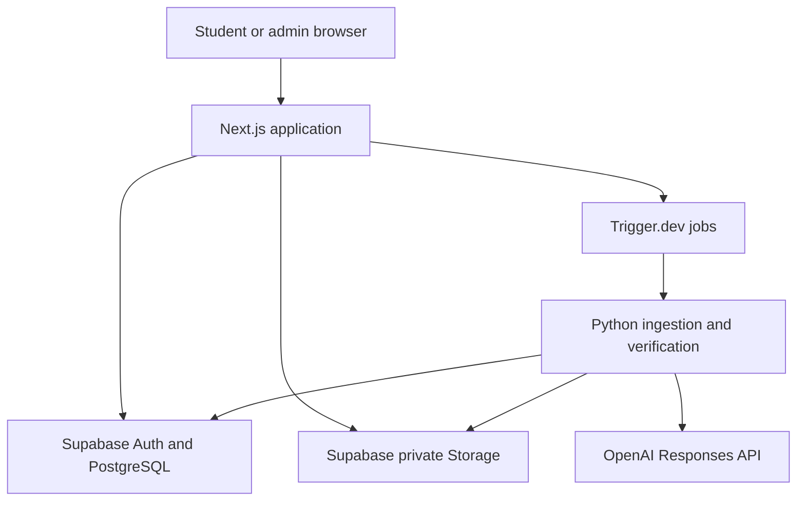

# ASEAN Scholar Preparation Platform — Technical Architecture

**Document status:** Proposed implementation architecture  
**Last updated:** 7 September 2026  
**Companion document:** `plan.md`

## 1. Architecture decision

Build a **modular monolith with asynchronous workers**:

- One Next.js application for student pages, admin pages and synchronous APIs.
- One Supabase project for authentication, PostgreSQL and object storage.
- Trigger.dev for durable background-job orchestration.
- A Python package for PDF, image, OCR-support and mathematical-verification work.
- OpenAI API calls only from trusted server or worker code.

This is deliberately not a microservice architecture. The December beta does not need Kubernetes, Redis, Kafka, Elasticsearch, a vector database, a standalone Express API, or independent deployable services for every feature.

## 2. System topology



### 2.1 Trust boundaries

- The browser is untrusted.
- Next.js server code is trusted but must act on behalf of the authenticated user unless explicitly performing an administrator operation.
- Trigger.dev and Python workers are trusted and may use service credentials.
- Supabase Row-Level Security is the final data-access boundary for user-facing operations.
- Original papers, question crops, solution crops and essays are private objects.

## 3. Technology stack

| Layer | Choice | Reason |
|---|---|---|
| Primary web language | TypeScript | Shared types across UI, route handlers, jobs and validation |
| Processing language | Python 3.12 | Stable ecosystem for PDF, image and symbolic-math processing |
| Web framework | Next.js App Router | Full-stack React application with server and client components |
| UI | React, Tailwind CSS, shadcn/ui | Fast component development with controlled design ownership |
| Forms | React Hook Form | Efficient client-side form state and validation integration |
| Runtime validation | Zod | API, form, environment and AI-output schemas |
| Math rendering/input | KaTeX and MathLive | Reliable rendering and student-friendly mathematical input |
| Database | Supabase PostgreSQL | Relational curriculum, progress and content data |
| Authentication | Supabase Auth | Managed sessions and JWTs; no custom JWT implementation |
| Object storage | Supabase Storage | PDFs, crops, diagrams and essay-related assets |
| Job orchestration | Trigger.dev | Long-running, retryable and observable work outside web-request limits |
| PDF parsing | PyMuPDF and pdfplumber | Rendering, page metadata and OCR text-layer extraction |
| Image processing | Pillow and OpenCV | Cropping, deskewing, contrast and image-quality checks |
| OCR support | Existing PDF OCR layer; optional PaddleOCR fallback | Existing text is useful for anchors but not authoritative mathematics |
| Vision extraction | OpenAI Responses API with GPT-5.4 Mini | Image input and schema-constrained structured extraction |
| Math checking | SymPy and Python `Decimal` | Algebraic equivalence and precise numeric comparison |
| Monitoring | Sentry | Web, API and worker error aggregation |
| Analytics | PostHog | Product events, funnels, retention and feature flags |
| Email | Resend | Invitations, authentication support and notifications |
| Web tests | Vitest and Playwright | Unit/component and complete-browser testing |
| Python tests | pytest | Extractor and verifier regression testing |
| CI/CD | GitHub Actions | Automated checks and controlled deployments |
| Web deployment | Vercel | Natural Next.js deployment target |
| Package managers | pnpm and uv | Fast reproducible dependency management |

Official references:

- [Next.js App Router](https://nextjs.org/docs/app)
- [Supabase Storage access control](https://supabase.com/docs/guides/storage/security/access-control)
- [Trigger.dev with Next.js](https://trigger.dev/docs/guides/frameworks/nextjs)
- [OpenAI GPT-5.4 Mini](https://developers.openai.com/api/docs/models/gpt-5.4-mini)
- [OpenAI Structured Outputs](https://developers.openai.com/api/docs/guides/structured-outputs?api-mode=responses)

## 4. Proposed repository and file responsibilities

```text
asean-scholar/
├── apps/
│   └── web/
│       ├── app/
│       │   ├── (auth)/
│       │   │   ├── login/page.tsx
│       │   │   ├── register/page.tsx
│       │   │   └── reset-password/page.tsx
│       │   ├── (student)/
│       │   │   ├── dashboard/page.tsx
│       │   │   ├── mathematics/[chapterId]/page.tsx
│       │   │   ├── practice/[sessionId]/page.tsx
│       │   │   ├── english/page.tsx
│       │   │   ├── essays/[promptId]/page.tsx
│       │   │   └── submissions/[submissionId]/page.tsx
│       │   ├── admin/
│       │   │   ├── papers/page.tsx
│       │   │   ├── papers/[documentId]/page.tsx
│       │   │   ├── questions/[questionId]/page.tsx
│       │   │   ├── curriculum/page.tsx
│       │   │   ├── english/page.tsx
│       │   │   ├── invitations/page.tsx
│       │   │   └── operations/page.tsx
│       │   ├── api/
│       │   │   ├── attempts/route.ts
│       │   │   ├── practice-sessions/route.ts
│       │   │   ├── essays/submit/route.ts
│       │   │   ├── admin/papers/route.ts
│       │   │   └── webhooks/trigger/route.ts
│       │   ├── layout.tsx
│       │   ├── error.tsx
│       │   └── not-found.tsx
│       ├── components/
│       │   ├── mathematics/
│       │   ├── english/
│       │   ├── progress/
│       │   └── admin/
│       ├── lib/
│       │   ├── auth/
│       │   ├── supabase/
│       │   ├── rate-limit/
│       │   ├── analytics/
│       │   └── env.ts
│       ├── middleware.ts
│       └── instrumentation.ts
├── packages/
│   ├── schemas/
│   │   ├── question.ts
│   │   ├── answer.ts
│   │   ├── essay-feedback.ts
│   │   └── jobs.ts
│   ├── question-engine/
│   │   ├── normalize-answer.ts
│   │   ├── select-next-question.ts
│   │   ├── progression.ts
│   │   └── types.ts
│   ├── database/
│   │   ├── generated.types.ts
│   │   ├── queries/
│   │   └── commands/
│   └── ui/
│       └── shared presentation components
├── trigger/
│   ├── ingest-paper.ts
│   ├── mark-essay.ts
│   ├── regenerate-question.ts
│   └── cleanup-orphans.ts
├── workers/
│   └── ingestion/
│       ├── pyproject.toml
│       ├── src/
│       │   ├── pipeline.py
│       │   ├── document.py
│       │   ├── render.py
│       │   ├── segment.py
│       │   ├── crop.py
│       │   ├── ocr.py
│       │   ├── extract.py
│       │   ├── classify.py
│       │   ├── pair_solutions.py
│       │   ├── verify.py
│       │   ├── sympy_checker.py
│       │   ├── image_quality.py
│       │   └── storage.py
│       └── tests/
├── supabase/
│   ├── config.toml
│   ├── migrations/
│   ├── seed.sql
│   └── tests/
├── tests/
│   └── e2e/
├── .github/
│   └── workflows/
│       ├── ci.yml
│       └── deploy.yml
├── .env.example
├── pnpm-workspace.yaml
├── package.json
├── plan.md
└── ARCHI.md
```

### 4.1 Web-route descriptions

- `login/page.tsx`: sign-in interface and redirect to the correct authenticated area.
- `register/page.tsx`: invitation validation, account creation and track onboarding.
- `reset-password/page.tsx`: secure password-recovery completion.
- `dashboard/page.tsx`: current chapter, next action, progress, accuracy and English assignments.
- `mathematics/[chapterId]/page.tsx`: chapter overview, topic list and chapter-unlock state.
- `practice/[sessionId]/page.tsx`: question player, answer field, attempts and Give up state.
- `english/page.tsx`: English components, assignments and submission history.
- `essays/[promptId]/page.tsx`: prompt, autosaving editor, word count and final submission.
- `submissions/[submissionId]/page.tsx`: immutable essay, marking status and feedback.
- `admin/papers/page.tsx`: PDF upload and document inventory.
- `admin/papers/[documentId]/page.tsx`: job status, pages, extracted questions and failures.
- `admin/questions/[questionId]/page.tsx`: source crops, extracted fields, checks and publication controls.
- `admin/curriculum/page.tsx`: track, chapter, topic and ordering configuration.
- `admin/english/page.tsx`: prompts, rubrics, criteria and model essays.
- `admin/invitations/page.tsx`: issue, revoke and inspect beta invitations.
- `admin/operations/page.tsx`: failed jobs, API cost, latency and system health.

### 4.2 API-route descriptions

- `attempts/route.ts`: authenticates the student, validates a final answer, calls deterministic checking, writes an immutable attempt and returns only permitted feedback.
- `practice-sessions/route.ts`: creates/resumes a session and retrieves the next eligible question.
- `essays/submit/route.ts`: freezes the latest draft, creates an immutable submission and starts the marking job.
- `admin/papers/route.ts`: authorises an administrator, creates document metadata and starts ingestion.
- `webhooks/trigger/route.ts`: receives authenticated job lifecycle notifications if required.

### 4.3 Shared-package descriptions

- `schemas/question.ts`: the canonical structured shape returned by AI extraction.
- `schemas/answer.ts`: allowed answer formats and server-validation rules.
- `schemas/essay-feedback.ts`: canonical criterion-level marking output.
- `schemas/jobs.ts`: job payloads and status-event schemas.
- `normalize-answer.ts`: user-input cleanup before comparison.
- `select-next-question.ts`: orchestration around the database selection function.
- `progression.ts`: configurable chapter-completion and unlocking rules.
- `generated.types.ts`: generated TypeScript representation of the Supabase schema.

### 4.4 Python-file descriptions

- `pipeline.py`: top-level state machine coordinating every ingestion stage.
- `document.py`: PDF fingerprinting, metadata extraction and page classification.
- `render.py`: deterministic page rendering at configured DPI.
- `segment.py`: question-start, continuation-page and solution-section detection.
- `crop.py`: creates ordered question, diagram and solution crops.
- `ocr.py`: reads embedded text and optionally runs fallback OCR for anchors.
- `extract.py`: calls the vision model and validates structured question output.
- `classify.py`: maps a question into the fixed track/topic taxonomy with confidence.
- `pair_solutions.py`: links question assets with matching answer or marking-scheme assets.
- `verify.py`: aggregates schema, source-agreement, independent-solution and deterministic checks.
- `sympy_checker.py`: controlled symbolic and numeric equivalence functions.
- `image_quality.py`: detects blank, tiny, truncated or low-resolution crops.
- `storage.py`: service-authenticated download/upload functions and path conventions.

## 5. Database design

Use UUID primary keys, `timestamptz` timestamps, database constraints, and explicit status enums. Store all schema changes as migrations.

### 5.1 Identity tables

#### `profiles`

Extends the Supabase Auth identity without duplicating credentials.

Key columns:

```text
id uuid references auth.users
display_name text
role student | admin | academic_admin
selected_track_id uuid
onboarding_completed_at timestamptz
created_at timestamptz
```

#### `invitations`

Controls the private beta.

```text
id uuid
code_hash text unique
email text nullable
track_id uuid nullable
expires_at timestamptz
max_uses integer
use_count integer
revoked_at timestamptz nullable
```

### 5.2 Curriculum tables

#### `tracks`

Stores `sec1_entry` and `sec3_entry`, display names and curriculum-version metadata.

#### `chapters`

Ordered curriculum units. Includes unlock-policy configuration and checkpoint references.

#### `topics`

Stable taxonomy such as algebraic manipulation, ratios, geometry or statistics.

#### `chapter_topics`

Many-to-many mapping allowing a topic to occur in multiple curriculum chapters.

#### `enrollments`

Pins a student to a specific curriculum version so later edits do not unexpectedly rewrite an active path.

### 5.3 Content tables

#### `source_documents`

```text
id
sha256 unique
school
year
assessment_type
source_level
target_track_id
original_filename
storage_path
page_count
status
```

#### `source_pages`

Stores rendered-page paths, page type, dimensions, OCR text and page-level confidence.

#### `questions`

Stores the structured academic item, answer type, normalized answer, marks, difficulty, publication state and confidence fields.

#### `question_assets`

Stores an ordered list of question crops, diagrams and solution crops. This supports multi-page questions.

#### `answer_keys`

Stores raw official answer text, normalized official answer, units, tolerance and acceptable alternatives.

#### `solution_versions`

Stores generated student-facing explanations. Never overwrite an explanation silently; create a new version and mark the active version.

#### `question_topics`

Stores primary and secondary topic labels, classifier confidence, model version and taxonomy version.

#### `question_verifications`

One row per verification check, for example `crop_complete`, `answer_parsed`, `symbolic_equivalence`, `independent_solution_agrees`, or `source_solution_agrees`.

### 5.4 Practice tables

#### `practice_sessions`

Represents one student practice visit and its target chapter/topic.

#### `session_questions`

Records question order so refreshing the page does not randomly change the session.

#### `attempts`

Immutable record of every submitted answer, normalized value, correctness, attempt number and timestamp.

#### `question_progress`

Derived per-student state: unseen, attempting, correct, gave_up, or queued_for_retry.

#### `chapter_progress`

Stores completion counts, first-attempt accuracy, checkpoint results and unlock timestamps.

### 5.5 English tables

#### `english_prompts`

Stores prompt type, track, instructions, time guidance, word guidance and publication state.

#### `rubrics` and `rubric_criteria`

Versioned marking definitions. Submitted essays reference the rubric version used for grading.

#### `model_essays`

Stores founder-provided reference essays and associated annotations.

#### `essay_drafts`

Mutable autosaved working text. Only its owner may access it.

#### `essay_submissions`

Immutable snapshot of submitted text, prompt and rubric version.

#### `essay_feedback`

Stores overall score estimate, strengths, priorities, model, prompt version and processing status.

#### `essay_criterion_scores`

Stores one score, evidence set and improvement recommendation per rubric criterion.

### 5.6 Operations tables

#### `ingestion_jobs`

Stores pipeline stage, attempt, progress, error code, timestamps and idempotency key.

#### `ai_runs`

Stores provider, model snapshot, prompt version, input hash, token use, latency, outcome and estimated cost.

#### `audit_events`

Records administrative publication and configuration changes.

#### `system_events`

Records product analytics events that require relational analysis; high-volume UI analytics may go to PostHog.

## 6. Storage design

Use separate buckets and deny public listing.

```text
source-pdfs-private/
rendered-pages-private/
question-assets-private/
essay-assets-private/
public-brand-assets/
```

Suggested object convention:

```text
source-pdfs-private/{document_id}/original.pdf
rendered-pages-private/{document_id}/page-{page_number}.webp
question-assets-private/{question_id}/question-{order}.webp
question-assets-private/{question_id}/solution-{order}.webp
```

Student question assets should be delivered through short-lived signed URLs or an authenticated proxy. Solution-asset URLs must not be sent before the solution is unlocked.

## 7. Authentication and authorisation

### 7.1 Authentication

Use Supabase Auth for account creation, sessions, refresh tokens and JWT validation. Do not sign or manage application JWTs manually.

### 7.2 Row-Level Security policy summary

- `profiles`: student reads/updates their own permitted fields; admins have controlled access.
- `attempts`: student inserts and reads their own rows; no student update/delete.
- `practice_sessions`: student accesses only their own sessions.
- `essay_drafts`: owner only.
- `essay_submissions`: owner reads/inserts; submitted content cannot be updated by the student.
- `essay_feedback`: owner reads; only trusted workers write.
- `questions`: students select only `published` records eligible for their track.
- `source_documents`: administrators only.
- Storage: private by default, with owner or application-authorised reads.

Never expose the Supabase service-role key or OpenAI API key in a `NEXT_PUBLIC_` environment variable.

## 8. PDF, OCR and vision pipeline

### 8.1 Technical finding from representative PDFs

The Canberra and Zhonghua samples contain selectable text, but the exam pages are effectively scanned images with OCR overlays. OCR is helpful for words and coordinates but unreliable for exact Mathematics. Common errors include lost fraction bars, corrupted exponents, π becoming a letter, inequality corruption, missing degree symbols, and variable confusion.

Therefore:

- OCR is an anchor and indexing tool.
- The rendered source image is the visual source of truth.
- Vision extraction is required for structured mathematics.
- Official solution crops are retained as evidence.

### 8.2 Pipeline stages

#### Stage A — intake

1. Receive an administrator upload or future source-adapter download.
2. Compute SHA-256.
3. Reject an exact duplicate.
4. Create `source_documents` and `ingestion_jobs` rows.
5. Store the original PDF privately.

#### Stage B — render

1. Render every page at 200–250 DPI.
2. Convert to loss-controlled WebP or PNG.
3. Record page width, height and checksum.
4. Detect blank or nearly blank pages.

#### Stage C — page classification

Classify each page as:

```text
cover
instructions
formula_sheet
question
continuation
answer_key
worked_solution
blank
advertisement
unknown
```

Use deterministic header rules first, then a low-cost model only when necessary.

#### Stage D — segmentation

1. Use OCR word coordinates to find likely question-number anchors.
2. Detect marks such as `[2]` and `Answer` lines as supporting evidence.
3. Determine the crop from one question anchor to the next.
4. Preserve diagrams within the question region.
5. Attach continuation pages where headings refer to the same question.
6. Store every crop with page and ordering metadata.

#### Stage E — question/solution pairing

- For repeated worked-solution papers, match by question number and page sequence.
- For tabular marking schemes, identify question and subpart rows.
- Retain a confidence score and supporting page references.
- Never infer a pair solely because two pages are adjacent.

#### Stage F — structured extraction

Call a pinned GPT-5.4 Mini snapshot through the Responses API with image input and Structured Outputs. Require fields such as:

```json
{
  "question_number": "2",
  "subparts": ["a", "b"],
  "question_text": "...",
  "question_latex": "...",
  "marks": 4,
  "answer_type": "decimal_with_unit",
  "official_answer_raw": "3.5 days",
  "official_answer_normalized": "3.5|day",
  "solution_steps": [],
  "diagram_present": false,
  "extraction_confidence": 0.94
}
```

Validate this output with Pydantic in Python and Zod when it enters the TypeScript application.

#### Stage G — classification

Use a fixed taxonomy, not free-form model labels. The classifier returns:

```text
track compatibility
source level
primary topic id
secondary topic ids
difficulty estimate
required prerequisite ids
confidence
taxonomy version
```

Recommended method:

1. Deterministic keyword/rule candidates.
2. GPT-5.4 Mini chooses only among allowed topic IDs.
3. Validate the returned ID against the database.
4. Hide content below the classification threshold.

A separately trained machine-learning classifier is not required for the beta. The likely dataset is initially too small, and a schema-constrained language model is more maintainable.

#### Stage H — verification

Aggregate:

- Schema validity.
- Complete crop check.
- Question/solution number agreement.
- Answer parsing success.
- Source-answer agreement.
- Independent generated-solution agreement.
- SymPy or numeric equivalence where supported.
- Diagram-presence consistency.
- Confidence thresholds.

Only all-required-checks-passed questions become `verified`. Publication remains a separate state.

## 9. Answer checking

### 9.1 Principle

Student submissions are never judged by a live LLM during normal Mathematics practice. The authoritative checker is a typed deterministic function.

### 9.2 Answer-type implementations

| Answer type | Normalisation and comparison |
|---|---|
| Integer | Parse sign and digits; compare exact integer |
| Decimal | Parse with `Decimal`; compare exact value or configured tolerance |
| Fraction | Reduce to rational form; compare numerator/denominator value |
| Percentage | Normalize `%`, decimal and fractional equivalents where allowed |
| Algebraic expression | Parse controlled syntax with SymPy; simplify difference to zero |
| Equation | Normalize sides or test solution-set equivalence |
| Multiple roots | Normalize unordered solution set |
| Coordinate | Parse ordered tuple and compare components |
| Unit answer | Compare normalized value and allowed unit family |
| Multiple choice | Compare stable option identifier, not display letter alone |
| Text answer | Lowercase/trim/normalize punctuation and compare approved alternatives |

Do not pass raw untrusted strings directly to unrestricted symbolic evaluation. Use a controlled parser, allowed-symbol list, input-length limit and computation timeout.

### 9.3 Attempt transaction

Answer submission should execute atomically:

1. Confirm authenticated user and active session.
2. Confirm the question is published and assigned to the session.
3. Reject duplicate idempotency key.
4. Normalize and compare the answer.
5. Insert immutable attempt.
6. Update derived question progress.
7. Enable Give up when incorrect count reaches two.
8. Update chapter aggregates.
9. Return only `correct`, `incorrect`, or the permitted solution-unlock state.

## 10. Question selection and progression

Use a PostgreSQL function or transactionally consistent server query rather than `ORDER BY random()` alone.

Selection priority:

1. Current track and unlocked chapter.
2. Required retry items if retry mode is enabled.
3. Unseen published questions.
4. Questions not attempted recently.
5. Difficulty balance.
6. Random tie-breaking.

Persist selected question IDs in `session_questions` so a refresh does not change the sequence.

Chapter-unlock policy should be configuration data:

```json
{
  "policy": "checkpoint",
  "required_practice_count": 15,
  "checkpoint_question_count": 8,
  "passing_percentage": 75
}
```

The values above are examples, not confirmed product decisions.

## 11. Cached Mathematics solutions

Generate solutions during ingestion, not on student demand.

Each `solution_versions` record should contain:

- Explanation text.
- Mathematical markup.
- Ordered steps.
- Final answer.
- Source marking-scheme reference.
- Model snapshot.
- Prompt version.
- Verification status.
- Creation timestamp.

The student request retrieves the active verified version only after Give up. Regenerating a solution creates a new version so earlier student activity remains auditable.

## 12. English implementation

### 12.1 Objective English

Grammar and vocabulary use the generic question/attempt framework with supported objective answer types. No live AI call is needed for marking.

### 12.2 Essay editor

Required technical behaviour:

- Local editor state updates immediately.
- Debounced autosave writes to `essay_drafts`.
- Draft version number prevents older network responses overwriting newer text.
- Word count is calculated locally and validated on submission.
- Browser close/reopen restores the latest server draft.
- Submit requires explicit confirmation.
- Submission writes an immutable snapshot.
- No AI feedback endpoint is callable for an unsubmitted draft.

### 12.3 Essay-marking job

1. Create job with `submission_id`, `rubric_version_id` and idempotency key.
2. Load immutable essay, prompt, rubric and selected model-essay context.
3. Run criterion-level evaluation using Structured Outputs.
4. Run a consistency pass that checks arithmetic, evidence and rubric limits.
5. Reject or retry malformed output.
6. Store overall estimate and criterion records.
7. Mark submission feedback ready.
8. Notify the student in-app; email can be added if useful.

Suggested schema:

```json
{
  "overall_score": 21,
  "maximum_score": 30,
  "criterion_scores": [
    {
      "criterion_id": "content",
      "score": 7,
      "maximum_score": 10,
      "evidence": ["..."],
      "improvement": "..."
    }
  ],
  "strengths": ["..."],
  "priority_improvements": ["..."],
  "language_corrections": []
}
```

Present the result as an AI-generated estimate. Store score and feedback separately so the interface can emphasise actionable feedback.

## 13. OpenAI API design

### 13.1 Model policy

- Default: GPT-5.4 Mini.
- Pin a snapshot, such as the documented `gpt-5.4-mini-2026-03-17`, for repeatable processing.
- Use image input for question and solution crops.
- Use Structured Outputs for every extraction and marking task.
- Use a stronger fallback only for explicitly low-confidence or complex cases.
- Do not fine-tune in the beta.

### 13.2 Prompt/version policy

Every prompt template has:

```text
prompt_name
semantic_version
input_schema_version
output_schema_version
model_snapshot
created_at
retired_at
```

An ingestion job must record the exact version used. Prompt changes should be evaluated against the golden dataset before deployment.

### 13.3 Cost controls

- Cache Mathematics solutions permanently by question and prompt version.
- Hash inputs and reuse identical successful extraction results.
- Batch offline work where practical.
- Do not call AI for normal Mathematics submissions.
- Limit essay length and submission frequency.
- Record token usage and estimated cost.
- Set provider spend alerts.
- Add per-user and per-job rate limits.

## 14. Background jobs

### `ingest-paper`

Long-running workflow covering render, page classification, segmentation, extraction, classification, solution pairing, verification and publication eligibility.

### `mark-essay`

Loads an immutable submission, produces structured feedback, performs consistency validation and stores the result.

### `regenerate-question`

Reruns only selected stages for one question without duplicating its identity or attempts.

### `cleanup-orphans`

Finds abandoned temporary assets that are not referenced by database records. It must use a retention window and dry-run reporting before deletion.

All jobs require:

- Idempotency key.
- Explicit state transitions.
- Bounded retries with exponential backoff.
- Machine-readable error code.
- Correlation ID shared with logs and `ai_runs`.
- Dead-letter or terminal-failure state.

## 15. API surface

Suggested routes:

```text
POST   /api/auth/accept-invitation
GET    /api/curriculum/current
POST   /api/practice-sessions
GET    /api/practice-sessions/:id/next
POST   /api/attempts
POST   /api/questions/:id/give-up
GET    /api/questions/:id/solution
PUT    /api/essay-drafts/:id
POST   /api/essays/:promptId/submit
GET    /api/submissions/:id/feedback
POST   /api/admin/papers
GET    /api/admin/papers/:id/status
POST   /api/admin/questions/:id/reprocess
PATCH  /api/admin/questions/:id/publication
POST   /api/admin/invitations
```

Rules:

- Authenticate on every private route.
- Authorise resources server-side.
- Validate all bodies with Zod.
- Use idempotency keys for attempts, submissions and job creation.
- Never accept a client-provided correctness value, role, score or unlock state.
- Avoid returning official answers or solution storage paths before unlock.

## 16. Observability

### 16.1 Error monitoring

Capture:

- Unhandled Next.js errors.
- Route-handler failures.
- Worker exceptions.
- Job terminal failures.
- PDF page and question identifiers.
- Correlation IDs without unnecessary student essay content.

### 16.2 Product analytics events

Suggested event names:

```text
invitation_accepted
onboarding_completed
chapter_opened
practice_started
answer_submitted
question_completed
question_gave_up
chapter_completed
essay_started
essay_submitted
essay_feedback_viewed
question_reported
```

Avoid sending raw essay content or final answers to the analytics provider.

### 16.3 Operational dashboards

- Published questions per track/topic.
- Ingestion acceptance and rejection rate.
- Failed jobs by error code.
- AI tokens and cost by job type.
- Essay-marking latency.
- Incorrect-question reports.
- Web/API error rate.

## 17. Security controls

- Row-Level Security enabled before real student data is inserted.
- Private buckets for academic sources and essays.
- Signed, short-lived asset URLs.
- Service credentials only in server/worker environments.
- Separate development and production secrets.
- Administrator checks performed server-side.
- Input-size and file-type limits.
- PDF processing runs as an unprivileged worker with time and memory limits.
- Symbolic-math parsing uses an allowlist and timeout.
- Content Security Policy and secure cookies.
- Rate limiting on authentication and expensive routes.
- Dependency and secret scanning in CI.
- Minimal student personal data.
- Account deletion and operational audit trail.

## 18. Testing strategy

### 18.1 TypeScript unit tests

- Answer normalization.
- Give up becomes available exactly after the second incorrect attempt.
- Solution access remains forbidden before Give up.
- Chapter unlock calculations.
- Invitation limits and expiry.
- Essay-submission immutability.

### 18.2 Python unit and regression tests

- Page classification.
- Question-anchor detection.
- Multi-page attachment.
- Blank-page detection.
- Structured-output validation.
- Fraction, decimal, algebra and unit equivalence.
- Malicious or pathological symbolic input.

### 18.3 Database tests

- Constraints and uniqueness.
- Row-Level Security isolation.
- Transactional attempt updates.
- No unpublished question selection.
- Idempotent job creation.

### 18.4 Browser tests

- Invitation through onboarding.
- Complete Mathematics question.
- Two incorrect attempts, continued attempt and Give up.
- Locked chapter behaviour.
- Essay autosave, refresh, submission and feedback.
- Admin upload and processing-status display.

### 18.5 AI evaluations

Use versioned golden sets for:

- Mathematical transcription accuracy.
- Correct question/solution pairing.
- Topic-classification accuracy.
- Final-answer agreement.
- Essay rubric adherence.
- Feedback consistency and actionability.

## 19. CI/CD and environments

### 19.1 Environments

- Local: local Next.js and Supabase CLI where practical.
- Preview: per-pull-request web deployment using non-production data.
- Production: beta users and production content only.

Never copy student essays from production into development.

### 19.2 Pull-request checks

```text
TypeScript typecheck
lint
Vitest
pytest
database migration validation
RLS tests
Playwright critical paths
build
secret scan
```

### 19.3 Deployment

- Merge to the main branch deploys the web application after checks pass.
- Database migrations run as an explicit controlled step before incompatible application changes.
- Worker versions deploy with their job definitions.
- A rollback procedure is documented for application and worker code.
- AI prompt changes deploy as versioned configuration, not invisible text edits.

## 20. Cost model

Published prices checked on 7 September 2026:

| Service | Development/beta option | Current base cost |
|---|---|---:|
| Supabase | Free, then Pro for production | $0 or $25/month |
| Vercel | Hobby for non-commercial prototype, then Pro | $0 or $20/month |
| Trigger.dev | Free, then Hobby if needed | $0 or $10/month |
| OpenAI | Usage based | Variable |
| Sentry | Free tier initially | $0 |
| PostHog | Free tier initially | $0 |
| Resend | Free tier initially | $0 |

References:

- [Supabase pricing](https://supabase.com/pricing)
- [Vercel pricing](https://vercel.com/pricing)
- [Trigger.dev pricing](https://trigger.dev/pricing)
- [GPT-5.4 Mini pricing and capabilities](https://developers.openai.com/api/docs/models/gpt-5.4-mini)

Supabase Pro currently includes 8 GB database disk, 100 GB file storage and 250 GB egress, which is sufficient for the expected beta by a wide margin.

GPT-5.4 Mini is currently listed at $0.75 per million input tokens, $0.075 per million cached-input tokens and $4.50 per million output tokens. Planning assumptions—not guarantees—are:

- Mathematics ingestion: approximately $0.02–$0.08 per accepted question after multiple calls and retries.
- 1,000 accepted questions: approximately $20–$80 one-time.
- Essay evaluation: approximately $0.01–$0.03 per submission with one or two Mini calls.

Measure the first representative batch and replace assumptions with observed token data.

## 21. Scaling path

### Up to 100 active students

No architecture change should be required. Use Supabase Pro, Vercel Pro if commercial, background-job monitoring and API budgets.

### Hundreds to low thousands

- Improve indexes and query plans.
- Add database connection pooling where needed.
- Move high-volume derived analytics out of transactional requests.
- Precompute more question-selection pools.
- Increase worker concurrency carefully.
- Add parent/billing data only after product validation.

### Large scale

Only then evaluate dedicated queues, independent services, data warehouse, regional deployment, and specialised search. Scale due to measured bottlenecks rather than predicted ones.

## 22. Explicit non-goals for the beta

- No custom authentication or JWT service.
- No native mobile application.
- No handwriting recognition.
- No real-time AI tutor.
- No student-visible token charging for Mathematics.
- No embeddings/vector database unless a demonstrated retrieval need appears.
- No model fine-tuning.
- No distributed microservices.
- No automatic dependence on a single external source website.
- No live model call for routine Mathematics answer checking.

## 23. Architecture definition of done

The architecture is implemented sufficiently for the beta when:

- All P0 flows in `plan.md` operate in production.
- Every private table and bucket has tested access policies.
- PDF ingestion is asynchronous, retryable and idempotent.
- Question images remain the source display while extracted data drives classification and marking.
- Only verified and published questions can be selected.
- Mathematics answer checking is deterministic and regression-tested.
- Solution access follows the two-error and explicit-Give-up rule.
- Essay feedback uses immutable submissions and versioned structured output.
- Prompt, model, token and cost information is observable.
- CI covers application, database, worker and critical browser paths.
- The system supports the invited 10–30-student December cohort without manual database operations during ordinary use.

