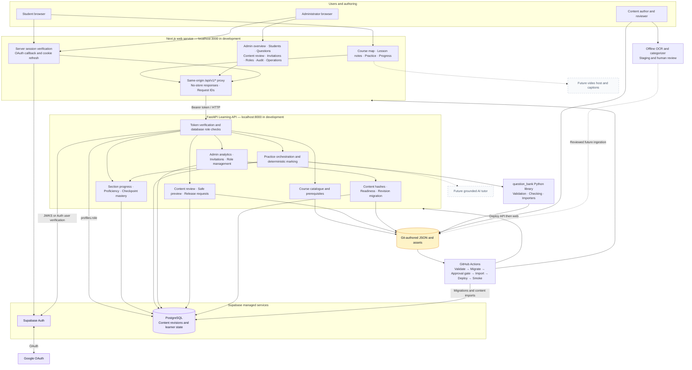
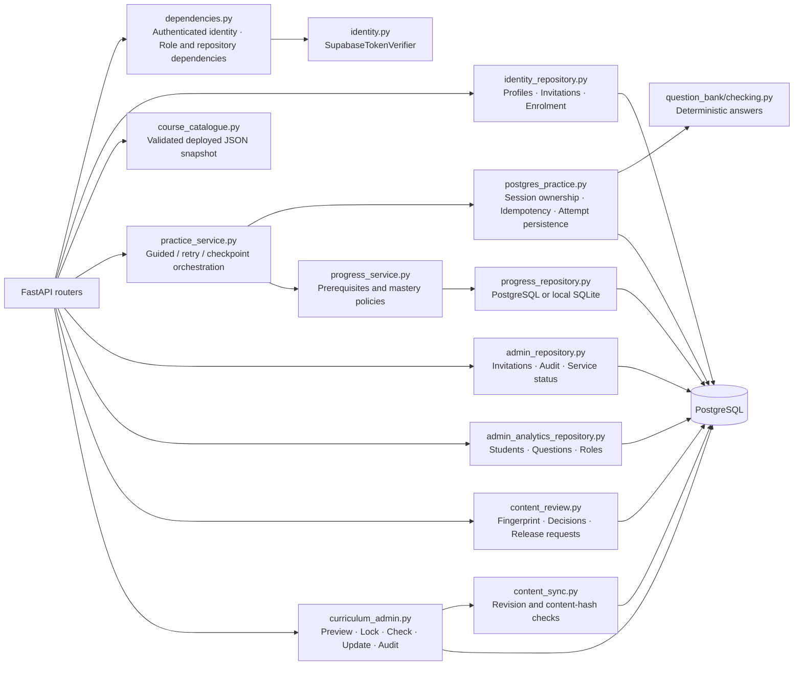
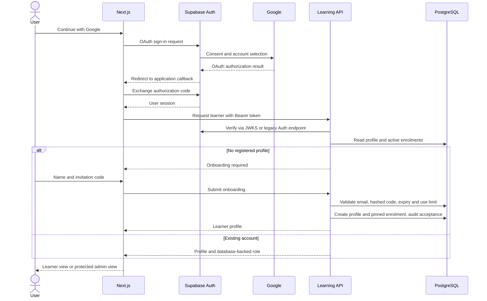
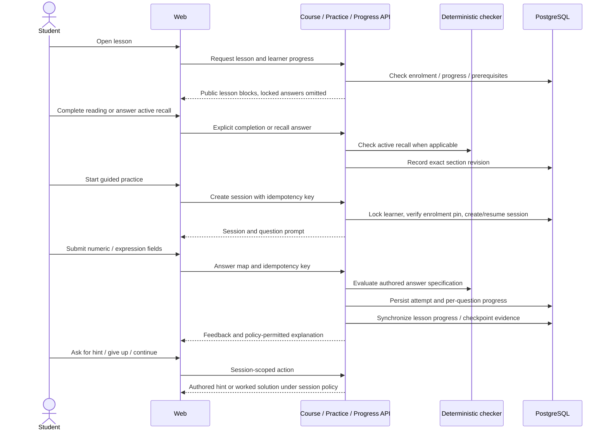
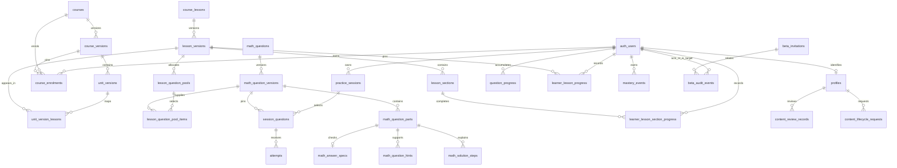
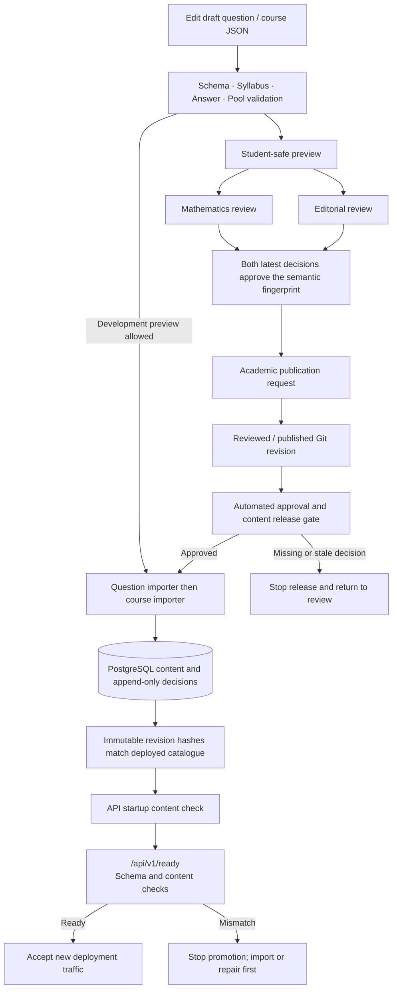
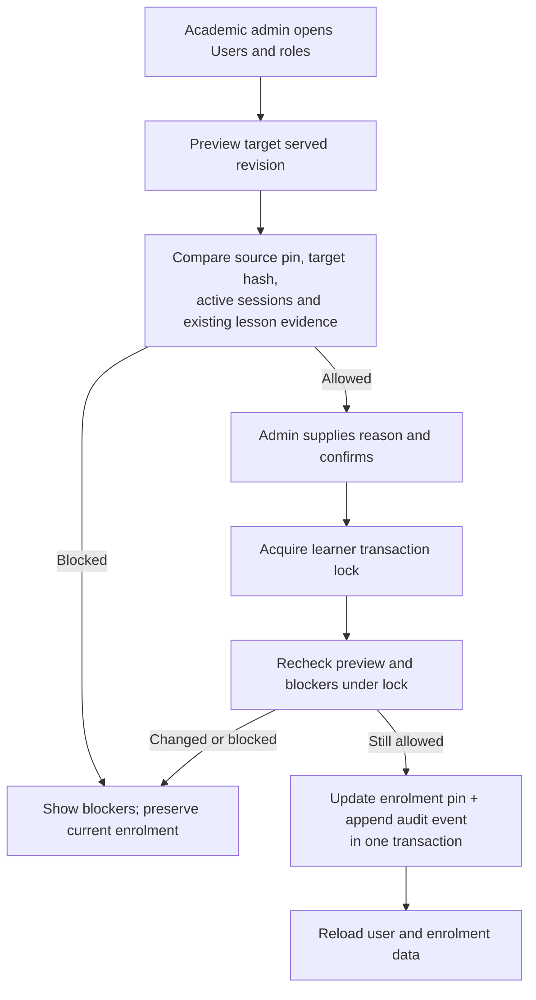
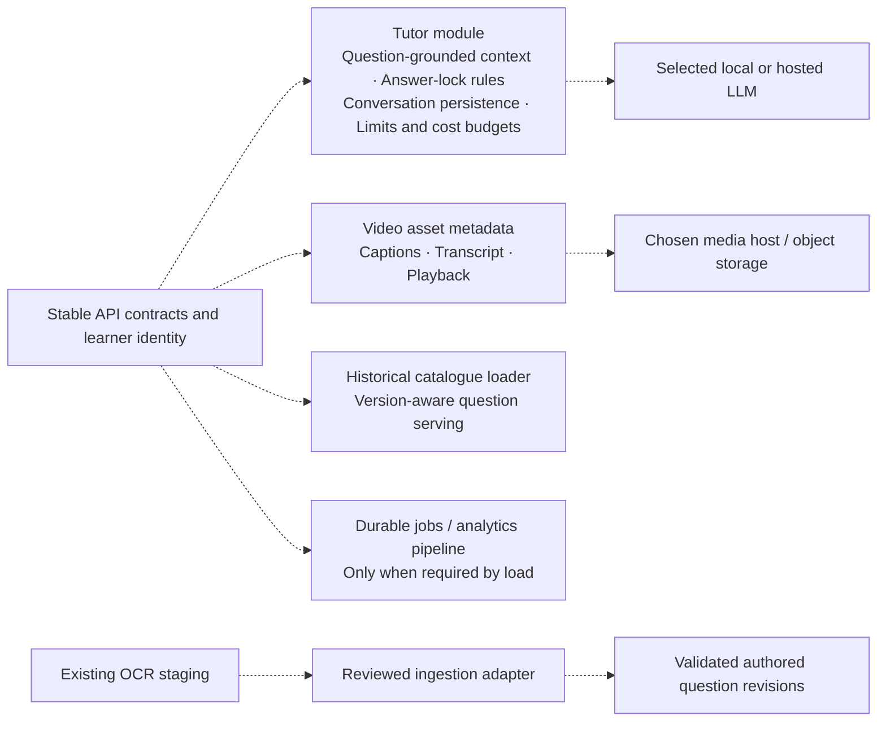

# ASEAN Academy beta architecture

**Implementation snapshot:** 28 September 2026, `feature/authenticated-beta-e2e`.
**Companions:** [Content synchronization and admin runbook](CONTENT_SYNC_ADMIN_DASHBOARD.md) and [Content review and controlled publication](CONTENT_REVIEW_PUBLICATION.md).
**Format:** Markdown with editable Mermaid diagrams. GitHub renders these diagrams; a
Mermaid-enabled Markdown preview can render them locally. The overview is also supplied
as [BETA_ARCHITECTURE.mmd](BETA_ARCHITECTURE.mmd) for Mermaid editors and SVG/PDF export.
Use SVG for a large, zoomable exported diagram; JPEG makes small labels harder to read.

## 1. Boundaries and implementation status

The beta has **two application processes**: a Next.js web server and a Python FastAPI
Learning API. It uses managed Supabase Auth and PostgreSQL. The API is a modular
application: identity, course, practice, progress and administration are code modules
inside the same process, not separately deployed microservices. The question-bank
package is an imported Python library and command-line tool.

This keeps deployment, transactions and debugging manageable at beta scale. Split a
module into a separate service only when scaling, isolation or ownership requires it.

| Component | Responsibility | Current status / location |
| --- | --- | --- |
| Web | Student and administrator pages, Google sign-in, session cookies, same-origin API proxy, KaTeX | Implemented, `apps/web`; design remains replaceable |
| Learning API | Verified identity, access rules, lesson/practice workflows, progress, administration | Implemented, `services/learning_api` |
| Supabase Auth | Google OAuth exchange, user identity, access/refresh tokens | Integrated; Google/Supabase dashboard configuration is external |
| PostgreSQL | Imported content revisions, profiles, invitations, enrolments, attempts, progress, audit | Implemented, `supabase/migrations` |
| Question-bank domain | Validation, numeric/expression checking, hints, solutions, content import | Implemented shared package, `question_bank` |
| Git-authored content | Editable, reviewable source for lessons and questions | 40 N1 question drafts; seven lesson records; Lesson 1 has draft notes |
| CI and release tooling | Unit/contract tests, authenticated browser journeys, migration checks, imports, deployment sequencing, health checks | Workflows implemented; actual Railway/GitHub configuration must be verified separately |
| OCR and categorization | PDF extraction, staging/review and syllabus mapping | Existing offline tools; outside the student request path |
| Conversational AI tutor | Grounded follow-up explanations and multi-turn conversation | Planned; current hints/solutions are authored content, not live LLM responses |
| Video delivery | Hosted media, captions/transcript, playback | Pending media and hosting decision; lesson page has placeholder support |

## 2. System and network overview

Solid arrows represent implemented dependencies. Dashed arrows represent future integrations.
Hosted service names are logical names; no IP addresses or production URLs are assumed.

### Connections and trust boundaries

| From → to | Transport / address | Identity and restrictions |
| --- | --- | --- |
| Browser → web | HTTP localhost:3000; HTTPS when hosted | Supabase-backed browser session; admin server guards |
| Web → API | HTTP localhost:8000; configured `LEARNING_API_URL` when hosted | Verified session access token forwarded as Bearer; browser-supplied role is not trusted |
| Web → Supabase Auth | HTTPS project URL | Publishable key and OAuth session; publishable key is not a DB password |
| API → Supabase Auth | HTTPS JWKS; legacy-token fallback to Auth user endpoint | Checks token signature/issuer/audience/expiry or asks Auth to verify |
| API → PostgreSQL | psycopg using saved server-only database URL | Explicit ownership/role checks plus database RLS where applicable |
| Bootstrap / release → PostgreSQL | Administrative migration/import connection | Server-side secret; never a frontend variable |
| Google → Supabase | OAuth callback `https://<project>.supabase.co/auth/v1/callback` | Google client ID/secret configured in Supabase provider |
| Supabase → web | Allowed application `/auth/callback` | Application exchanges code and establishes cookies |

Supabase PostgREST is not the application's learning-data access path. Database
credentials remain on the API/release side. An owner-level DB connection can bypass
RLS; application ownership and role checks remain essential. Do not treat RLS as
a substitute for endpoint authorization.

## 3. API module map

These modules run in one API process. There is no Redis, message broker, Kubernetes
cluster, asynchronous marking worker or independent analytics warehouse in the beta.

## 4. Sign-in and onboarding sequence

Signing in identifies a person; an invitation authorizes entry to the beta.
An administrator role is stored in `profiles.role`, not assigned by an email string
in the UI or by untrusted user metadata. Google login alone does not prevent account
sharing; device/session policy would be a separate future feature.

## 5. Learning, answers and progress

- Marks, two hints and worked solutions live with each question revision.
- Submitted final answers are checked deterministically; handwriting OCR is not required.
- Reading completion records engagement, not mastery.
- Guided practice, retry review and checkpoint policies differ; checkpoint feedback
  remains governed by its assessment rules.
- Author-defined lesson pools have an explicit sequence; they are not all randomized.
  The shared practice engine supports adaptive selection, and required retries are
  selected from recorded unresolved evidence.
- Attempt writes are idempotent. Practice persistence and progress synchronization
  span service operations; repeated summary reads reconcile progress. There is no
  claim of a distributed transaction or message queue.
- Live conversational tutoring is still future work. Showing an authored full solution
  does not mean an LLM has been called.

## 6. Database relationships

The following ER diagram groups the main real tables. It omits secondary indexes and
some columns for readability; migration SQL remains the authoritative schema.

Additional tables include curriculum versions, syllabus topics/outcomes, programmes,
mastery policies, lesson prerequisites/assets/outcomes, unit checkpoint pools and
practice creation idempotency keys. A question's stable key identifies it across
revisions; attempts and session items refer to exact persisted versions.

### Who owns which data?

| Data | Source of truth | Read/write path |
| --- | --- | --- |
| Authored lessons/questions | Reviewed Git JSON and assets | Validator → importer → immutable DB revisions |
| Runtime course display | Validated snapshot shipped with API | Catalogue reads deployed JSON; readiness verifies corresponding DB hashes |
| User identity | Supabase Auth | OAuth and token verification |
| Role, invitation, course pin | PostgreSQL | Authorized identity/admin APIs |
| Attempts and progress | PostgreSQL in hosted mode | Student-scoped API and repositories |
| Local unauthenticated preview | SQLite | Development-only fallback; not automatically merged into hosted accounts |
| Aggregated admin metrics | PostgreSQL query results | Protected API; no separate analytics copy |
| Review decisions and lifecycle requests | Append-only PostgreSQL records bound to a Git-content fingerprint | Protected content-review API; release gate reads them |
| Release identity and request logs | Process environment and logs | Health/status endpoints and hosting log system |

**Important limitation:** the current API serves one bundled N1 catalogue. Importing
multiple revisions does not create a full arbitrary historical-catalogue server.
Existing sessions can resume only while their question revisions remain supported
by the deployed engine. Keep those revisions available and test active sessions
before shipping question revisions. This milestone adds explicit migration guards,
not unrestricted historical course delivery.

## 7. Content authoring, synchronization and release

Importing a draft is allowed for development and does **not** publish it. Production
configuration refuses draft visibility. Current N1 content still needs review.
A repeated import accepts the same immutable revision and rejects changed content
under the same revision. Increment revisions for meaningful content changes.

Local `bootstrap:api` previews first and applies only with `--apply`. It uses the
existing saved connection, checks migration history, applies pending migrations
with a ledger entry in each transaction, and imports content transactionally.
It does not reset credentials, create invitations or migrate enrolments.

## 8. Safe learner course updates

The same learner lock guards new practice sessions and lesson-progress starts.
A course update cannot silently replace an active session or remap progress from
changed/removed lessons. Same or older target revisions are rejected. Compatible
existing lesson evidence stays in place; incompatible evidence needs a separately
reviewed migration design. There is no force-reset button.

## 9. Administrator surface and access

| Page | content_admin | academic_admin | Purpose |
| --- | --- | --- | --- |
| `/admin` | Yes | Yes | Aggregate learning metrics |
| `/admin/students` | Yes | Yes | Search/paginate student summaries |
| `/admin/students/<id>` | Yes | Yes | Individual lesson and attempt aggregates |
| `/admin/questions` | Yes | Yes | Filter question performance by outcome/difficulty |
| `/admin/content` | Yes | Yes | Safe preview and review; lifecycle requests require academic role |
| `/admin/invitations` | Yes | Yes | Create/list/revoke beta invitations |
| `/admin/audit` | Yes | Yes | Latest 100 operational audit events |
| `/admin/users` | No | Yes | All profiles including admins, role changes, course migration |
| `/admin/operations` | No | Yes | Live release/database/content status |

The backend independently enforces the same restrictions. Hiding a link is only
presentation. Role changes require explicit confirmation; self-role changes and
removing the last academic administrator are rejected. Role changes are serialized
to protect the last-admin check. Analytics excludes raw submitted answers, auth
tokens and invitation secrets. Invitation plaintext is returned once on creation.

This dashboard is usable as the placeholder admin interface. It does not include
an in-browser content editor, video uploader, billing console, full log browser, metrics history
or unrestricted audit export.

## 10. Deployment and observability

```mermaid
flowchart LR
  BRANCH["Feature branch / PR"] --> CI["Lint · Types · Unit tests<br/>Fresh PostgreSQL · Integration tests<br/>Authenticated Chromium journeys<br/>Contract generation · Web build"]
  CI --> MAIN["Reviewed main branch"]
  MAIN --> STAGING["Automatic staging workflow<br/>Isolated Supabase + Railway"]
  STAGING --> STAGINGSMOKE["Preview environment · Google provider<br/>Auth gate · readiness · scheduled checks"]
  STAGINGSMOKE --> RELEASE["Manual production workflow<br/>Protected environment"]
  RELEASE --> MIGRATE["Migration safety + Supabase migrations"]
  MIGRATE --> APPROVAL["Human approval release gate"]
  APPROVAL --> IMPORT["Immutable question and course imports"]
  IMPORT --> API["Deploy API with release SHA"]
  API --> READY["Readiness + expected release smoke check"]
  READY --> WEB["Deploy web"]
  WEB --> SMOKE["Full application smoke check"]
  SMOKE --> LIVE["Production"]
  LIVE --> MONITOR["Scheduled availability check"]
  LIVE --> LOGS["Structured logs<br/>Request ID · Status · Duration · Release"]
  LIVE --> STATUS["Academic admin system status"]
```

Additive schema changes precede code rollout. Health-gated hosting overlap/draining
must be configured on the actual platform; source files alone do not prove those
settings are active. Roll application code back to a known-good compatible release
if needed; leave additive DB schema in place and repair forward. Test old-session
compatibility before changes to question revisions. No architecture can promise
zero disruption without testing those operational settings.

`/health` checks process liveness; `/ready` checks the database/schema and imported
content. Admin operations show current status, not historical uptime. Request IDs
connect user-visible failures to logs. See
[Deployment automation and observability](DEPLOYMENT_AUTOMATION_OBSERVABILITY.md)
for production environment setup and rollback procedures. The hosted pre-production path is in [Hosted staging deployment](HOSTED_STAGING.md). The browser-test boundary and local/CI runbook are in [Authenticated beta end-to-end verification](AUTHENTICATED_BETA_E2E.md).

## 11. Future extensions without blocking this beta milestone

The friend's frontend can replace layout/components while retaining the same
`/api/v1` contracts, server-side session handling, KaTeX content blocks and error
envelopes. Public content rendering must not expose answer specifications.
Do not embed database access or admin authorization decisions into Figma-generated
client code.

## 12. Source map

- [Web app](../../apps/web/src/app), [admin UI](../../apps/web/src/components/admin-dashboard.tsx)
- [API routers](../../services/learning_api/src/learning_api/routers)
- [API contracts](../../services/learning_api/openapi.json),
  [generated TypeScript](../../apps/web/src/lib/api/schema.d.ts)
- [Shared checking](../../question_bank/src/question_bank/checking.py)
- [Question importer](../../question_bank/src/question_bank/repository.py),
  [course importer](../../question_bank/src/question_bank/course_repository.py)
- [Database migrations](../../supabase/migrations)
- [Content check](../../services/learning_api/src/learning_api/content_sync.py), [content review](../../services/learning_api/src/learning_api/content_review.py),
  [release gate](../../services/learning_api/scripts/verify_content_release.py),
  [bootstrap](../../services/learning_api/scripts/bootstrap_local.py)
- [Curriculum update](../../services/learning_api/src/learning_api/curriculum_admin.py)
- [CI](../../.github/workflows/ci.yml), [release](../../.github/workflows/deploy-production.yml)
