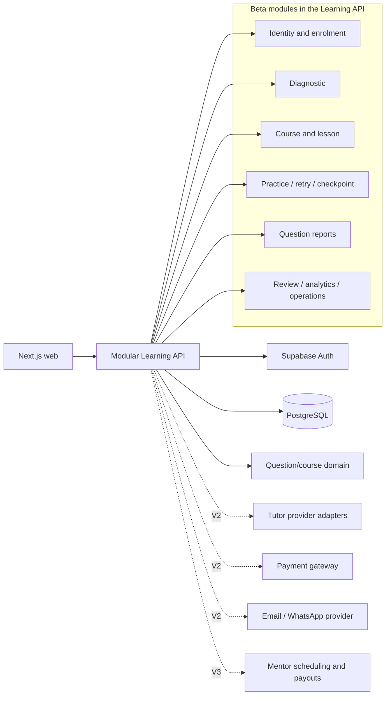

# Beta, V2 and V3 technical execution plan

**Status:** Current delivery companion to
[ROADMAP_BETA_V2_V3.md](ROADMAP_BETA_V2_V3.md).

**Audited:** 29 September 2026 against commit `993a798` plus the product roadmap
commit `b9763e7`.

**Purpose:** Convert the product roadmap into an executable sequence, correct stale
implementation statuses, identify content and external-service dependencies, and keep
the December beta small enough to operate safely.

For an investor-oriented summary followed by the detailed current technical stack,
architecture, security, scaling and AI-tutor design, see
[PRODUCT_TECHNOLOGY_ARCHITECTURE_INVESTOR_OVERVIEW.md](PRODUCT_TECHNOLOGY_ARCHITECTURE_INVESTOR_OVERVIEW.md).

The product roadmap remains the source for desired behaviour. This document is the
source for engineering order, release gates and technical readiness. `PLAN_V2.md`
continues to define domain boundaries and long-term architecture.

## Five-level difficulty foundation

The authoring and runtime contracts now use a shared Level 1–5 rubric. Existing N1 content remains at `15/15/10/0/0`; new topic calibration batches can include Levels 4 and 5. See [FIVE_LEVEL_DIFFICULTY_MIGRATION.md](FIVE_LEVEL_DIFFICULTY_MIGRATION.md) for stage ranges, compatibility, database rollout, and review rules.

## 1. Feasibility decision

A **full Secondary 1–2 Mathematics invitation beta for 10–30 students is technically feasible in
December 2026** if the team freezes the scope described below and validates a real
hosted staging deployment early.

Codex makes a larger December Beta technically plausible because backend, tests, API
contracts, migrations and integration work can move in parallel. It does not remove the
human gates for mathematical review, videos, final design acceptance, privacy decisions,
external-provider setup or testing with real students. At the stated 10–25 combined team
hours per week, treating every roadmap row as a mandatory launch gate would still put too
many independent dependencies on one critical path.

The recommended release split is:

- **December Beta core:** invitation access, a full Sec 1–2 Mathematics readiness diagnostic, reviewed
  notes, guided practice, spaced retry, unit checkpoint, progress, question reporting,
  essential admin operations, responsive NextScholar frontend and production safety.
- **December Beta stretch:** all seven videos and an expiring parent-share link. Neither
  blocks a learning beta when reviewed notes/transcripts and internal score reporting
  are available.
- **Move to V2:** English grammar, essay AI, self-service content editors, Sec 3 content,
  open signup, payments, parent delivery, tutor and gamification.
- **Build behind a flag when capacity allows:** the provider-neutral tutor and usage
  ledger. It is useful engineering work before V2, but it is not a Beta release gate.

January 2027 is plausible for a **reduced public paid release** only if the December
beta starts early and V2 is limited to open signup, Sec 1 Maths, entitlements,
payments, a grounded tutor and basic parent email. The full V2 list should be shipped
incrementally through the first 2027 application cycle rather than tied to one January
date.

V3 is appropriately placed after demand, parent engagement and managed mentor sessions
have been measured.

### 1.1 Codex-adjusted delivery assessment

The updated Beta features are not being rejected. They are split by confidence and can
all remain visible in the roadmap:

- **Commit to the controlled Beta:** B-01–B-07, B-09–B-13, B-16–B-18, B-21–B-25 and
  B-27–B-29, subject to their review, hosted and accessibility gates.
- **Include when the parallel owner finishes:** B-08 videos and B-26 final brand assets.
  Reviewed notes keep the learning flow usable if video production finishes later.
- **Run behind a disabled flag or separate pilot:** a narrow grounded tutor can be built
  early, but it should not receive real student data or become a Beta promise until its
  evaluation and quota controls pass.
- **Keep out of the December launch gate:** B-14/B-15 English, browser-based lesson/course
  editors, payments, public signup, Sec 3 content and gamification. These require new
  reviewed content, policy or provider operations beyond writing code.

Codex changes implementation throughput, so this plan should be re-estimated after each
milestone instead of using the original calendar estimate mechanically. Scope only moves
into the committed cohort when it has an owner, acceptance test and safe fallback. This
allows the team to ship more when work finishes early without delaying the core learning
experiment.

## 2. Current technical baseline

The current integrated feature chain already contains more than the new roadmap's
`feature/beta-operations` status column reflects:

- Supabase Google authentication, invitation acceptance and database-backed roles;
- invitation-bound course enrolment and immutable course/question revisions;
- seven N1 lesson shells and one draft lesson-note implementation;
- 40 draft questions with deterministic numeric/expression checking;
- guided practice, two hints, Give up, worked solutions and idempotent attempts;
- retry selection, lesson proficiency, checkpoint/mastery policies and PostgreSQL
  persistence;
- course, lesson, practice, progress and administrator web pages using generated API
  contracts;
- administrator invitations, student/question analytics, roles, curriculum migration,
  content-review workflow, audit history and operations status;
- authenticated browser journeys against disposable PostgreSQL;
- staging and production deployment workflows, health/readiness, structured logs,
  migration safety and release identity;
- shared mutation rate limits, request-size limits and append-only security events; and
- a real PostgreSQL dump/restore integrity drill.

The current blockers are product completion rather than basic infrastructure:

- the 40 questions and most lesson material remain unreviewed drafts;
- the final frontend has not replaced the technical shell;
- a real hosted staging environment has not passed the manual Google sign-in journey;
- the course-map UI still labels the checkpoint as pending despite backend support;
- retry evidence exists, but due-date spacing and variant selection do not;
- diagnostic persistence/API/UI are implemented as an N1 pilot slice, but the 19-topic catalogue and 76 production diagnostic items remain unauthored and unpublished;
- question reports and account deletion are implemented locally, but still need hosted
  rehearsal and final B4 frontend integration.

The `main` branch is also behind the stacked feature chain. No beta deployment should
be cut directly from `main` until the feature branches are consolidated through a
reviewed integration pull request.

## 3. Corrected Beta readiness audit

`Implemented` means code and tests exist. It does not mean hosted configuration, final
content or final design has been approved.

| ID   | Audited readiness                                                               | Required action                                                                                                                   |
| ---- | ------------------------------------------------------------------------------- | --------------------------------------------------------------------------------------------------------------------------------- |
| B-01 | Implemented; hosted journey still needs verification                            | Deploy staging, test expiry/revocation/email matching with real Google accounts                                                   |
| B-02 | Implemented; external OAuth configuration remains                               | Verify callback, refresh, sign-out and private-window login in staging                                                            |
| B-03 | Partial                                                                         | Invitations currently choose the course. Keep invitation-assigned Sec 1 for Beta; defer student selection and Sec 3               |
| B-04 | Technical implementation complete; production forms content-pending             | Generalise the syllabus/bank contract and author/review/import 76 isolated matched items, then verify baseline/endline in staging |
| B-05 | Authenticated learner result and admin comparison implemented                   | Validate final design; private share link/PDF remains stretch                                                                     |
| B-06 | Implemented technical shell                                                     | Integrate final responsive design and reviewed content states                                                                     |
| B-07 | Versioned lesson infrastructure implemented; content incomplete                 | Author and review all seven lesson notes and active-recall sections                                                               |
| B-08 | Metadata/handoff designed; no delivery                                          | Choose host and add captions/transcripts; allow notes/transcript fallback for Beta                                                |
| B-09 | Implemented technical vertical slice                                            | Review questions and integrate final interaction/error/loading states                                                             |
| B-10 | Immediate retry exists                                                          | Add durable due dates, spacing state, daily cap and reserve-question selection                                                    |
| B-11 | Backend checkpoint/mastery implemented; learner UI says pending                 | Review pool, expose start/resume/results UI and run failure/retake/pass journey                                                   |
| B-12 | Implemented technical page                                                      | Add due dates, diagnostic comparison and final responsive design                                                                  |
| B-13 | Implemented locally; final UI/hosted workflow remain                            | Validate learner submission and admin resolution in staging/B4                                                                    |
| B-14 | No production domain/API                                                        | Move to V2 unless a separate owner and reviewed English bank are ready                                                            |
| B-15 | No production domain/API or AI evaluation                                       | Move to V2; do not make open-ended AI feedback a Beta dependency                                                                  |
| B-16 | Admin navigation and pages implemented                                          | Apply final design and verify role-specific navigation                                                                            |
| B-17 | Implemented                                                                     | Verify hosted creation/revocation/audit and invitation secret handling                                                            |
| B-18 | Review API, safe preview, UI and lifecycle audit implemented                    | Use it on real content; reconcile the roadmap's “3 reviews” with the implemented Maths/editorial plus academic publication rule   |
| B-19 | Review/version infrastructure exists; browser editor does not                   | Keep lesson authoring in reviewed Git for Beta; defer editor to V2                                                                |
| B-20 | Versioned Git course/pools and importers exist; browser editor does not         | Keep Git as source for Beta; defer editor to V2                                                                                   |
| B-21 | Implemented with B-13                                                           | Validate administrator reports inbox in staging/B4                                                                                |
| B-22 | Broad audit exists for invitations, roles, course changes and content lifecycle | Add question-report and account-lifecycle events; verify export/retention needs                                                   |
| B-23 | Implemented administrator student progress and aggregate analytics              | Validate against real staging accounts and final UI                                                                               |
| B-24 | Deletion, retention, restore, monitoring and rate limits complete locally       | Rehearse hosted alerts, limits, load and rollback before inviting students                                                        |
| B-25 | Not implemented                                                                 | Perform one repository-wide brand migration; retain internal package/database identifiers where renaming adds risk                |
| B-26 | Designed externally                                                             | Integrate accessible assets, metadata and icons after the design handoff                                                          |
| B-27 | Partial component primitives exist                                              | Map Figma components to existing API states and add missing error/empty/loading/focus states                                      |
| B-28 | Technical shell is responsive in places, not acceptance-tested                  | Test 390/768/1440 widths and keyboard/screen-reader paths                                                                         |
| B-29 | Not implemented in product form                                                 | Replace the developer home screen with the invite-only NextScholar landing page                                                   |

## 4. Beta scope contract

The following decisions prevent hidden scope from re-entering the December critical
path.

### 4.1 Recommended product defaults

- **Track:** every Beta invitation pins the Sec 1 course. No learner track picker.
- **Diagnostic:** Mathematics across all 19 supplied Sec 1–2 topic groups, described as a readiness check rather than a predicted scholarship result.
- **Measurement:** use two matched 38-question forms with two items for each of the 19 topic groups per form. Therefore 76 separate reviewed diagnostic items are required. Do not reuse practice/checkpoint questions or the identical form at the end.
- **Report:** authenticated learner results and administrator comparison are required.
  An expiring parent link or PDF is stretch work.
- **English:** defer B-14 and B-15 to V2.
- **Videos:** ship them when ready, but reviewed notes and transcripts are the reliable
  learning fallback. The video host must not block the first technical pilot.
- **Authoring:** Git JSON/Markdown plus the existing review/publication gate remains the
  Beta workflow. Browser lesson/course editors move to V2.
- **Tutor:** disabled for students during Beta unless its fixed evaluation set passes.
  Authored hints and solutions remain the default help.
- **Deletion:** a documented, audited administrator procedure is sufficient for an
  invite-only cohort; self-service deletion can follow in V2.

### 4.2 Beta is ready only when

1. A new invited Google user can onboard, complete the first diagnostic, learn, practise,
   retry due work, finish the checkpoint and complete the final diagnostic.
2. Refresh, sign-out/sign-in and a second browser preserve the correct state.
3. Locked hints/solutions and checkpoint rules cannot be bypassed through direct API
   calls.
4. An administrator can invite/revoke, review content, inspect reports and progress,
   change allowed roles, inspect operations and follow request IDs through audit/logs.
5. Every student-visible question and lesson revision has the required human approvals.
6. Staging passes authenticated E2E, database restore, rate-limit and bounded load checks.
7. The final frontend passes keyboard, focus, contrast, mobile and slow/error-state checks.
8. Account deletion, incident response, rollback and restore procedures have named owners.
9. No real student data is sent to a free-tier AI provider.

## 5. Beta engineering milestones

Milestones are ordered by dependency. Content and final frontend work should run in
parallel with backend work, but release gates remain shared.

Indicative engineering effort, assuming the current code remains the baseline:

| Milestone |  Focused engineering effort | Calendar implication                                                      |
| --------- | --------------------------: | ------------------------------------------------------------------------- |
| B0        |            2–4 working days | Do first; external credentials can extend elapsed time                    |
| B1        |           7–10 working days | Backend and diagnostic frontend can overlap                               |
| B2        |           7–10 working days | Retry/report backend and checkpoint UI can overlap                        |
| B3        |            3–5 working days | Runbooks and operational rehearsal                                        |
| B4        | 10–15 frontend working days | Runs in parallel after API/fixture contracts freeze                       |
| B5        |       5–10 engineering days | Integration, bug fixing and pilot support; excludes authoring/review time |

At 10–25 combined team hours per week, the reduced Beta requires roughly 7–10 calendar
weeks when frontend and content proceed in parallel. External setup delays or late content
can consume that margin. These ranges are planning bounds, not delivery promises.

### B0 — Consolidate and prove the hosted baseline

**Purpose:** stop building on an unmerged chain and expose external configuration failures
early.

- Create one reviewed integration PR containing the complete feature chain and the
  product/technical roadmaps.
- Resolve `main` divergence and retain both sets of sample papers without rewriting
  published history.
- Run all Python, PostgreSQL, browser and Next.js checks from the merge result.
- Configure the isolated staging GitHub environment, Supabase project, Railway services
  and Google OAuth client.
- Add `STAGING_ABUSE_HASH_SECRET` and other documented staging secrets.
- Deploy staging, run the automated smoke, then complete the manual Google journey.
- Record a known-good release SHA and rehearse rollback once.

**Exit:** an invited test account can reach the current N1 shell in hosted staging and an
academic administrator can reach all protected admin pages.

### B1 — Mathematics diagnostic and evidence baseline

**Engineering status (29 September 2026): reusable engine and N1 pilot slice complete.** Full-syllabus catalogue/form activation remains a content-platform and B5 gate. See [N1_DIAGNOSTIC_EVIDENCE.md](N1_DIAGNOSTIC_EVIDENCE.md).

**Data model**

- `diagnostic_forms`: stable key, revision, track/course pin, purpose (`baseline` or
  `endline`), status and content hash.
- `diagnostic_form_items`: exact question revision, outcome, position and weight.
- `diagnostic_sessions`: learner, form revision, state, started/submitted timestamps and
  idempotency data.
- `diagnostic_responses`: autosaved answer payload, deterministic score and timestamps.
- `diagnostic_results`: immutable aggregate score, outcome scores and band-policy version.

**API**

```text
GET  /api/v1/diagnostics/next
POST /api/v1/diagnostics/sessions
GET  /api/v1/diagnostics/sessions/{id}
PUT  /api/v1/diagnostics/sessions/{id}/responses/{position}
POST /api/v1/diagnostics/sessions/{id}/submit
GET  /api/v1/diagnostics/sessions/{id}/result
GET  /api/v1/admin/students/{id}/diagnostics
POST /api/v1/admin/students/{id}/diagnostics/{purpose}/reset
```

- Reuse deterministic question checking without returning correctness until submission.
- Autosave one answer at a time with idempotency and ownership checks.
- Pin every response to immutable form and question revisions.
- Calculate outcome results server-side using a versioned band policy.
- Make baseline/endline eligibility server-owned and non-repeatable except through an
  audited admin reset.
- Exclude diagnostic questions from practice, checkpoint and reserve pools.

**Exit:** refresh-safe baseline and endline forms produce reproducible outcome scores and
an administrator can compare them.

### B2 — Spaced retry, checkpoint completion and problem reports

**Engineering status (29 September 2026): complete locally.** See [B2_RETRY_CHECKPOINT_REPORT_EVIDENCE.md](B2_RETRY_CHECKPOINT_REPORT_EVIDENCE.md). Hosted and final-content gates remain.

**Spaced retry**

- Extend `question_progress` with scheduling state, `due_at`, last resolution and review
  streak; keep immutable attempts as the recalculation source.
- Implement the 2/4/7/14-day state transition as a pure tested policy function.
- Cap due review at five questions per learner day, ordered by overdue time.
- From the second review, select a different eligible reserve question with the same
  outcome and level; fall back transparently when the pool lacks capacity.
- Treat server/database time as authoritative and display dates in the learner timezone.

**Checkpoint**

- Remove the hardcoded “pending” presentation when the reviewed pool is available.
- Add learner start, resume, completion and result states around the existing backend.
- Preserve one-attempt answers, no hints/Give up, 6-of-8 pass and retake behaviour.

**Question reports**

- Add `question_reports` with learner, immutable question/session references, category,
  comment, status, resolution, actor and timestamps.
- Categories: possible error, unclear wording, display problem and other.
- Add create/list/detail/resolve endpoints with learner ownership and admin role checks.
- Emit audit events without copying submitted answers into audit metadata.

**Exit:** a wrong/given-up question becomes due at the correct time, checkpoint mastery is
usable in the web app, and an admin can resolve a learner report.

### B3 — Operational privacy and release controls

**Engineering status (29 September 2026): backend and local operational rehearsal complete.** See [B3_OPERATIONAL_PRIVACY_RELEASE_CONTROLS.md](B3_OPERATIONAL_PRIVACY_RELEASE_CONTROLS.md). Hosted load/rate-limit, backup-retention, alert-delivery and rollback evidence remain release gates.

- Add an account-deletion runbook and protected script/endpoint with preview, explicit
  target confirmation, audit and a defined treatment of legally/operationally retained
  records.
- Define retention for tutor-free Beta data, security events, audit events and reports.
- Add report/diagnostic counts and failures to administrator operations/analytics.
- Verify database restore against the new tables.
- Add external uptime/error alerting or document the named person watching current GitHub
  availability checks during the cohort.
- Run rate-limit tests against staging and the bounded health/read load smoke.

**Exit:** the team can answer how to delete, restore, investigate and roll back before
accepting the first student.

### B4 — Final frontend integration

**Engineering status (30 September 2026): B4.1 wires the authenticated `/learn` dashboard and `/courses/[courseKey]` map to live APIs. B4.2 integrates `/lessons/[lessonKey]` and guided `/practice/[sessionId]`. B4.3 integrates live `/progress`, retry-review entry and checkpoint start/resume/retake. B4.4 integrates Google sign-in and invitation onboarding. B4.5 integrates the readiness landing, autosaving diagnostic player and outcome result. B4.6 integrates all administrator routes with role-aware NextScholar navigation and exposes the protected report resolution, diagnostic reset and signed account-deletion workflows. B4.7 completes the automated authenticated contract, role, keyboard and 390/768/1440 responsive acceptance suite. The previous visual shells remain behind the server-only `ASEAN_ACADEMY_BETA_LEARNING_UI` rollback flag. Hosted Google OAuth, screen-reader/contrast spot checks and founder visual sign-off remain B5 release gates.** See [B4_FRONTEND_KIT_INTEGRATION_AUDIT.md](B4_FRONTEND_KIT_INTEGRATION_AUDIT.md).

The final frontend consumes the generated OpenAPI client and existing same-origin proxy.
It must not duplicate business rules or call PostgreSQL/Supabase learning tables directly.

- Rebrand user-facing strings and assets to NextScholar.
- Map Figma components to route/API states before replacing pages.
- Integrate login, onboarding, diagnostic, learning home, course, lesson, practice,
  checkpoint, progress and report flows.
- Integrate admin overview, students, questions, content review, reports, invitations,
  audit, users/roles and operations.
- Preserve semantic HTML, KaTeX accessibility, keyboard operation and visible focus.
- Add screenshots/visual checks at 390, 768 and 1440 px for critical flows.
- Keep errors mapped by API `code`, with request IDs available for support.

**Exit:** the final UI passes the same authenticated E2E contract as the technical shell.

### B5 — Content release and controlled pilot

**Engineering status (30 September 2026): the fail-closed release-evidence gate, protected GitHub rehearsal, exact-SHA/content binding, diagnostic-isolation checks and controlled cohort phases are implemented. The current N1 source remains below the 19-topic-group/1,900-question/76-diagnostic threshold, six lesson notes remain empty, content is draft, and hosted/manual evidence has not passed. See [B5_CONTENT_RELEASE_CONTROLLED_PILOT.md](B5_CONTENT_RELEASE_CONTROLLED_PILOT.md).**

**Catalogue foundation (30 September 2026):** generic Secondary 1/2 topic, outcome, bank, multi-unit course and PostgreSQL import contracts are implemented. The complete registry now contains two courses, 19 level-specific topic groups and 87 outcome-linked lesson slots; only N1 currently has authored deployable content. The supplied official pages confirm the complete scope: 13 unique topic codes, 19 level-specific topic groups and 87 outcomes. See [B5_GENERALIZED_CONTENT_CATALOGUE.md](B5_GENERALIZED_CONTENT_CATALOGUE.md) and [G3_MATHEMATICS_SYLLABUS.md](../reference/G3_MATHEMATICS_SYLLABUS.md).

**Shared review integration (1 October 2026):** every authored bank can now enter the
protected administrator queue before it becomes learner-deployable. Reviewers can filter
by authoring batch, inspect full answers, hints and solutions, and record separate
Mathematics and editorial decisions tied to the exact content fingerprint. The portable
HTML/Markdown/CSV packet remains a fallback. See
[SHARED_CONTENT_REVIEW_STAGING.md](SHARED_CONTENT_REVIEW_STAGING.md).

**Multi-author automation (1 October 2026):** a versioned claim registry now prevents
two active branches from owning the same question batch. Pull-request CI enforces the
claim and single-batch boundary, runs aggregate validation and duplicate detection, adds
a concise job summary, and uploads reviewer-ready HTML, Markdown, CSV and JSON evidence.
See [MULTI_AUTHOR_QUESTION_PIPELINE.md](MULTI_AUTHOR_QUESTION_PIPELINE.md).

The bulk authoring sequence and approximately 1,900–2,850-question target are defined in [QUESTION_BANK_SCALE_PLAN.md](QUESTION_BANK_SCALE_PLAN.md).

- Review the existing N1 pilot, build the 19-topic bank, and create/review 76 matched diagnostic items.
- Author/review all seven notes, examples, active-recall items, hints and solutions.
- Confirm checkpoint/reserve capacity after diagnostic isolation.
- Import approved immutable revisions and verify catalogue/database hashes.
- Run a founder alpha with fresh accounts, then 3–5 friendly users before inviting 10–30.
- Freeze schema/content changes during the first cohort except incident fixes.
- Measure baseline/endline change, weekly activity, lesson proficiency, retry completion
  and reports per 100 attempted questions.

**Exit:** all Beta readiness criteria pass and the founders agree on a release SHA,
content revision and cohort list.

## 6. Parallel work lanes

| Lane                | Can proceed now                                                                                              | Blocks Beta                                 |
| ------------------- | ------------------------------------------------------------------------------------------------------------ | ------------------------------------------- |
| Backend             | B0 integration, diagnostics, spaced retry, reports, deletion runbook                                         | Yes                                         |
| Frontend            | NextScholar tokens/components and screens against fixtures/OpenAPI                                           | Yes                                         |
| Mathematics content | Generalized 19-topic bank, approximately 1,976 first-target items, 76 diagnostic items, notes and pool audit | Yes                                         |
| Video               | Host experiment, captions, transcripts, posters                                                              | Only if the team makes all videos mandatory |
| English             | Taxonomy, question/essay format and rubric research                                                          | No; V2                                      |
| AI tutor            | Provider interface, quotas and synthetic evaluation behind a flag                                            | No; V2                                      |
| Operations          | Staging credentials, tester invitations, privacy/consent text, support owner                                 | Yes                                         |

API fixtures should be versioned and generated. The frontend owner should not wait for a
hosted backend for every screen, and backend work should not depend on final styling.

## 7. V2 technical sequence

V2 should extend the modular Learning API rather than create a microservice for each
feature.

### V2.0 — Product identity, entitlements and dates

- Open registration while retaining invitation/promotional enrolment paths.
- Add plans, entitlements, access periods, intake/test dates and feature allowances.
- Put every paid restriction behind a server-side entitlement check.
- Keep price calculation versioned and server-owned; store the quoted formula inputs.
- Add consented parent contact separately from the student's authentication identity.

### V2.1 — Payments and public release safety

- Integrate one gateway with QRIS, virtual accounts and supported e-wallets.
- Treat signed webhooks as the payment source of truth; make processing idempotent.
- Model orders, payment attempts, access grants, refunds, guarantees and instalment state.
- Never unlock access from a browser “payment successful” redirect alone.
- Add payment audit/admin views, reconciliation and support procedures.
- Implement pro-rated season pricing only after the product decision is confirmed.

### V2.2 — Grounded tutor and AI cost controls

**Implementation update (8 October 2026):** The provider-neutral foundation, Gemini
evaluation path, multi-turn administrator lab, and deterministic economy/premium router
are implemented on the tutor feature chain. Shadow mode records premium recommendations
while executing only the economy provider, and monthly administrator evidence compares
recommended versus executed premium routes and projected versus actual cost. The routing
score, GPT-4o premium adapter, append-only evidence schema, cost reservations, and rollout gates are defined in
[TUTOR_HYBRID_MODEL_ROUTING.md](TUTOR_HYBRID_MODEL_ROUTING.md). Hosted migration and
human evaluation remain release gates.

The next implementation milestone is the administrator-only staging shadow pilot defined in
[TUTOR_SHADOW_ROUTING_STAGING_MILESTONE.md](TUTOR_SHADOW_ROUTING_STAGING_MILESTONE.md).
It adds a server-side rollout cohort, decision-level evidence API, administrator evidence
panel, staging activation runbook and measurable go/no-go gates before any live premium
request is allowed.

**Implementation update (9 October 2026):** The server-side `academic_admin` cohort gate,
routing status endpoint and cursor-paginated decision evidence endpoint are implemented.
The next work package renders this evidence in the existing Tutor Evaluation Lab.

- Add provider-neutral Gemini/Anthropic/OpenAI adapters and a disabled provider.
- Develop first with a private server-side Gemini free-tier key using synthetic data only.
- Add tutor sessions/messages, prompt-policy versions, answer-lock context and structured
  output validation.
- Add durable daily reservations/reconciliation for requests, input/output tokens and
  actual provider cost.
- Add learner, academy and provider circuit breakers plus administrator usage analytics.
- Run fixed correctness, pedagogy, leakage, latency and cost evaluations before choosing
  the paid public provider.
- Keep authored hints/solutions available when AI is disabled or quota is exhausted.

### V2.3 — Free/paid learning policy

- Add weekly solution allowances only after entitlements exist.
- Preserve unlimited authored hints and deterministic marking.
- Add recheck quizzes using reserve capacity and immutable proficiency evidence.
- Build the first study planner as deterministic weekly rules over diagnostic, due review,
  progress and test date.
- Add light XP/streaks only after the core evidence events are stable; do not award XP for
  raw correctness or speed.

### V2.4 — Parent communication and English

- Use a transactional email provider first; add WhatsApp only with consent, templates,
  delivery-state handling and an explicit business case.
- Generate weekly summaries from aggregate progress, never raw answers.
- Create English objective-question contracts separately from Mathematics answer specs.
- Build essay submission/versioning, rubric evaluation, AI disclosure, human escalation,
  quotas and an evaluation set before selling essay feedback.
- Treat Sec 3 and further units primarily as reviewed content programmes on the existing
  platform, with schema changes only when real content proves they are needed.

### V2.5 — Authoring productivity

- Build browser lesson/course editors only after the Git workflow becomes a measured
  bottleneck.
- Preserve immutable revisions, preview, review dimensions, publication requests and
  audit regardless of editing UI.
- Promote OCR output only into candidate content; retain human verification before
  publication.

## 8. V3 architecture triggers

Do not split the modular application into services based only on roadmap labels. Consider
new deployable services when one of these triggers exists:

- notification/email work requires a durable queue and independent retry/throughput;
- payment webhooks need isolation from learner traffic;
- tutor generation latency or provider concurrency harms normal API latency;
- mentor scheduling/payout ownership becomes operationally independent; or
- analytics volume requires a read model/warehouse rather than PostgreSQL queries.

V3 mentor functionality should follow a completed managed-session experiment. Parent
accounts require an explicit child-parent relationship, consent and permissions rather
than reusing a student's Google session. Native mobile should remain deferred until usage
data shows that a responsive/PWA experience is inadequate.

## 9. Data and service boundaries by release



Beta should continue to operate as two application processes: Next.js and the FastAPI
Learning API. PostgreSQL is the runtime source of truth for identity-linked learning
state; reviewed Git content remains the authoring source of truth.

## 10. Verification matrix

| Capability      | Unit/domain                   | PostgreSQL integration                | API contract          | Browser E2E          | Hosted manual            |
| --------------- | ----------------------------- | ------------------------------------- | --------------------- | -------------------- | ------------------------ |
| Invitation/auth | Token and invite rules        | Profile/enrolment transaction         | Identity errors/roles | Google test boundary | Real Google callback     |
| Diagnostic      | Scoring/bands/eligibility     | Autosave, ownership, immutable result | No early feedback     | Resume and submit    | Real invited learner     |
| Practice        | Deterministic answer policies | Idempotency and progress              | Hint/solution locks   | Wrong/retry/give-up  | Multi-device persistence |
| Spaced retry    | 2/4/7/14 transition           | Due concurrency and ordering          | Server time/due state | Daily review flow    | Timezone check           |
| Checkpoint      | Pass/retake policy            | Mastery transaction                   | Support locked        | Failure and pass     | Refresh/multi-tab        |
| Reports         | Category/state transitions    | Ownership/audit                       | Safe metadata         | Submit/admin resolve | Support workflow         |
| Operations      | Limit/retention policies      | Restore signatures                    | Health/readiness      | Admin status         | Rollback/restore drill   |
| Tutor (V2)      | Prompt/lock/quota policy      | Reservation/reconciliation            | Structured output     | Multi-turn fallback  | Provider/cost alert      |
| Payments (V2)   | Entitlement/price policy      | Idempotent webhook                    | Signed event errors   | Checkout states      | Reconciliation/refund    |

## 11. Decisions and ownership to record

The plan proceeds with the recommended Beta defaults unless the founders explicitly
change them. Before V2 implementation, record these product decisions:

1. exact December pilot date and content freeze date;
2. whether all seven videos are a Beta gate;
3. whether a parent-share link is Beta core or stretch;
4. the first public V2 subset and whether January is a pilot or full launch;
5. free worked-solution allowance;
6. lesson access policy for free users;
7. pro-rated versus flat season pricing;
8. payment gateway and refund/instalment operating process;
9. parent-contact consent and delivery channel; and
10. model/provider selected by the tutor evaluation, not by brand preference alone.

Every P0 item needs one named owner across backend, frontend, content or operations. A
feature without an owner and acceptance test is not in the release even when a design
screen exists.

## 12. Immediate next actions

1. Review and merge this scope decision with the product roadmap.
2. Consolidate the stacked feature branches into a beta integration PR.
3. Configure and deploy the real isolated staging environment.
4. Generalise the bank schema, then commission, review and import 76 matched full-syllabus diagnostic items.
5. Implement B2 spaced retry, checkpoint UI and reports.
6. Complete B3 privacy/operations and the final frontend integration.
7. Activate the B1 forms and run the hosted baseline/endline acceptance journey.
8. Run the controlled pilot before opening the 10–30 student cohort.

The grounded tutor scaffold is the first non-blocking V2 backend milestone after the
Beta integration baseline is stable.
