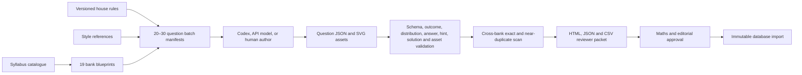

# Bulk question-authoring pipeline

## What the pipeline is

The pipeline is the controlled workflow around authored question JSON. A JSON Schema is one component: it describes the allowed shape of a blueprint, batch manifest, house-rules file, or question. The pipeline also creates work allocations, records provenance, runs executable checks, detects duplicates, and packages content for human review.



Question generation is deliberately separate from runtime student requests. Models or authors create repository files in claimed batches; the Learning API serves only validated, reviewed, imported revisions.

## Repository layout

```text
backend_resources/question_bank/
  authoring/house-rules-v1.json
  schema/question-batch-manifest-v1.schema.json
  schema/question-house-rules-v1.schema.json
  g3_math/<school_level>/<topic>/v1/
    blueprint.json
    batches/<batch-id>.json
    questions/<stable-key>.json
    assets/*
```

All 19 level-specific topic groups now have 104-question target blueprints. The existing 40 N1 draft questions remain unchanged and occupy their matching blueprint cells; its remaining 64 questions are split into batches of 22, 21, and 21. Each of the other 18 banks is split into four 26-question manifests. Together, 75 manifests reserve 1,936 new questions, producing the 1,976-question initial inventory when combined with the N1 pilot.

## Commands

From the repository root:

```bash
uv run --project question_bank question-bank authoring-schema
uv run --project question_bank question-bank authoring-blueprints
uv run --project question_bank question-bank authoring-plan
uv run --project question_bank question-bank authoring-validate
```

Export an authored batch after its manifest lists all generated question keys:

```bash
uv run --project question_bank question-bank authoring-export \
  backend_resources/question_bank/g3_math/secondary_1/n2/v1/batches/g3-sec1-n2-b001.json \
  /tmp/g3-sec1-n2-b001-review
```

The export contains `index.html`, the manifest, source question JSON, validation evidence, a reviewer CSV, and referenced assets.

## Batch lifecycle

1. `planned`: exact outcome/difficulty allocation and stable keys exist; generator fields may be `unassigned`.
2. `draft`: all 20–30 question keys exist and concrete provider, model, generator version, and prompt version are recorded.
3. `ready_for_review`: automated validation succeeds and the packet is exported.
4. `changes_requested`: reviewer corrections are required.
5. `approved`: mathematics and editorial decisions are both approved.

A batch cannot move beyond `planned` with missing question keys or placeholder generator metadata. An `approved` manifest cannot retain pending review decisions.

## Validation boundary

The authoring validator checks:

- complete blueprint coverage of all 19 syllabus topic groups;
- exact aggregate batch coverage of every blueprint outcome and difficulty cell;
- unique batch IDs and exclusive question ownership;
- source-reference checksums;
- question schema, bank, curriculum, topic and outcome alignment;
- exactly two ordered hints and internally consistent solution marks through the question model;
- canonical and explicitly accepted answers by executing the deterministic checker;
- referenced asset existence and SHA-256 checksums;
- exact prompt duplicates as errors; and
- number-normalised near-prompt matches as reviewer warnings.

Near-duplicate warnings are evidence for a reviewer because similarity can be legitimate in short procedural questions. Exact duplicates fail validation.

## Parallel Codex authoring

Each contributor claims one manifest, updates its generator metadata, works on a separate branch, and authors only the allocated cells. The manifest is the coordination contract, so contributors do not depend on shared conversation memory. Aggregate validation must run again after branches merge.

Additional examination papers can be added as checksum-tracked style references later. They improve calibration but are not needed to build or exercise this workflow.
