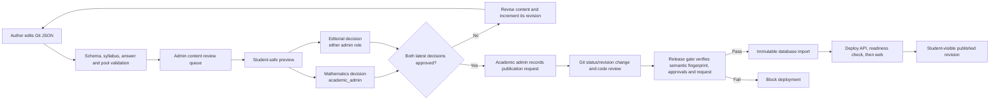
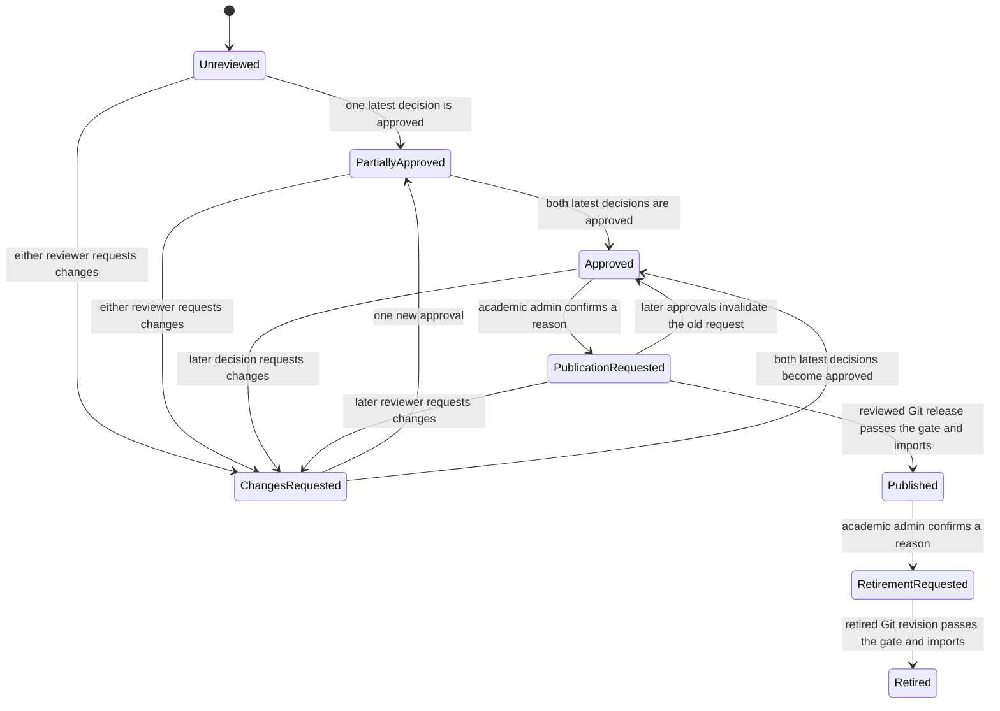

# Content review and controlled publication

**Implementation branch:** `feature/content-review-publication`
**Required schema revision:** `202609280010`
**Current catalogue:** one course, seven lessons and 40 questions; every item remains a draft.

## Purpose

This milestone adds the human approval trail between authored JSON and a student-visible
release. It does not turn the admin dashboard into an unrestricted content editor. Git
remains the source of truth for lesson and question content, while PostgreSQL stores
append-only decisions and release requests.

The separation prevents a dashboard click from making runtime data disagree with the
deployed source files. A release becomes student-visible only after the Git revision,
database import and deployment checks all agree.

## Roles and separation of duties

| Action | `content_admin` | `academic_admin` |
| --- | --- | --- |
| List and filter the review queue | Yes | Yes |
| Preview the exact student-visible content | Yes | Yes |
| Record editorial approval or request changes | Yes | Yes |
| Record Mathematics approval or request changes | No | Yes |
| Request publication or retirement | No | Yes |
| Change authored JSON or its publication status | Through the normal Git review process | Through the normal Git review process |

The API reads `profiles.role` for every protected request. Hiding controls in the web
interface is only a convenience; backend authorization is authoritative.

## Data flow



## Semantic fingerprint and stale-review protection

Each queue item has two hashes:

- `source_content_sha256` identifies the exact authored revision and all persisted
  fields.
- `review_fingerprint` identifies the teaching content. It excludes only workflow
  metadata such as revision number, status and reviewer metadata.

Review and lifecycle requests submit both hashes and the source revision. The API
rejects a stale browser page if any submitted value no longer matches the deployed
catalogue. Changing a prompt, mark, answer, hint, worked solution, asset, objective or
other teaching field changes the review fingerprint and requires new decisions.

A status-only transition can retain decisions because the reviewed teaching content
has not changed. The immutable source hash still changes and is checked by the normal
content importer.

## Review state rules



A publication request is active only when it is newer than both latest approvals. If a
reviewer later requests changes, or records a newer approval after requested changes,
the old publication request becomes inactive. The academic administrator must inspect
the latest decisions and create a fresh request.

## Append-only database records

Migration `202609280010_content_review_workflow.sql` adds:

- `content_review_records`: item identity, source revision/hash, semantic fingerprint,
  review dimension, decision, reviewer, notes, request ID and timestamp;
- `content_lifecycle_requests`: the same item identity plus publication/retirement
  action, requester, reason, request ID and timestamp; and
- three audit event types for review, publication request and retirement request.

Database triggers reject `UPDATE` and `DELETE` for both workflow tables. Corrections
are new records, preserving who decided what and when. Browser roles have no direct
table privileges. The API uses its server-only connection and enforces application
ownership and role rules.

## API contracts

All routes are below `/api/v1/admin/content`.

| Method and route | Role | Behavior |
| --- | --- | --- |
| `GET /` | either admin | Filter/paginate course, lesson and question review state |
| `GET /{kind}/{stable_key}/preview` | either admin | Return only the public student representation |
| `POST /{kind}/{stable_key}/reviews` | either admin; Mathematics requires academic | Append an approval or changes-requested decision |
| `POST /{kind}/{stable_key}/lifecycle-requests` | academic only | Append a publication or retirement request after eligibility checks |

The preview uses the same public serializers as the learning flow. It omits canonical
answers, answer specifications, hints, worked solutions and locked active-recall
feedback. The preview answer fields are disabled in the admin interface.

## Administrator workflow

1. Sign in with an administrator Google account.
2. Open <http://localhost:3000/admin/content>.
3. Filter by kind, authored status or review state, or search a stable key/title.
4. Select **Preview as student** and inspect exactly what the learner can see.
5. Choose Mathematics or editorial review, choose a decision, and record detailed
   notes. A content administrator can select editorial only.
6. Resolve every requested change in Git. Increment the authored revision whenever
   immutable content changes.
7. After both latest decisions approve the same fingerprint, an academic administrator
   selects **Review publication request**, enters the reason and confirms.
8. Create the reviewed/published Git revision without changing the approved teaching
   content, submit it for code review, and run the release pipeline.

The confirmation text states that the action records a request and does not directly
publish. Current draft content has no decisions or requests, so the student application
continues to show the development-preview restrictions.

## Release gate and deployment

Run locally from the repository root:

```bash
corepack pnpm release:content
```

The command loads the protected local API configuration and checks every non-draft
Git-authored item against PostgreSQL. It returns `checked_items: 0` while all content
is draft. A reviewed item requires both approvals. A published item also requires an
active publication request, and a retired item requires a retirement request.

The production workflow runs the same check after additive database migrations and
before immutable imports. A failed check stops the release. After it passes, deployment
continues in this order:

1. import question revisions;
2. import course and lesson revisions;
3. deploy the API;
4. wait for schema/content readiness and verify the release SHA;
5. deploy the web app; and
6. run the application smoke check.

Existing attempts and enrolments remain pinned to immutable revisions. Publication
does not rewrite learner history.

## Verification delivered

- Migration safety and a fresh-migration rehearsal cover the additive schema.
- PostgreSQL integration coverage verifies role separation, safe preview, dual
  approval, publication request invalidation, reapproval, a fresh request, audit rows
  and append-only mutation rejection.
- API tests verify student denial, content-admin preview and academic-only lifecycle
  requests.
- Browser component tests verify safe preview, disabled Mathematics review for a
  content administrator, review submission and explicit publication confirmation.
- OpenAPI and TypeScript contracts are generated from the backend models.

## Next backend milestones

The most useful follow-up is authenticated end-to-end coverage for Google sign-in,
onboarding, lesson progress, practice submission and the administrator review journey.
After that, add request throttling and abuse controls, database backup/restore drills,
and the grounded tutor conversation service. These tasks do not require final videos,
but tutor prompting should wait for approved lesson notes and worked solutions before
beta release.
