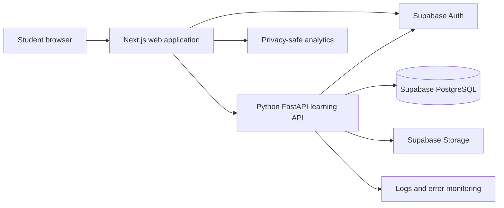

# ASEAN Academy frontend technology and Figma handoff plan

**Status:** Recommended implementation plan

**Audience:** Product designer, frontend implementer, backend developers, and AI coding assistants

**Last updated:** 21 September 2026

**Initial product slice:** Singapore Secondary 1 G3 Mathematics, beginning with N1 Numbers and their operations

## 1. Decision summary

Build the web frontend as a **Next.js App Router application written in TypeScript and React**.
Use **Tailwind CSS** for design tokens and layout, **shadcn/ui** for accessible component
foundations, and **KaTeX** for Mathematics. Generate the API types and client from the Python
API's OpenAPI document. Use **Supabase Auth** for identity, **TanStack Query** only where
interactive server-state caching is useful, and test the critical learner journeys with
**Playwright**.

The recommended stack is:

| Concern | Choice | Purpose |
|---|---|---|
| Runtime | Node.js 24 LTS | Supported production JavaScript runtime |
| Package manager | pnpm | Fast, strict dependency management and workspace support |
| Web framework | Next.js App Router | Routing, layouts, loading/error boundaries, server rendering |
| Language | TypeScript in strict mode | Compile-time contracts for screens, components, and API data |
| View library | React | Component composition and interactive learning flows |
| Styling | Tailwind CSS plus CSS custom properties | Translate Figma variables into maintainable design tokens |
| Component foundations | shadcn/ui | Accessible, locally owned primitives that can be restyled |
| Icons | Lucide React | Consistent SVG icon set; use only where an icon adds meaning |
| Mathematics | KaTeX | Render approved inline and display LaTeX |
| API schema | OpenAPI generated by FastAPI | One authoritative frontend/backend contract |
| API client | openapi-typescript plus openapi-fetch | Generated TypeScript paths and typed HTTP calls |
| Authentication | Supabase Auth and `@supabase/ssr` | Cookie-based browser session and server rendering support |
| Interactive server state | TanStack Query | Practice mutations, progress refreshes, retry and cache handling |
| Forms | React Hook Form plus Zod where needed | Accessible form state and client-side input feedback |
| Component tests | Vitest plus React Testing Library | Test visible behaviour and accessibility-oriented interactions |
| API mocking | Mock Service Worker | Use the same HTTP boundary in development and tests |
| Browser tests | Playwright | Verify complete learner flows on desktop and mobile viewports |
| Formatting and linting | ESLint and Prettier | Consistent code and early detection of common mistakes |

Node.js recommends production applications use an Active or Maintenance LTS line. Node 24 is
the current LTS line at the time of this decision. Revisit the runtime version during planned
dependency upgrades rather than changing it during feature work.

Useful official references:

- [Next.js App Router](https://nextjs.org/docs/app)
- [Next.js TypeScript](https://nextjs.org/docs/app/api-reference/config/typescript)
- [Tailwind CSS with Next.js](https://tailwindcss.com/docs/installation/framework-guides/nextjs)
- [shadcn/ui with Next.js](https://ui.shadcn.com/docs/installation/next)
- [KaTeX browser documentation](https://katex.org/docs/browser)
- [Supabase Auth with Next.js](https://supabase.com/docs/guides/auth/quickstarts/nextjs)
- [OpenAPI TypeScript](https://openapi-ts.dev/readme)
- [TanStack Query for React](https://tanstack.com/query/latest/docs/framework/react/installation)
- [Playwright](https://playwright.dev/docs/intro)
- [Node.js release schedule](https://nodejs.org/en/about/previous-releases)

## 2. Product and engineering goals

The frontend must let a student:

1. Sign in or accept a beta invitation.
2. See a clear course path and recommended next action.
3. Open a lesson and learn from text, Mathematics, examples, diagrams, and recall checks.
4. Attempt structured Mathematics questions with one or more answer fields.
5. Request hints progressively.
6. Submit answers and receive safe correctness feedback.
7. Give up only when the backend permits it and then view the approved solution.
8. Resume the same assigned question after refreshing or changing devices.
9. See lesson proficiency, retry work, checkpoint status, and course progress.

The implementation must also allow the visual design to change without moving learning rules
into React components. Figma owns the visual specification. The Python API owns question
eligibility, marking, attempts, hints, solutions, mastery, unlocks, and progress.

## 3. Responsibility boundaries

### 3.1 Frontend responsibilities

The web application owns:

- Page composition, responsive layouts, navigation, and browser history.
- Visual states such as loading, empty, error, locked, in-progress, and complete.
- Accessible controls, focus management, keyboard interaction, and announcements.
- Temporary form state before submission.
- Calling documented API operations and rendering their safe responses.
- Rendering approved content blocks, LaTeX, and learner-visible assets.
- Displaying the server's progress and next-action decisions.
- Retrying idempotent reads and providing useful recovery actions.
- Privacy-safe product analytics events when these are introduced.

### 3.2 Python API responsibilities

The Python service owns:

- Authentication-token verification and resource authorisation.
- Course publication state and the content revision shown to the student.
- Lesson prerequisites, recommendations, and unlock decisions.
- Question selection, pool eligibility, difficulty stage, and exact revision pinning.
- Deterministic answer normalisation and marking.
- Attempt numbering, idempotency, and persistence.
- Hint stages and Give-up/solution permissions.
- Mastery evidence, proficiency thresholds, checkpoints, and progress updates.
- Safe learner DTOs that omit canonical answers and locked solutions.

The browser must never calculate correctness, decide that a lesson is unlocked, choose an
unpublished question, or reveal a solution based on a local attempt counter.

## 4. System architecture



The Next.js application may use server components or route handlers to simplify cookie handling
and same-origin browser calls. These routes are transport adapters. They must not duplicate the
Python assessment or progression rules.

## 5. Recommended repository layout

Place the final frontend in `apps/web`:

```text
asean_academy/
├── apps/
│   └── web/
│       ├── public/
│       ├── src/
│       │   ├── app/
│       │   │   ├── (auth)/
│       │   │   ├── (learner)/
│       │   │   ├── (admin)/
│       │   │   ├── api/
│       │   │   ├── error.tsx
│       │   │   ├── global-error.tsx
│       │   │   ├── layout.tsx
│       │   │   ├── loading.tsx
│       │   │   └── not-found.tsx
│       │   ├── components/
│       │   │   ├── ui/
│       │   │   ├── layout/
│       │   │   ├── course/
│       │   │   ├── lesson/
│       │   │   ├── practice/
│       │   │   ├── progress/
│       │   │   └── math/
│       │   ├── features/
│       │   │   ├── auth/
│       │   │   ├── courses/
│       │   │   ├── lessons/
│       │   │   ├── practice/
│       │   │   └── progress/
│       │   ├── fixtures/
│       │   ├── hooks/
│       │   ├── lib/
│       │   │   ├── api/
│       │   │   ├── auth/
│       │   │   ├── math/
│       │   │   └── validation/
│       │   ├── styles/
│       │   └── types/
│       ├── e2e/
│       ├── components.json
│       ├── next.config.ts
│       ├── package.json
│       ├── playwright.config.ts
│       ├── tsconfig.json
│       └── vitest.config.ts
├── services/
│   └── learning_api/
├── backend_resources/
├── docs/
└── pnpm-workspace.yaml
```

Use route groups to separate authentication, learner, and admin layouts without putting group
names into public URLs. Keep reusable visual primitives in `components/ui`. Put feature-specific
composition and data hooks close to their feature rather than turning `components` into one large
unstructured directory.

## 6. Initial route map

| Route | Purpose | Primary states to design |
|---|---|---|
| `/` | Invitation or public landing page | Normal, invalid invitation |
| `/sign-in` | Student sign-in | Empty, submitting, invalid credentials, recovery |
| `/onboarding` | Confirm profile and target course | First visit, saved, expired invitation |
| `/learn` | Continue-learning dashboard | New student, active lesson, retry due, unit completed |
| `/courses/[courseKey]` | Course map | Loading, partial progress, complete, unavailable |
| `/units/[unitKey]` | Unit roadmap | Lessons in all progress states, checkpoint locked/ready |
| `/lessons/[lessonKey]` | Lesson content | In progress, resumed, complete, content error |
| `/practice/[sessionId]` | Question player | Loading, answer entry, incorrect, correct, Give up ready |
| `/checkpoints/[attemptId]` | Unit checkpoint | Instructions, active, interrupted, submitted, results |
| `/progress` | Progress and retry overview | Sparse/new, normal, needs review, mastered |
| `/settings` | Profile and account controls | Saved, validation error, destructive confirmation |
| `/admin/content` | Content review entry point | Queue, empty, filter, error |
| `/admin/questions/[questionKey]` | Question preview/review | Draft, reviewed, validation errors |
| `/admin/lessons/[lessonKey]` | Lesson preview/review | Draft, reviewed, publication blocked |

The first frontend milestone only needs `/learn`, `/courses/[courseKey]`,
`/lessons/[lessonKey]`, and `/practice/[sessionId]` with fixture data. Authentication and admin
screens can follow after the learning flow is stable.

## 7. Figma design requirements

The quality of generated code depends heavily on how the Figma file is prepared. The designer
should create a design system before asking an AI coding assistant to implement screens.

### 7.1 Figma file structure

Use these top-level pages:

```text
00 Cover and notes
01 Foundations
02 Components
03 Learner mobile
04 Learner desktop
05 Admin
06 Prototypes
07 Handoff and edge cases
```

The cover should state the product name, design version, supported viewports, font licences, and
the person responsible for approving visual changes.

### 7.2 Foundations to define

Create Figma variables or styles for:

- Brand, neutral, success, warning, danger, and information colours.
- Foreground and background pairs with sufficient contrast.
- Font families, sizes, weights, line heights, and letter spacing.
- Spacing scale, preferably based on 4 px increments.
- Border widths, radii, shadows, and focus-ring treatments.
- Content widths and responsive gutters.
- Motion duration and easing tokens.
- Light and dark themes only if both will be implemented during the first release.

Give variables semantic names such as `surface/default`, `text/muted`, `action/primary`, and
`feedback/correct`. Avoid names tied to a specific colour value such as `blue-2` in the component
design. Semantic names survive visual changes.

### 7.3 Component variants

At minimum, design these reusable components with explicit variants:

- Button: primary, secondary, ghost, danger, icon-only; normal, hover, focus, disabled, loading.
- Text field and numeric field: empty, filled, focus, invalid, disabled, read-only.
- Card: default, interactive, selected, locked, complete.
- Badge/status chip: draft, in progress, proficient, mastered, needs review.
- Navigation item: inactive, active, focus, notification present.
- Dialog and confirmation sheet.
- Toast or inline status message.
- Progress bar, progress ring, and lesson progress indicator.
- Lesson row and unit card.
- Question part and answer field.
- Hint panel: locked, available, revealed stage 1, revealed stage 2.
- Feedback panel: correct, partly correct, incorrect, system error.
- Mathematics block: inline, display, overflow/scroll behaviour.
- Skeletons matching the major page layouts.

Use Auto Layout, component properties, variants, and constraints. A frame made from manually
positioned rectangles usually produces brittle generated CSS.

### 7.4 Responsive frames

Design and review at least:

- 390 px mobile.
- 768 px tablet.
- 1440 px desktop.

Do not simply scale desktop screens down. Specify how navigation changes, where sidebars move,
how Mathematics overflows, how multipart questions stack, and where the primary action remains
visible. The question player must remain usable with an on-screen mobile keyboard.

### 7.5 Edge cases that require frames

Every core screen should show:

- Loading.
- Empty/new student.
- Partial content.
- Long title or long translated text.
- Offline/network failure.
- API validation error.
- Permission denied or content unavailable.
- Keyboard focus.
- Mobile layout.

For practice, additionally design first incorrect attempt, second incorrect attempt, Give up
available, solution visible, correct answer, multipart partial result, session complete, and
session expired.

## 8. Figma-to-code workflow with Claude

Do not ask Claude to convert the entire Figma application in one request. Use a controlled,
reviewable sequence.

### 8.1 Prepare the coding repository first

Before generating visual code:

1. Scaffold the Next.js TypeScript application.
2. Configure Tailwind and the design-token CSS variables.
3. Initialise shadcn/ui.
4. Create the intended route and component directories.
5. Add lint, typecheck, test, and build scripts.
6. Add typed fixture contracts.
7. Add a short `AGENTS.md` or contributor guide describing architectural boundaries.

This prevents the coding assistant from inventing a different framework or directory structure.

### 8.2 Implement in vertical slices

Use this order:

1. Global design tokens and fonts.
2. Base primitives: button, field, card, dialog, badge, progress and skeleton.
3. Application shell and mobile navigation.
4. Course map with fixture data.
5. Lesson renderer with text and Mathematics blocks.
6. Practice question player with fixture responses.
7. Hint, feedback, Give up, and solution states.
8. Progress page.
9. Authentication screens.
10. API client connection.

After each slice, run typecheck, lint, tests, production build, and a responsive visual review.

### 8.3 Recommended implementation prompt

Give Claude the repository, the specific Figma frame, and an instruction similar to:

```text
Implement the attached Figma frame in the existing apps/web Next.js App Router project.

Requirements:
- Use TypeScript, existing Tailwind design tokens, and existing shadcn/ui primitives.
- Reuse or extend components in src/components before adding a new primitive.
- Split the screen into small named components with typed props.
- Render data supplied through the existing fixture/API DTO; do not hardcode lesson data.
- Do not calculate correctness, mastery, lesson locks, hint access, question selection, or
  solution access in the browser. Render the fields supplied by the API contract.
- Include loading, empty, error, disabled, focus, mobile, and desktop states shown in Figma.
- Use semantic HTML, visible labels, keyboard-operable controls, and accessible status text.
- Use the MathContent component for LaTeX; do not inject arbitrary HTML.
- Do not add a new state-management or component library.
- Add focused component tests for meaningful interaction and accessibility behaviour.
- Run pnpm typecheck, pnpm lint, pnpm test, and pnpm build before completion.

Return a short summary of files changed, design assumptions, validation run, and any difference
between the Figma frame and the implemented responsive behaviour.
```

### 8.4 Review generated code for these failures

Reject or revise generated code that contains:

- One very large page component with repeated markup.
- Absolute positioning for ordinary page layout.
- Hard-coded pixel coordinates copied from Figma.
- Hard-coded student, course, lesson, or question content.
- Client-side answer keys or solution data.
- `any` types at API boundaries.
- Clickable `div` elements instead of buttons or links.
- Missing labels, focus states, or keyboard operation.
- A new dependency for something already provided by the chosen stack.
- Direct database or service-role access from browser code.
- Business rules inferred from colours, labels, or local counters.

## 9. Design-token implementation

Represent semantic Figma variables as CSS custom properties, then expose them through Tailwind.
A simplified example is:

```css
:root {
  --background: 210 40% 98%;
  --foreground: 216 35% 15%;
  --surface: 0 0% 100%;
  --surface-muted: 210 24% 95%;
  --primary: 174 65% 38%;
  --primary-foreground: 0 0% 100%;
  --success: 151 55% 36%;
  --warning: 38 92% 46%;
  --danger: 356 72% 50%;
  --border: 210 18% 84%;
  --focus: 210 90% 50%;
  --radius: 0.75rem;
}
```

The exact values must come from the approved Figma library. Components should use semantic
utilities such as `bg-background`, `text-foreground`, and `border-border`. Avoid scattering raw
hex colours throughout TSX files.

## 10. Component architecture

### 10.1 Content rendering

The backend returns ordered content blocks. Build a single renderer with an explicit allow-list:

```ts
type ContentBlock =
  | { type: "text"; text: string }
  | { type: "inline_math"; latex: string }
  | { type: "display_math"; latex: string }
  | { type: "asset_ref"; assetKey: string };
```

Recommended components:

```text
ContentBlocks
├── TextBlock
├── InlineMath
├── DisplayMath
└── ContentAsset
```

Treat normal text as text. Do not accept arbitrary HTML from lesson or question content. Configure
KaTeX with a restricted command policy and fail visibly in author/admin preview if approved LaTeX
cannot render. Learner screens should show a safe fallback and report a content-rendering error.

### 10.2 Course components

```text
CourseHeader
CourseProgress
UnitCard
LessonList
LessonRow
LessonStatusBadge
CheckpointCard
ContinueLearningCard
```

`LessonRow` receives a server-provided state such as `available`, `recommended`, `in_progress`,
`proficient`, `mastered`, or `locked`. It displays that state; it does not derive it from the
lesson's position.

### 10.3 Lesson components

```text
LessonHeader
LessonObjectiveList
LessonSectionRenderer
ExplanationSection
WorkedExampleSection
ActiveRecallSection
LessonSummary
LessonFooterAction
```

Keep lesson content rendering separate from progress mutations. A section-completion control
should call a named API operation, show its pending state, and use the returned next action.

### 10.4 Practice components

```text
PracticeHeader
QuestionStem
QuestionAsset
QuestionPartList
NumericAnswerField
AlgebraicAnswerField
AttemptActions
HintPanel
AttemptFeedback
GiveUpDialog
SolutionSteps
PracticeProgress
```

The server sends a stable assignment identifier and exact question revision. Preserve these
values for submissions. Generate a UUID idempotency key per user submission and retain it when a
network retry repeats the same logical action.

## 11. API contract and generated client

The FastAPI service should publish an OpenAPI document for `/api/v1`. Generate TypeScript types in
CI or through a deterministic script:

```json
{
  "scripts": {
    "api:generate": "openapi-typescript ../../services/learning_api/openapi.json -o src/lib/api/schema.d.ts",
    "api:check": "pnpm api:generate && git diff --exit-code -- src/lib/api/schema.d.ts"
  }
}
```

Create one configured client wrapper around `openapi-fetch`. It should add:

- API base URL.
- Request ID where appropriate.
- Authorization bearer token when the browser calls FastAPI directly.
- JSON headers.
- Standard error conversion.
- Timeout and cancellation support.

Do not handwrite duplicate DTO interfaces for API responses. Page-specific view models may
compose generated DTOs, but the network boundary must use generated types.

### 11.1 Minimum DTOs

The initial contract should provide:

```text
LearningHome
CourseMap
UnitMap
Lesson
LessonSection
LessonProgress
PracticeSession
StudentQuestion
QuestionPart
AttemptSubmission
AttemptResult
HintResponse
SolutionResponse
Checkpoint
CheckpointResult
ApiError
```

### 11.2 Standard API error shape

Every API failure should have a stable code that the frontend can map to a recovery experience:

```json
{
  "error": {
    "code": "solution_locked",
    "message": "The solution is not available yet.",
    "requestId": "req_...",
    "details": {}
  }
}
```

The frontend may show a friendly message based on `code`. Log `requestId` for diagnosis. Do not
parse arbitrary backend message strings to decide application behaviour.

## 12. Fixtures and mock development

The designer and frontend implementer should be able to work before the production API is ready.
Commit typed fixtures for:

- New student with only the first lesson recommended.
- Student halfway through N1.
- Completed N1 unit.
- Lesson with all supported content-block types.
- Active single-part numeric question.
- Active multipart question.
- First incorrect attempt.
- Second incorrect attempt with Give up available.
- Correct response.
- Revealed solution.
- Network error, permission error, and unavailable content.
- Loading and empty states.

Use Mock Service Worker to return fixtures through the same `/api/v1` URLs used in production.
This exercises the HTTP boundary and makes switching from mock to live API an environment change.

Fixtures must never contain production student information. Learner fixtures should also omit
canonical answers before the solution-unlocked state.

## 13. State-management rules

Use the smallest appropriate state mechanism:

| State | Tool |
|---|---|
| URL, selected route, filters worth sharing | Next.js route and search parameters |
| Input before submission | React Hook Form or local React state |
| Open dialog, selected tab, temporary visual state | Local React state |
| Remote progress, current question, attempts | Server/API; optionally cached by TanStack Query |
| Authentication session | Supabase cookie-backed session |
| Durable practice assignment | Backend database |

Do not add Redux at project creation. Introduce a global client-state library only when a concrete
cross-page state problem cannot be expressed through the URL, server state, or a small context.

For course pages rendered on the server, use normal server-side fetches. Use TanStack Query for
highly interactive practice operations where mutation state, invalidation, retries, or polling
provide a clear benefit.

## 14. Authentication and session flow

Supabase Auth stores the Next.js session in cookies through `@supabase/ssr`. The Python API
receives a bearer JWT and independently validates it. The API then authorises access to the
requested student, enrolment, course, or admin resource.

Rules:

- Browser environment variables may contain only the Supabase URL, publishable key, and public
  API base URL.
- Never expose the Supabase service-role key or PostgreSQL connection string to Next.js client
  code.
- Authenticated pages must avoid shared caching that could mix student responses.
- Redirect unauthenticated users through one defined flow.
- Do not trust a role submitted from the browser.
- Handle expired sessions and revoked invitations explicitly.

## 15. Accessibility requirements

Accessibility is part of implementation acceptance, not a later visual polish task.

Every P0 learner flow must:

- Work with keyboard only.
- Use headings in a logical order.
- Give every field a visible label and associated error text.
- Use buttons for actions and links for navigation.
- Keep a visible focus indicator.
- Announce correctness and asynchronous status without moving focus unexpectedly.
- Avoid colour as the only indication of correct, incorrect, locked, or complete.
- Provide text alternatives for informative assets.
- Preserve useful zoom and reflow at 200%.
- Respect reduced-motion preferences.
- Provide sufficient colour contrast.
- Keep tap targets usable on mobile.

Automated accessibility checks are useful, but keyboard and screen-reader spot checks remain
required for sign-in, course navigation, lesson completion, answer submission, hints, Give up,
and solution review.

## 16. Responsive and interaction rules

- Start layout implementation from the 390 px frame and progressively enhance it.
- Keep the primary practice action visible without covering answer fields.
- Allow display Mathematics to scroll horizontally inside its own region if unavoidable.
- Do not allow long equations to create page-wide horizontal scrolling.
- Preserve question part labels and marks when fields stack vertically.
- Use a bottom navigation pattern only when the Figma design defines its destinations clearly.
- Save important actions through the API before navigating away.
- Warn before abandoning unsent answer input only when losing it would materially surprise the
  student.
- Use skeletons that resemble the final layout rather than generic centred spinners.

## 17. Security and content-safety rules

- Render approved text as text and use React's default escaping.
- Do not use `dangerouslySetInnerHTML` for authored lesson or question text.
- Render LaTeX through the dedicated safe Mathematics component.
- Validate external asset URLs or serve assets through approved API/storage paths.
- Never place answer specifications, canonical answers, or locked solutions in page source.
- Do not log JWTs, passwords, complete student answers, or private essay content.
- Add dependency and secret scanning to CI.
- Keep public and server-only environment variables clearly separated.
- Treat generated frontend code as untrusted until reviewed and tested.

## 18. Performance approach

The first release should optimise user-visible behaviour rather than chase an arbitrary score.

- Prefer Server Components for mostly read-only course and lesson shells.
- Use Client Components only where browser interaction is required.
- Lazy-load heavy optional interfaces such as admin previews.
- Optimise approved raster images and provide dimensions to prevent layout shift.
- Bundle KaTeX CSS once and avoid loading duplicate renderers.
- Keep the initial learner route free of admin dependencies.
- Measure route bundle size and Core Web Vitals in preview deployments.
- Avoid premature memoisation; profile before adding complexity.

## 19. Testing strategy

### 19.1 Component and interaction tests

Use Vitest and React Testing Library for meaningful component behaviour:

- Question fields have labels and described errors.
- Submit disables while the mutation is pending.
- Feedback renders from the server DTO.
- Give up remains hidden or disabled until the response permits it.
- Locked solutions cannot be displayed through local component state.
- Course and lesson status text remains understandable without colour.
- Content blocks dispatch to the correct safe renderer.

Do not write tests that merely repeat Tailwind classes or implementation details.

### 19.2 Browser tests

Use Playwright for:

1. Invitation/sign-in to the first available lesson.
2. Course map to Lesson 1.
3. Lesson completion to guided practice.
4. Refresh preserving the same assigned question.
5. Incorrect attempt, hint, second incorrect attempt, Give up, and solution.
6. Correct answer and next-question transition.
7. Multipart question submission.
8. Unit checkpoint completion and progress update.
9. Keyboard-only P0 flow.
10. Mobile viewport P0 flow.

Run a small Chromium set on every pull request and the browser matrix on main or before release.

### 19.3 Contract tests

- Generate TypeScript from the committed OpenAPI document.
- Validate mock fixtures against the OpenAPI schema.
- Fail CI when generated types differ from the committed result.
- Verify unanswered-question responses contain no answer or solution fields.
- Treat incompatible `/api/v1` changes as coordinated releases.

## 20. Required scripts and CI gates

The web package should expose predictable commands:

```json
{
  "scripts": {
    "dev": "next dev",
    "build": "next build",
    "start": "next start",
    "lint": "eslint .",
    "typecheck": "tsc --noEmit",
    "test": "vitest run",
    "test:watch": "vitest",
    "test:e2e": "playwright test",
    "format:check": "prettier --check .",
    "api:generate": "openapi-typescript ../../services/learning_api/openapi.json -o src/lib/api/schema.d.ts"
  }
}
```

A pull request should pass:

1. Locked dependency installation.
2. Formatting check.
3. ESLint.
4. TypeScript typecheck.
5. Component tests.
6. Production build.
7. Relevant Playwright smoke tests.
8. Generated API-client consistency.

## 21. Environment variables

Provide `.env.example` with placeholders only:

```dotenv
NEXT_PUBLIC_APP_ENV=local
NEXT_PUBLIC_LEARNING_API_URL=http://127.0.0.1:8000/api/v1
NEXT_PUBLIC_SUPABASE_URL=https://example.supabase.co
NEXT_PUBLIC_SUPABASE_PUBLISHABLE_KEY=replace-me

# Server-only values have no NEXT_PUBLIC_ prefix.
LEARNING_API_INTERNAL_URL=http://127.0.0.1:8000/api/v1
```

The frontend should start in fixture mode before live credentials exist. Add an explicit local
feature flag or mock-worker configuration; never infer fixture mode because a secret is missing.

## 22. Local setup

Once `apps/web` is introduced, initialise it using current supported releases and commit the
lockfile:

```bash
cd /home/william/asean_academy
corepack enable
pnpm create next-app@latest apps/web \
  --typescript \
  --tailwind \
  --eslint \
  --app \
  --src-dir \
  --import-alias "@/*"

cd apps/web
pnpm dlx shadcn@latest init
pnpm dev
```

Open <http://localhost:3000>. Record the Node version in `.nvmrc` or `.node-version` and set the
same major version in CI and deployment configuration.

## 23. Deployment recommendation

Use separate deployments:

- **Frontend:** Vercel or another platform with first-class Next.js support.
- **Learning API:** Container-hosted Python/FastAPI service, for example Railway.
- **Database/Auth/Storage:** Supabase.

Create local, preview, and production environments. Preview deployments use fake users and
reviewed fixture content. They must not contain production student data or private source papers.

Before production:

- Configure exact allowed origins.
- Configure authentication redirect URLs for every environment.
- Confirm the public API base URL.
- Add error monitoring and request IDs.
- Verify server-only secrets are absent from browser bundles.
- Test a complete authenticated flow against the production-like API.

## 24. Delivery plan

### Phase 1 — Foundation

- Create `apps/web`.
- Configure TypeScript strict mode, Tailwind, shadcn/ui, fonts, linting, tests, and CI.
- Implement the approved design tokens.
- Create the application shell, error boundaries, and fixture switch.
- Add the generated API-client script.

**Exit:** A health screen builds in CI and can call or mock `/api/v1/health`.

### Phase 2 — Course-map fixture

- Implement the learner shell and navigation.
- Implement `/learn`, course map, unit card, lesson row, and progress components.
- Add new, partial-progress, complete, loading, empty, and error fixtures.
- Review mobile and desktop against Figma.

**Exit:** The designer can review the complete N1 course path without a live backend.

### Phase 3 — Lesson 1 fixture

- Implement the typed content-block renderer.
- Add KaTeX and asset rendering.
- Implement explanation, worked example, active recall, and summary sections.
- Add section-completion interaction using mocked API calls.

**Exit:** Lesson 1 is readable, accessible, responsive, and can advance into practice.

### Phase 4 — Practice fixture

- Implement question stem, parts, answer fields, hints, feedback, Give up, and solutions.
- Add idempotency-key handling at the API-client boundary.
- Implement all required states with MSW.
- Add Playwright coverage for the two-error Give-up flow.

**Exit:** The complete learning flow works with fixture responses and contains no local marking.

### Phase 5 — Live API integration

- Generate the client from the FastAPI OpenAPI document.
- Replace fixture handlers route by route.
- Add Supabase session handling and authenticated API calls.
- Verify API errors and refresh/resume behaviour.

**Exit:** The same screens complete Lesson 1 against a local live API.

### Phase 6 — Progress and checkpoint

- Connect progress, retry queue, checkpoint player, and checkpoint result screens.
- Add accessibility and browser-matrix checks.
- Measure performance on realistic content.

**Exit:** A student can complete the initial N1 vertical slice and see the resulting progress.

## 25. Definition of done for a frontend screen

A screen is complete when:

- It matches the approved Figma intent at mobile and desktop widths.
- It uses shared tokens and components.
- It consumes a typed fixture or generated API type.
- It has loading, empty, error, and disabled states where relevant.
- Keyboard navigation and focus behaviour work.
- Important status does not depend only on colour.
- No learning rule or private answer is implemented in the component.
- Meaningful component tests pass.
- The relevant Playwright flow passes.
- Typecheck, lint, test, and production build pass.
- The designer and implementing developer have reviewed the result.

## 26. Decisions the team must record

Before implementation begins, record:

| Decision | Recommended default |
|---|---|
| Frontend owner | The teammate responsible for the Figma library and React implementation |
| Design approval owner | Same designer for visual consistency, with product owner final approval |
| Supported browsers | Current Chrome, Edge, Firefox, Safari; current mobile Chrome/Safari |
| First theme | One approved theme; add dark mode after the core flow unless it is required |
| Frontend hosting | Vercel |
| API hosting | Railway container near the Supabase region |
| Analytics | Disabled until events and privacy rules are agreed |
| Error monitoring | Add before external beta |
| Fixture ownership | Frontend owns presentation fixtures; backend verifies contract validity |
| API contract | FastAPI OpenAPI under `/api/v1` |

## 27. Handoff checklist for the designer

Before giving the Figma file to Claude or another implementer, confirm:

- [ ] Figma foundations and semantic variables are defined.
- [ ] Components use Auto Layout and variants.
- [ ] Mobile, tablet, and desktop behaviour is specified.
- [ ] Loading, empty, error, focus, disabled, and completion states exist.
- [ ] Practice feedback and Give-up states are designed.
- [ ] Fonts and icons have clear licences and export instructions.
- [ ] Icons are supplied as SVG where appropriate.
- [ ] Informative images have proposed alt text.
- [ ] Mathematical expressions are supplied as text/LaTeX, not screenshots.
- [ ] The exact frame and component names are included in each coding task.
- [ ] Generated code is reviewed in the browser rather than accepted from screenshots alone.

## 28. Handoff checklist for the frontend implementer

- [ ] Use Node 24 LTS and pnpm.
- [ ] Build inside `apps/web`.
- [ ] Keep TypeScript strict and avoid `any` at boundaries.
- [ ] Use approved design tokens and shared UI primitives.
- [ ] Work against typed fixtures before the live API is ready.
- [ ] Generate API types from OpenAPI.
- [ ] Keep marking, mastery, unlock, and solution decisions on the backend.
- [ ] Use the shared safe content and Mathematics renderers.
- [ ] Test keyboard and mobile behaviour.
- [ ] Run typecheck, lint, tests, build, and the relevant Playwright flow.
- [ ] Document deliberate differences from the Figma layout.

This plan should be updated through reviewable commits whenever the framework choice, API
boundary, design-token strategy, or deployment topology changes.
