# Hosted staging deployment and verification

**Implementation:** 28 September 2026 on branch **feature/staging-deployment-smoke**.

This milestone adds a persistent hosted environment between local/CI testing and
production. It does not depend on final lesson videos, approved question content, or
the final visual design. Staging intentionally serves draft content and must use
separate Supabase data and a Railway environment-scoped deployment token.

## Automated release path

Once this workflow is merged into the default branch, a successful **CI** run on
**main** starts **Staging release**. An operator can also run it manually.

```mermaid
flowchart LR
  MERGE["Reviewed main commit"] --> CI["CI passes"]
  CI --> VERIFY["Rebuild fresh PostgreSQL<br/>Tests · contracts · production build"]
  VERIFY --> OAUTH["Verify Supabase Google provider<br/>Site URL · callback · signup"]
  OAUTH --> MIGRATE["Apply staging migrations"]
  MIGRATE --> IMPORT["Import draft questions and course"]
  IMPORT --> API["Configure and deploy API<br/>ASEAN_ACADEMY_ENV=preview"]
  API --> READY["Health · readiness · release SHA<br/>environment=preview"]
  READY --> WEB["Configure and deploy web"]
  WEB --> AUTH["Verify /learn redirects to Google login"]
  AUTH --> PUBLIC["Verify Supabase Auth health<br/>and Google provider"]
  PUBLIC --> STAGING["Staging available"]
  STAGING --> SCHEDULE["30-minute availability checks"]
```



Deployments are serialized and are not cancelled midway. The API is deployed and
verified before the web application. A failure stops the sequence; additive migrations
remain in place and the previous healthy Railway deployment can continue serving.

## Required isolated resources

Create these before the first hosted run:

1. A separate Supabase project in the Singapore region for staging.
2. A Railway staging environment with independent API and web services.
3. A Google OAuth web client dedicated to staging, or an existing client whose
   allow-list explicitly includes staging.
4. A GitHub environment named **staging**.

Do not reuse the production database URL, Supabase project, Railway project token, or
Google client secret. The workflow compares staging and production public URLs and
requires an explicit staging guard.

## Google and Supabase configuration

In Google Auth Platform, configure:

| Setting                      | Value                                                    |
| ---------------------------- | -------------------------------------------------------- |
| Application type             | Web application                                          |
| Authorized JavaScript origin | The exact HTTPS staging web origin                       |
| Authorized redirect URI      | https://STAGING_PROJECT_REF.supabase.co/auth/v1/callback |

In Supabase Authentication URL Configuration, configure:

| Setting                    | Value                                         |
| -------------------------- | --------------------------------------------- |
| Site URL                   | The exact HTTPS staging web origin            |
| Redirect URL               | STAGING_WEB_URL/auth/callback                 |
| Allow new users to sign up | Enabled                                       |
| Google provider            | Enabled with the staging client ID and secret |

New Auth users must be allowed because an invited tester authenticates with Google
before the application validates the beta invitation. Uninvited users can authenticate
but cannot create a learner profile or enrolment without a valid email-bound invitation.

The workflow calls the Supabase Management API using a protected access token. It fails
before migration or deployment if Google is disabled, the Site URL differs, the callback
is absent, or new-user authentication is disabled. After deployment it checks the public
Auth health and settings endpoints using the publishable key.

## GitHub staging environment

Add these **environment secrets**:

| Name                         | Source                                                                         |
| ---------------------------- | ------------------------------------------------------------------------------ |
| STAGING_RAILWAY_TOKEN        | Railway project token scoped only to the staging environment                   |
| SUPABASE_ACCESS_TOKEN        | Fine-grained Supabase token with auth config read and project migration access |
| STAGING_SUPABASE_DB_PASSWORD | Password for the staging Supabase database                                     |
| STAGING_DATABASE_URL         | Encoded staging transaction-pooler connection string                           |

Add these **environment variables**:

| Name                             | Meaning                            |
| -------------------------------- | ---------------------------------- |
| STAGING_DEPLOYMENT_GUARD         | Must equal ASEAN_ACADEMY_STAGING   |
| STAGING_SUPABASE_PROJECT_ID      | Staging Supabase project reference |
| STAGING_SUPABASE_URL             | https://PROJECT_REF.supabase.co    |
| STAGING_SUPABASE_PUBLISHABLE_KEY | Public sb_publishable key          |
| STAGING_RAILWAY_API_SERVICE      | Exact staging FastAPI service name |
| STAGING_RAILWAY_WEB_SERVICE      | Exact staging Next.js service name |
| STAGING_API_URL                  | Public HTTPS API origin            |
| STAGING_WEB_URL                  | Public HTTPS web origin            |

The repository-level production URL variables should remain configured so the staging
workflow can reject accidental production targets.

## Railway service settings

Use the same monorepo checkout for both services. Configure the API service with:

- build command: **uv sync --project services/learning_api --locked --no-dev**
- start command: **uv run --project services/learning_api --locked uvicorn learning_api.main:app --host 0.0.0.0 --port $PORT**
- health path: **/api/v1/ready**
- health timeout: 300 seconds
- deployment overlap: 30 seconds
- draining: 20 seconds
- restart policy: always

Configure the web service with:

- build command: **corepack pnpm --filter @asean-academy/web build**
- start command: **corepack pnpm --filter @asean-academy/web start**
- the same overlap/draining policy.

The workflow stamps and sets application variables before each deployment. Railway
project tokens are environment scoped, so **STAGING_RAILWAY_TOKEN** must be issued from
the staging environment. Disable competing GitHub autodeploys after this workflow is
active.

## First academic administrator

After the first successful deployment, create an invitation for the administrator
email using the staging database URL on a trusted machine:

```bash
read -r -s -p "Staging database URL: " DATABASE_URL
echo
export DATABASE_URL
uv run --project services/learning_api --locked   python services/learning_api/scripts/create_invitation.py   willsugiharto@gmail.com
unset DATABASE_URL
```

The command prints the one-time invitation code locally. Sign into staging with that
Google account and accept the invitation. Then promote the resulting profile:

```bash
read -r -s -p "Staging database URL: " DATABASE_URL
echo
export DATABASE_URL
uv run --project services/learning_api --locked   python services/learning_api/scripts/set_admin_role.py   willsugiharto@gmail.com --role academic_admin
unset DATABASE_URL
```

Sign out and back in. Confirm **/admin**, **/admin/users**, and
**/admin/operations** load. Future invitations should be created in the protected admin
dashboard so their creation is audited.

## Manual hosted verification

Automation deliberately does not enter a real Google password. Perform this short check
after initial OAuth setup and whenever the Google/Supabase configuration changes:

1. Open a private browser window at the staging web URL.
2. Confirm **/learn** redirects to login.
3. Select **Continue with Google**.
4. Confirm the Google consent screen identifies the intended staging OAuth client.
5. Confirm Google returns through Supabase to **STAGING_WEB_URL/auth/callback**.
6. Confirm an uninvited account remains on onboarding.
7. Accept an email-matched invitation.
8. Complete a lesson section and one practice attempt.
9. Sign out, sign in again, and confirm progress persists.
10. Confirm the academic administrator can open system status and that the reported
    environment is **preview**.

## Updating and rollback

Every successful CI run on **main** becomes a staging candidate. Draft imports are
replay-safe and revisions are immutable. Staging uses additive migrations and deploys
API before web.

If a release fails:

1. keep the previous healthy Railway deployment active;
2. inspect the failed release SHA and request IDs;
3. redeploy the last known-good API and web deployments;
4. leave additive migrations in place;
5. run **scripts/smoke_deployment.py** against staging; and
6. repair forward on a new branch.

The scheduled **Staging availability** workflow checks health, readiness, environment,
the learner login gate, Supabase Auth health, and Google-provider availability every
30 minutes. It is a beta safety net rather than an incident paging service.

## Implemented files

- **.github/workflows/deploy-staging.yml**
- **.github/workflows/staging-availability.yml**
- **scripts/smoke_deployment.py**
- **scripts/verify_supabase_auth_config.py**
- **scripts/test_smoke_deployment.py**

The first real deployment remains blocked until the GitHub, Railway, Supabase, and
Google values listed above exist. No hosted credentials are committed to Git.
