# Multi-author question pipeline

**Implementation:** 1 October 2026 on
`feature/bulk-question-authoring-pipeline`.

## Purpose

This milestone lets multiple people and Codex sessions author the approximately 2,000
question inventory without silently editing the same batch. Git remains the coordination
and content source of truth. Every question pull request proves batch ownership, runs the
complete 19-bank validator, scans duplicates, and publishes a reviewer packet as a CI
artifact.

```mermaid
flowchart LR
  PICK["Select planned batch"] --> CLAIM["Merge small claim PR"]
  CLAIM --> BRANCH["Create exact claimed branch"]
  BRANCH --> AUTHOR["Author reserved question keys"]
  AUTHOR --> PR["Open one-batch pull request"]
  PR --> OWN["Verify active claim and branch"]
  OWN --> VALIDATE["Validate schema, provenance,<br/>answers, distribution and assets"]
  VALIDATE --> DUPES["Scan every bank for duplicates"]
  DUPES --> PACKET["Upload HTML, Markdown, CSV,<br/>JSON and CI summary"]
  PACKET --> REVIEW["Mathematics and editorial review"]
  REVIEW --> MERGE["Merge reviewed batch"]
  MERGE --> RELEASE["Release claim in a small PR"]
```



## Versioned claim registry

Claims live in
`backend_resources/question_bank/authoring/batch-claims-v1.json`. Each history record
contains:

- the controlled batch ID;
- the author or operator identity;
- the exact Git branch allowed to modify the batch;
- the claim timestamp; and
- the release timestamp, once completed or abandoned.

The contract permits only one active claim per batch and only one active batch per
branch. Released records stay in the file as coordination history. The registry is
validated against all current manifests in local checks and CI.

## Claim workflow

Use GitHub usernames or another stable team identifier for `--owner`. Use a branch name
that contains the batch ID.

First, create a small claim branch from the latest shared integration branch and run:

```bash
uv run --project question_bank question-bank authoring-claim \
  g3-sec1-n2-b002 \
  --owner YOUR_GITHUB_USERNAME \
  --branch questions/g3-sec1-n2-b002-YOUR_GITHUB_USERNAME
```

Commit only the claim registry, open a pull request and merge it promptly. Then create
the exact target branch from the updated integration branch:

```bash
git switch content-review
git pull --ff-only
git switch -c questions/g3-sec1-n2-b002-YOUR_GITHUB_USERNAME
```

A repeated claim by the same owner and branch is idempotent. A competing owner, an
already-used branch or an unknown batch is rejected. A ready batch may be claimed again for review-state or requested-change work.

After the authored batch is merged, release it in another small pull request:

```bash
uv run --project question_bank question-bank authoring-release \
  g3-sec1-n2-b002 \
  --owner YOUR_GITHUB_USERNAME
```

Release is also required when an author abandons a batch so another person can claim it.

## Authoring pull-request contract

Each authoring pull request may change exactly one claimed batch. The checker associates
changes through:

- the batch manifest path;
- reserved question stable keys;
- question-referenced assets; and
- the batch review-packet directory.

Question files added while a manifest remains `planned` are rejected. Before committing
generated questions, set the manifest to `draft` and replace all `unassigned` generator
fields with the real provider, model, generator version and prompt version. A complete
batch may move to `ready_for_review` in the same pull request.

The checker rejects:

- missing, duplicate or invalid claim records;
- a pull-request branch that differs from the claimed branch;
- more than one changed batch;
- question keys that are not reserved by a manifest;
- changed assets that no authored batch question references;
- planned manifests containing newly changed questions;
- schema, syllabus, bank, outcome or difficulty mismatches;
- incomplete expected allocations;
- invalid canonical or accepted answers;
- missing or checksum-mismatched sources and assets; and
- exact duplicates anywhere in the 19-bank catalogue.

Near-duplicate templates remain warnings in the CI summary so a reviewer can decide
whether similar procedural questions are educationally justified.

## CI evidence

The `Question batch ownership and reviewer evidence` job runs for every pull request. It
uses the base and head commit SHAs, so it evaluates the complete PR rather than only the
latest commit.

Its GitHub job summary contains:

- pass/fail status;
- changed and exported batch IDs;
- total blueprints, manifests and authored questions;
- aggregate error, warning and duplicate counts;
- claim owner and branch;
- manifest status and generator provenance;
- actual question count and Level 1–5 distribution; and
- every validation finding.

The downloadable `question-authoring-review-PR_NUMBER` artifact is retained for 14 days.
For a completed changed batch it contains:

```text
summary.md
report.json
batches/<batch-id>/
  index.html
  manifest.json
  questions.json
  review.md
  review.csv
  validation.json
  assets/*
```

This artifact is temporary review evidence. The protected administrator dashboard is the
long-term review surface once shared staging is deployed.

## Local verification

Run these commands before opening a pull request:

```bash
uv run --project question_bank question-bank authoring-claims-validate
uv run --project question_bank question-bank authoring-validate
uv run --project question_bank ruff check question_bank/src question_bank/tests
uv run --project question_bank pytest question_bank/tests
```

To reproduce the PR checker locally, list changed paths relative to the repository root
and use the exact claimed branch:

```bash
mkdir -p .local
git diff --name-only origin/content-review...HEAD > .local/authoring-changed-files.txt
uv run --project question_bank question-bank authoring-pr-check \
  --changed-files .local/authoring-changed-files.txt \
  --head-branch "$(git branch --show-current)" \
  --output .local/authoring-pr-review
```

The `.local` directory is ignored. CI artifacts remain outside the committed question
source, while explicitly approved review packets may still be committed when a durable
fallback is needed.

## Parallel author allocation

Authors should claim different manifests, even when working on the same topic. For
example:

| Author | Branch | Batch |
| --- | --- | --- |
| Founder | `questions/g3-sec1-n2-b002-founder` | `g3-sec1-n2-b002` |
| Teammate | `questions/g3-sec1-n2-b003-teammate` | `g3-sec1-n2-b003` |
| Additional Codex account | `questions/g3-sec1-n2-b004-codex-3` | `g3-sec1-n2-b004` |

Do not divide one 26-question manifest across branches. The manifest is the smallest
coordination and review unit.
