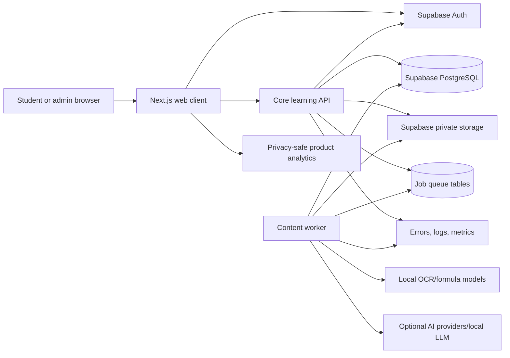
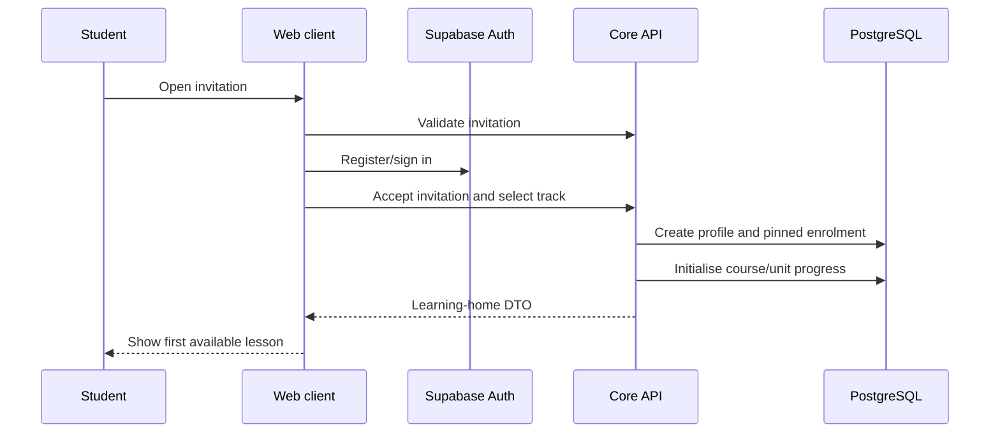
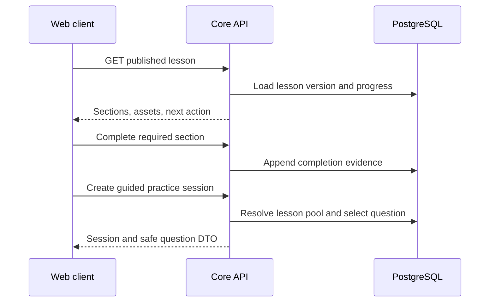
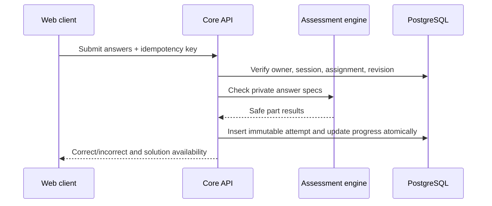
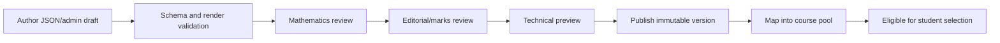

# ASEAN Academy PLAN V2 — Course-Based Learning Platform

**Document status:** Proposed implementation source of truth

**Created:** 20 September 2026

**Target:** A course-led beta in which students learn syllabus content, practise progressively harder questions, revisit weak skills, and complete mastery checkpoints

**Initial vertical slice:** Singapore Secondary 1 G3 Mathematics, N1 Numbers and their operations

**Companion documents:** `plan.md`, `ARCHI.md`, `STAGES.md`, `N1_QUESTION_BANK_SCHEMA.md`, and `PRACTICE_APPLICATION.md`

## 1. Purpose

This plan specifies the services, features, data contracts, integration order, and verification work required to turn the current question-bank prototype into a complete course-based learning application.

The intended experience combines:

- A structured course, unit, lesson, quiz, and mastery path similar to Khan Academy.
- Curriculum-aligned notes, active recall, guided help, and targeted intervention similar to Pallo.
- Exam-style questions with deterministic Mathematics marking.
- An optional AI tutor that explains approved lesson content without becoming the source of truth for marks or unlocked answers.
- A replaceable frontend so visual design work can proceed independently from learning logic.

This document supersedes earlier documents where their implementation sequence or service boundaries conflict. The product principles and beta scope in `plan.md` still apply unless explicitly changed here.

## 2. Current repository state

The project is not starting from zero. The following foundations already exist on `feature/n1-question-bank`:

| Area | Current state |
|---|---|
| N1 authored bank | 40 fixed draft questions with a 15/15/10 difficulty distribution |
| Question contract | Versioned Pydantic and JSON Schema models for content blocks, parts, answers, hints, solutions, marks, and assets |
| Answer checking | Deterministic numeric, rounding, prime-factor, ordered-list, and relation checking |
| Reviewer workflow | Local KaTeX preview with answers, hints, solutions, and multipart inputs |
| Practice prototype | Persistent local SQLite sessions, revision-pinned assignments, retries, hints, attempts, Give up, and a placeholder frontend |
| PostgreSQL | Question-bank and practice-session migrations exist but are not yet the complete production schema |
| OCR | Local PDF rendering, layout/OCR/formula/table recognition, review workbench, and staging persistence |
| Categorisation | Local explainable question-to-syllabus categorisation tools |
| Final frontend | Not yet implemented; a friend is designing it |
| Production identity | Not yet connected to Supabase Auth |
| Course content | Not yet authored or stored as versioned lessons |
| Production API | Not yet extracted from the local prototype |

The existing 40 questions remain drafts. Passing schema validation does not mean that their Mathematics, wording, marks, or difficulty have been human-approved.

## 3. Product structure

The platform should use the following stable hierarchy:

```text
Programme
└── Course
    └── Unit
        ├── Lesson
        │   ├── Learn sections
        │   ├── Worked examples
        │   ├── Active-recall checks
        │   ├── Guided practice
        │   ├── Independent practice
        │   └── Optional challenge
        ├── Unit quiz
        └── Unit mastery checkpoint
```

For the first release:

```text
Programme: ASEAN Scholarship preparation
Course: Singapore Secondary 1 G3 Mathematics
Unit: N1 Numbers and their operations
Lessons: Outcomes 1.1 through 1.7
```

Difficulty should increase inside each lesson. The application should not present all Level 1 content across the entire course before teaching Level 2 work. Students first learn a coherent concept, then move from guided to independent and challenging questions for that concept.

## 4. N1 learning sequence

The first course should use the seven existing syllabus outcomes as lesson boundaries. These are broad enough for the current 40-question bank and can be split into smaller lessons later when more content exists.

| Position | Lesson key | Title | Outcome | Main learning progression |
|---:|---|---|---|---|
| 1 | `n1-lesson-01` | Primes and prime factorisation | 1.1 | Identify primes, decompose integers, use index notation |
| 2 | `n1-lesson-02` | HCF, LCM, squares, cubes and roots | 1.2 | Use prime structure for HCF/LCM and powers/roots |
| 3 | `n1-lesson-03` | Number sets and operations | 1.3 | Classify numbers and operate with signed, rational, and real numbers |
| 4 | `n1-lesson-04` | Calculator calculations | 1.4 | Enter, interpret, and verify multi-step calculations |
| 5 | `n1-lesson-05` | Number lines and ordering | 1.5 | Place, compare, and order positive and negative values |
| 6 | `n1-lesson-06` | Inequalities | 1.6 | Translate comparisons into valid inequality statements |
| 7 | `n1-lesson-07` | Approximation and estimation | 1.7 | Decimal places, significant figures, and reasonableness checks |

Each lesson should follow this sequence:

1. State the learning objective in student language.
2. Activate required prior knowledge with one or two short recall prompts.
3. Explain the idea in small sections using text, LaTeX, diagrams, and callouts.
4. Show at least one fully worked example with each decision explained.
5. Ask a non-graded concept check.
6. Assign guided Level 1 practice with progressive hints.
7. Assign Level 2 independent practice.
8. Offer a Level 3 challenge when a suitable question is available.
9. Record lesson proficiency.
10. Recheck the skill later in a quiz or checkpoint before calling it mastered.

### 4.1 Initial allocation of the 40 questions

Question use should be declared in course configuration instead of inferred by the frontend. The first allocation can reserve questions as follows:

| Outcome | Available | Lesson practice | Checkpoint pool | Reserve/adaptive pool |
|---|---:|---:|---:|---:|
| 1.1 | 6 | 3 | 2 | 1 |
| 1.2 | 8 | 4 | 2 | 2 |
| 1.3 | 8 | 4 | 2 | 2 |
| 1.4 | 4 | 2 | 1 | 1 |
| 1.5 | 4 | 2 | 1 | 1 |
| 1.6 | 3 | 1 | 1 | 1 |
| 1.7 | 7 | 3 | 2 | 2 |
| **Total** | **40** | **19** | **11** | **10** |

The unit checkpoint can draw eight unseen questions from the eleven-question checkpoint pool. Reserve questions support later practice, alternate forms, and replacement when a question is retired. A gave-up question may also reappear after a delay; it does not need to consume a new reserve question.

This allocation is configuration, not permanent question metadata. A question may move between pools without creating a new assessed-content revision.

## 5. Architecture decision

The beta should use logical service boundaries without deploying every boundary as a separate process.

### 5.1 Deployable applications

Use four deployable units at most:

1. **Web client:** Next.js/React application owned by the frontend developer.
2. **Core learning API:** Python API containing course, practice, checking, mastery, and student-facing orchestration.
3. **Content worker:** Python background worker for OCR, categorisation, import, verification, and later essay marking.
4. **Managed platform:** Supabase Auth, PostgreSQL, and private object storage.

Observability and analytics are managed integrations rather than custom services.

The local `question-bank practice` server remains a development reference. The production API should migrate its domain behaviour into a framework designed for authenticated JSON APIs, such as FastAPI, without changing the tested selection and checking rules.

### 5.2 Why the core learning API remains Python

- The existing deterministic checker and question models are Python.
- Future algebraic checking benefits from controlled SymPy integration.
- OCR, content validation, and authoring tools are already Python.
- A frontend-neutral API allows the UI design to be replaced without moving correctness or progression rules into the browser.
- It avoids maintaining different TypeScript and Python implementations of Mathematics equivalence.

The frontend may use Next.js route handlers as same-origin proxies, but those handlers must not reimplement marking, unlock, or mastery decisions.

### 5.3 System topology



## 6. Logical service catalogue

The term “service” below means a module with owned responsibilities and contracts. Several services live inside the same core API deployment.

| Service | Deployable owner | Beta priority | Main responsibility |
|---|---|---:|---|
| Web experience | Web client | P0 | Course navigation, lesson rendering, practice and progress UI |
| Identity and enrolment | Supabase + core API | P0 | Authentication, invitations, profiles, roles, track enrolment |
| Course catalogue | Core API | P0 | Courses, units, lessons, ordering, prerequisites, publication |
| Lesson content | Core API | P0 | Versioned learning sections, examples, assets, concept checks |
| Practice orchestration | Core API | P0 | Sessions, question selection, attempts, hints, Give up |
| Assessment engine | Core API | P0 | Normalisation and deterministic marking |
| Mastery and progression | Core API | P0 | Lesson states, retry queues, checkpoints, unlocks |
| Question bank | Core API + authoring tools | P0 | Immutable assessed revisions and publishable question records |
| Content administration | Web client + core API | P0 | Review, authoring, publication, course mapping |
| Asset delivery | Supabase Storage + core API | P0 | Private source assets and safe public/learner assets |
| Jobs and worker control | Core API + content worker | P0 | Idempotent asynchronous workflows and retries |
| OCR and ingestion | Content worker | P1 | Convert permitted PDFs into reviewable question candidates |
| Categorisation and verification | Content worker | P1 | Map content to syllabus and enforce publication gates |
| Tutor and intervention | Core API + optional model | P1 | Grounded explanations and guided help |
| English objective practice | Core API | P1 | Deterministic grammar and vocabulary exercises |
| Essay workflow | Core API + content worker | P1 | Drafts, immutable submissions, rubric feedback |
| Notifications | Core API/managed provider | P2 | In-app and later email reminders |
| Analytics and observability | All deployments | P0/P1 | Reliability, learning events, operational insight |

## 7. Detailed service specifications

### 7.1 Web experience service

**Responsibilities**

- Render the learner dashboard, course map, unit map, lesson content, quizzes, checkpoints, history, and profile.
- Render the admin content and operations screens.
- Manage browser interaction state, optimistic form state, accessibility, and responsive layout.
- Render approved content blocks safely.
- Call only documented APIs.

**Required learner screens**

| Route | Purpose |
|---|---|
| `/` | Marketing or invitation landing page |
| `/onboarding` | Track choice and initial enrolment |
| `/learn` | “Continue learning” dashboard and course overview |
| `/courses/[courseKey]` | Course units, completion, and locks |
| `/units/[unitKey]` | Lesson roadmap, quiz, and checkpoint status |
| `/lessons/[lessonKey]` | Learn sections and worked examples |
| `/practice/[sessionId]` | Existing practice flow through the production API |
| `/checkpoints/[attemptId]` | Unit checkpoint player and results |
| `/progress` | Outcome mastery, retries, accuracy, and recent work |
| `/settings` | Profile, target track, and account controls |

**Required admin screens**

- Course, unit, and lesson editor.
- Question review and preview.
- Question-to-lesson pool mapping.
- Publication status and audit history.
- OCR job status and review queue.
- Student progress overview for invited beta users.
- Content and application error dashboard links.

**Frontend contract rules**

- Never calculate correctness, mastery, unlocks, attempt numbers, or solution permission in the browser.
- Treat stable keys, UUIDs, revision numbers, and cursor values as opaque.
- Escape normal text and render only allowed LaTeX commands with KaTeX or MathJax.
- Do not receive canonical answers or solution steps until the server authorises them.
- Use a generated API client or shared schema package rather than handwritten response shapes.
- Make every P0 action usable by keyboard and on a mobile viewport.

**Frontend replacement strategy**

The placeholder and the final design consume the same versioned API. The friend designing the frontend can initially work against fixture responses or a mock server generated from the OpenAPI specification. Switching to the live backend should require environment configuration, not rewriting screen state logic.

### 7.2 Identity and enrolment service

**Responsibilities**

- Invitation-only beta registration.
- Supabase email/password or approved OAuth authentication.
- Role assignment: `student`, `content_admin`, `academic_admin`.
- Student profile and target track.
- Course enrolment and curriculum-version pinning.
- Session revocation and account deletion workflow.

**Owned data**

```text
profiles
beta_invitations
student_enrolments
role_assignments or profiles.role
account_deletion_requests
```

**Important rules**

- Do not duplicate passwords outside Supabase Auth.
- Invitations are single-use or have an explicit use limit and expiry.
- The server determines role and enrolment; the browser cannot submit an elevated role.
- A student enrolment pins a curriculum version so course edits do not silently rewrite active progress.
- Changing target track is an explicit migration, not a profile-string edit.

### 7.3 Course catalogue service

**Responsibilities**

- Define programmes, courses, units, lessons, order, prerequisites, and publication state.
- Return the course map enriched with the current student’s progress.
- Determine which lesson is recommended next.
- Resolve stable content keys to current published versions.
- Keep course structure separate from visual navigation.

**Owned data**

```text
programmes
courses
course_versions
course_units
unit_versions
course_lessons
lesson_versions
lesson_prerequisites
lesson_outcomes
```

**Core features**

- Draft, reviewed, published, retired lifecycle.
- Stable identity plus immutable published versions.
- Ordered units and lessons.
- Soft locks for recommended order and hard locks only where academically necessary.
- Preview draft courses for admins without exposing them to students.
- Locale-ready titles and descriptions, even if the beta is English-only.

### 7.4 Lesson content service

**Responsibilities**

- Store and serve versioned educational content.
- Reuse the existing safe content-block model for text, inline math, display math, and asset references.
- Add lesson-specific sections such as explanations, examples, callouts, and concept checks.
- Record content completion without treating scrolling alone as mastery.

**Suggested authoring layout**

```text
backend_resources/courses/
└── g3_math/
    └── secondary_1/
        └── n1/
            └── v1/
                ├── course.json
                ├── lessons/
                │   ├── n1-lesson-01.json
                │   ├── n1-lesson-02.json
                │   └── ...
                └── assets/
```

**Lesson source shape**

```json
{
  "stable_key": "n1-lesson-01",
  "revision": 1,
  "status": "draft",
  "title": "Primes and prime factorisation",
  "outcomes": ["1.1"],
  "prerequisite_lessons": [],
  "estimated_minutes": 20,
  "sections": [
    {
      "type": "explanation",
      "title": "Prime numbers",
      "blocks": [
        {"type": "text", "text": "A prime number has exactly two positive factors."}
      ]
    },
    {
      "type": "worked_example",
      "title": "Write 360 as prime factors",
      "steps": []
    }
  ],
  "mastery_policy_key": "n1-default-v1"
}
```

**Publication checks**

- Every outcome ID exists in the pinned curriculum.
- Every asset exists and matches its checksum.
- LaTeX renders.
- Worked examples have independently checked calculations.
- Concept checks have deterministic answers.
- Accessibility text exists for every informative image.
- A named human reviewer approves Mathematics and language.

### 7.5 Question bank service

**Responsibilities**

- Preserve stable question identity and immutable assessed versions.
- Provide student-visible question DTOs without private answer data.
- Provide private answer specifications to the assessment engine only.
- Maintain question status, assets, outcomes, provenance, and review evidence.
- Retire bad questions without breaking historical attempts.

**Existing components to retain**

- `question_bank.models`
- `question_bank.validation`
- `question_bank.checking`
- `question_bank.repository`
- Git-authored N1 JSON files
- PostgreSQL migration `202609200001_n1_question_bank.sql`

**Required additions**

- Course/lesson pool mappings.
- Reviewer decision and audit records for authored questions.
- A safe student DTO serializer as an explicit schema.
- Admin preview endpoints.
- Import reports and source-to-database checksum reconciliation.
- Publication commands that reject unreviewed content.

### 7.6 Practice orchestration service

**Responsibilities**

- Create, resume, complete, or abandon practice sessions.
- Select eligible questions using lesson context and progress.
- Persist question order so refresh does not change an assignment.
- Pin every assignment to a question revision.
- Reveal hints progressively.
- Accept idempotent multipart submissions.
- Unlock Give up only after two incorrect attempts.
- Return solutions only after an explicit authorised Give up action.
- Write immutable attempts and update derived progress atomically.

**Selection priority**

1. Correct course, unit, lesson, and published curriculum version.
2. Required delayed retries when the session mode allows them.
3. Unseen questions in the requested lesson pool.
4. Least-recently-attempted eligible questions.
5. Difficulty target for the current lesson stage.
6. Random tie-breaking.

**Session modes**

```text
guided_practice
independent_practice
challenge
lesson_mastery
unit_quiz
unit_checkpoint
retry_review
free_practice
```

The existing local `PracticeEngine` is the behavioural reference. The PostgreSQL adapter must pass the same domain tests before replacing SQLite.

### 7.7 Assessment engine

**Responsibilities**

- Parse controlled answer formats.
- Normalise equivalent input.
- Run deterministic comparison.
- Return safe correctness and format feedback.
- Never use a live LLM to decide routine Mathematics correctness.

**Initial supported response types**

- Exact integer, decimal, fraction, or percentage.
- Absolute numeric tolerance.
- Required decimal places or significant figures.
- Prime factorisation.
- Ordered numeric list.
- Exact relation/inequality.
- Multipart combinations of these types.

**Later supported response types**

- Algebraic equivalence using a controlled SymPy parser.
- Equations and solution sets.
- Coordinates and ordered tuples.
- Values with normalized units.
- Multiple-choice stable option IDs.
- Approved short text alternatives for English objective practice.

**Security limits**

- Maximum input length.
- Allowed character and symbol sets by response type.
- Restricted expression grammar.
- Time and memory limit for symbolic work.
- No Python `eval`, unrestricted SymPy parsing, or client-supplied checker configuration.

### 7.8 Hint and solution service

This can remain a module within practice orchestration.

**Responsibilities**

- Return stage-one and stage-two authored hints in order.
- Record hint usage independently of correctness.
- Enforce the two-error solution lock.
- Return the pinned solution version matching the assigned question revision.
- Keep source marking evidence private unless explicitly approved for learner display.

**Rules**

- Hint usage does not automatically reduce marks in the beta.
- Hints should guide the next decision without giving the final answer.
- Solutions are pre-authored or pre-generated and reviewed; they are not generated on demand for routine Mathematics.
- Regenerating a solution creates a new version and never changes a past attempt’s evidence.

### 7.9 Mastery and progression service

**Responsibilities**

- Track content completion, practice performance, delayed checks, and checkpoint results.
- Recommend the next action.
- Unlock lessons and units according to versioned policy.
- Queue weak skills for later review.
- Preserve first-attempt accuracy separately from eventual completion.

**Learner-facing states**

```text
locked
available
learning
practising
proficient
mastered
needs_review
```

**Recommended N1 policy V1**

- `available`: prerequisites are proficient or an administrator has opened the lesson.
- `learning`: the lesson has been started.
- `practising`: required content sections have been completed and practice has begun.
- `proficient`: required lesson questions are completed with at least 70% eventual correctness and no unresolved required item.
- `mastered`: the outcome is demonstrated again in a later quiz or unit checkpoint.
- `needs_review`: the student gave up, repeatedly failed, or later missed the skill in a checkpoint.

The percentages and counts must be versioned configuration. Product experiments may change them without rewriting historical results.

**Mastery evidence model**

Store immutable evidence events such as:

```text
lesson_started
content_section_completed
hint_revealed
attempt_submitted
question_completed
question_gave_up
quiz_completed
checkpoint_completed
mastery_awarded
mastery_revoked_to_review
```

Derived progress tables may be rebuilt from these events plus attempts. Never rely only on a mutable percentage with no evidence trail.

### 7.10 Content administration service

**Responsibilities**

- Author and review lessons.
- Review and publish questions.
- Map questions into lesson, quiz, checkpoint, and reserve pools.
- Preview exactly what a student sees.
- Record reviewer, decision, notes, and timestamp.
- Retire content and explain why.

**Review roles**

- Mathematics review.
- Language/editorial review.
- Technical/rendering review.
- Final publication decision.

One founder may perform several roles in the beta, but the decisions should remain separate fields so responsibility can be divided later.

### 7.11 OCR and ingestion service

**Responsibilities**

- Ingest permitted source PDFs into staging.
- Render, preprocess, segment, recognise prose/formulas/tables, and retain source crops.
- Preserve evidence and warnings.
- Produce candidate questions only.

**Relationship to the authored bank**

- OCR output never enters learner selection directly.
- OCR candidates enter a review queue.
- A reviewer corrects transcription and supplies missing academic metadata.
- Accepted content is converted into the canonical authored question contract.
- The canonical question then passes the same review and publication checks as an originally generated question.

OCR remains useful for future Mathematics and English paper ingestion. It is not on the critical path for the first N1 course because the 40 fixed questions already exist.

### 7.12 Categorisation and verification service

**Responsibilities**

- Map reviewed questions to fixed syllabus IDs.
- Estimate difficulty with an explainable rubric.
- Validate answers and solutions.
- Aggregate publication checks.

**Publication gate**

A question is selectable only when all required checks pass:

```text
schema_valid
mathematics_reviewed
language_reviewed
marks_reviewed
difficulty_reviewed
assets_valid
latex_valid
answer_checker_accepts_canonical
solution_matches_answer
curriculum_mapping_valid
status_published
```

Confidence is supporting evidence, not a replacement for required human review.

### 7.13 Tutor and intervention service

The tutor is a P1 enhancement. The course must remain usable when the model is unavailable.

**Allowed tutor modes**

- Explain the current approved lesson section differently.
- Ask a Socratic question.
- Diagnose a named misconception from the student’s safe interaction history.
- Recommend an approved section or practice session.
- Summarise what the learner has completed.

**Disallowed behaviour during active assessment**

- Reveal a locked canonical answer or solution.
- Decide the official mark.
- invent curriculum content or cite unapproved sources as authoritative.
- Modify progress directly.
- See another student’s data.

**Grounding strategy**

1. Retrieve the current published lesson version and approved examples.
2. Include only the minimum learner context needed.
3. Tell the model the active mode and answer-lock state.
4. Require structured output with response type, explanation, and recommended next action.
5. Filter for answer leakage when a question is active.
6. Store model, prompt version, latency, and safety outcome.

Begin with relational retrieval by course/lesson/outcome. Do not add a vector database until content volume or retrieval evaluation demonstrates a need.

The provider interface should allow a local model, a paid API, or no tutor. Local inference avoids token charges but still needs measured accuracy, latency, RAM/VRAM, and operational support.

### 7.14 English services

English should reuse the common course, lesson, practice, mastery, and progress services.

**Objective English**

- Grammar and vocabulary lessons.
- Multiple choice, approved short text, and structured objective responses.
- Deterministic marking.
- Cached explanations.

**Essay workflow**

- Versioned prompts and rubrics.
- Autosaved mutable draft.
- Explicit immutable submission.
- Asynchronous rubric-based marking.
- Criterion scores, evidence, strengths, and priority improvements.
- Clear labelling as AI-generated feedback.
- Resubmission creates a new submission instead of overwriting the first.

Essay marking is independent from the first N1 vertical slice and should not delay it.

### 7.15 Jobs and worker control service

**Responsibilities**

- Create and claim asynchronous jobs.
- Enforce idempotency.
- Track stage, progress, retry count, timestamps, and terminal errors.
- Link all logs and model calls with a correlation ID.

**Initial job types**

```text
import-question-bank
validate-course-content
ingest-paper
categorise-question
verify-question
generate-or-review-solution
mark-essay
rebuild-progress
cleanup-orphan-assets
```

Every job needs bounded retries, a machine-readable failure code, a terminal failed state, and an admin-visible retry action. A database-backed job table is sufficient for the beta; adopt an external queue only after measuring contention or reliability problems.

### 7.16 Assets and storage service

**Asset classes**

| Class | Examples | Visibility |
|---|---|---|
| Public brand | Logo, app icon | Public |
| Learner course | Approved diagrams and lesson illustrations | Public or authenticated |
| Learner question | Approved diagrams/question images | Authenticated or short-lived signed URL |
| Private source | Original papers, OCR pages, solution crops | Admin/worker only |
| Private student | Essay drafts and submissions | Owner and authorised staff only |

**Rules**

- Store checksums and MIME types.
- Reject executable uploads and unexpected types.
- Do not expose raw private storage paths as permanent public URLs.
- Use signed URLs or authenticated proxy delivery where appropriate.
- Preserve source assets referenced by published or historically attempted content.

### 7.17 Analytics and observability service

**Operational signals**

- API error rate and latency.
- Database query latency and pool saturation.
- Worker queue depth and terminal failures.
- OCR/model duration and memory failures.
- Tutor/essay model calls, tokens, latency, and cost.
- Published-content counts and failed publication checks.

**Learning events**

```text
onboarding_completed
course_opened
unit_opened
lesson_started
lesson_content_completed
practice_started
hint_revealed
answer_submitted
question_completed
question_gave_up
lesson_proficient
checkpoint_started
checkpoint_completed
outcome_mastered
review_session_started
```

Do not send raw student answers, essay text, authentication tokens, or private source content to product analytics.

## 8. Data model additions

The existing question-bank and practice tables remain. Add the following groups through ordered migrations.

### 8.1 Identity and enrolment

```text
profiles
beta_invitations
student_enrolments
```

Key properties:

- `profiles.id` matches `auth.users.id`.
- `student_enrolments` pins course/curriculum versions.
- Only one active enrolment per student/course combination.

### 8.2 Course structure

```text
programmes
courses
course_versions
course_units
unit_versions
course_lessons
lesson_versions
lesson_prerequisites
lesson_outcomes
lesson_sections
lesson_assets
```

Stable identity tables should not contain mutable published content. Version tables hold titles, descriptions, policy references, and ordered content.

### 8.3 Question pools

```text
lesson_question_pools
lesson_question_pool_items
unit_checkpoint_pools
unit_checkpoint_pool_items
```

Suggested pool-item fields:

```text
pool_id
question_id
question_version_id nullable
role: core | checkpoint | reserve | challenge
position nullable
weight
active_from
active_until
```

Prefer mapping stable question identity and resolving the current published version at session creation. Once assigned, persist the exact version ID.

### 8.4 Lesson and mastery progress

```text
lesson_progress
unit_progress
outcome_progress
mastery_events
content_section_completions
checkpoint_attempts
checkpoint_questions
```

Progress rows are derived snapshots. `mastery_events`, attempts, and checkpoint records are the audit evidence.

### 8.5 Content review and audit

```text
content_reviews
publication_events
content_reports
audit_events
```

`audit_events` should record high-impact admin actions such as publishing, retiring, role changes, invitation changes, and reprocessing.

### 8.6 Jobs and model runs

```text
jobs
job_attempts
ai_runs
prompt_versions
```

No secret or full credential may be stored in a job payload or log.

## 9. API contract

Use `/api/v1` for the first stable public client contract. Generate an OpenAPI document from the core API and use it to generate the frontend client/types.

### 9.1 General conventions

- JSON requests and responses.
- Supabase access token in an `Authorization: Bearer` header or through a secure same-origin proxy.
- UUID idempotency key for create/submit operations.
- ISO 8601 UTC timestamps.
- Cursor pagination for admin lists and histories.
- Stable machine-readable error codes.
- `X-Request-ID` accepted and returned; generate one if absent.

Error envelope:

```json
{
  "error": {
    "code": "solution_locked",
    "message": "The solution unlocks after two incorrect attempts.",
    "request_id": "uuid",
    "details": {}
  }
}
```

### 9.2 Identity and home

```text
POST /api/v1/invitations/accept
GET  /api/v1/me
PATCH /api/v1/me/profile
GET  /api/v1/me/learning-home
POST /api/v1/enrolments
```

`learning-home` should return the active course, recommended next action, unresolved retries, recent progress, and no private answer data.

### 9.3 Course and lessons

```text
GET  /api/v1/courses
GET  /api/v1/courses/{courseKey}
GET  /api/v1/units/{unitKey}
GET  /api/v1/lessons/{lessonKey}
POST /api/v1/lessons/{lessonKey}/start
POST /api/v1/lessons/{lessonKey}/sections/{sectionKey}/complete
GET  /api/v1/progress
```

Lesson responses include only published content for students. Admin preview uses a separate authorised route and explicit version.

### 9.4 Practice and checking

```text
POST /api/v1/practice-sessions
GET  /api/v1/practice-sessions/{sessionId}
GET  /api/v1/practice-sessions/{sessionId}/next
POST /api/v1/practice-sessions/{sessionId}/questions/{questionKey}/hints/{stage}
POST /api/v1/attempts
POST /api/v1/practice-sessions/{sessionId}/questions/{questionKey}/give-up
POST /api/v1/practice-sessions/{sessionId}/abandon
```

Session creation should accept learning context:

```json
{
  "lesson_key": "n1-lesson-01",
  "mode": "guided_practice",
  "question_count": 2,
  "client_idempotency_key": "uuid"
}
```

The server resolves outcome, difficulty, question pools, and eligibility. The browser must not choose unpublished question IDs.

### 9.5 Checkpoints

```text
POST /api/v1/units/{unitKey}/checkpoints
GET  /api/v1/checkpoints/{checkpointId}/next
POST /api/v1/checkpoints/{checkpointId}/attempts
POST /api/v1/checkpoints/{checkpointId}/finish
GET  /api/v1/checkpoints/{checkpointId}/results
```

Checkpoint results may affect mastery only after the attempt is finished. Refreshing must not replace assigned questions.

### 9.6 Tutor

```text
POST /api/v1/tutor/sessions
POST /api/v1/tutor/sessions/{sessionId}/messages
GET  /api/v1/tutor/sessions/{sessionId}
```

The server determines tutor mode, grounding, and solution-lock context. Rate limits apply by user and day.

### 9.7 Admin

```text
GET   /api/v1/admin/review-queue
GET   /api/v1/admin/questions/{questionKey}
POST  /api/v1/admin/questions/{questionKey}/reviews
POST  /api/v1/admin/questions/{questionKey}/publish
POST  /api/v1/admin/questions/{questionKey}/retire
GET   /api/v1/admin/courses/{courseKey}/draft
PUT   /api/v1/admin/lessons/{lessonKey}/draft
POST  /api/v1/admin/lessons/{lessonKey}/reviews
POST  /api/v1/admin/lessons/{lessonKey}/publish
PUT   /api/v1/admin/lesson-pools/{poolKey}
POST  /api/v1/admin/papers
GET   /api/v1/admin/jobs/{jobId}
POST  /api/v1/admin/jobs/{jobId}/retry
```

Every admin mutation records an audit event.

## 10. End-to-end stitching flows

### 10.1 Onboarding and enrolment



**Integration checks**

- Expired/reused invitation is rejected.
- A repeated request is idempotent.
- Student cannot submit an admin role.
- Correct course version is pinned.
- Only the first permitted lesson is recommended.

### 10.2 Learn and start practice



**Integration checks**

- Draft lesson cannot be requested by a student.
- Content completion does not directly award mastery.
- Practice uses the lesson’s configured pool and stage difficulty.
- The question revision is pinned before delivery.

### 10.3 Submit a Mathematics answer



**Integration checks**

- Repeating an idempotency key returns the original result.
- A question from another session is rejected.
- Client-supplied correctness is ignored.
- Canonical answers are absent from the response.
- Two simultaneous submissions cannot create the same attempt number.

### 10.4 Give up and solution access

1. API verifies session ownership and current assignment.
2. API counts committed incorrect attempts.
3. Before two errors, return `solution_locked`.
4. After two errors, explicit Give up changes the assignment to `gave_up`.
5. API returns the solution version pinned to the question revision.
6. Mastery service appends review evidence and schedules a delayed retry.
7. The next question may then be assigned.

### 10.5 Mastery and next lesson

1. Practice completion appends evidence.
2. Mastery policy evaluates required lesson work.
3. Lesson moves to `proficient` when requirements pass.
4. Course service recommends the next lesson.
5. A later quiz/checkpoint tests the prior outcome again.
6. Passing delayed evidence moves the outcome to `mastered`.
7. Failure moves it to `needs_review` without deleting earlier progress.

### 10.6 Content authoring and publication



No draft becomes selectable merely because it was imported successfully.

### 10.7 OCR ingestion

1. Admin uploads PDF and metadata.
2. API writes private storage object and job row.
3. Worker renders and recognises locally.
4. Worker stores candidates, evidence, and warnings in staging.
5. Admin corrects and checks candidate content.
6. Accepted candidate converts to canonical authored-question JSON.
7. Standard question review and publication runs.
8. Academic admin maps the published question into a course pool.

### 10.8 Tutor request

1. Student requests help from a lesson or active practice screen.
2. API determines whether a question answer is locked.
3. API retrieves approved lesson content and safe progress context.
4. Tutor model returns a structured explanation or Socratic prompt.
5. Leakage and schema checks run.
6. Safe response is returned and logged.
7. Tutor output never changes marks or mastery directly.

## 11. Contract-first frontend collaboration

The frontend and backend teams should use the following workflow:

1. Backend writes or updates OpenAPI schemas and example fixtures.
2. Frontend generates typed client functions.
3. Frontend develops screens against a mock server using the same fixtures.
4. Backend implements endpoints behind contract tests.
5. CI runs consumer examples against the live test API.
6. Visual changes remain within the frontend unless the contract lacks necessary information.

### 11.1 Shared frontend DTOs

At minimum, generate types for:

```text
LearningHome
CourseMap
UnitMap
Lesson
LessonProgress
PracticeSession
StudentQuestion
AttemptSubmission
AttemptResult
HintResponse
SolutionResponse
Checkpoint
CheckpointResult
ApiError
```

### 11.2 Mock fixtures

Create fixtures for:

- New student with only Lesson 1 available.
- Student halfway through N1.
- Active multipart question.
- First incorrect attempt.
- Second incorrect attempt with Give up enabled.
- Correct response.
- Completed lesson awaiting checkpoint mastery.
- Unit mastered.
- Empty/error/loading states.
- Draft-content admin preview.

Fixtures must not use production student data.

## 12. Environments and configuration

### 12.1 Local

- Local Next.js frontend.
- Local core API.
- Local SQLite adapter for fast domain tests or local Supabase for integration tests.
- Local question/course JSON.
- Local model cache for OCR.

### 12.2 Preview

- Per-branch frontend preview.
- Shared or per-branch non-production API/database depending on cost.
- Seeded fake users and reviewed fixture content.
- No production source papers or student essays.

### 12.3 Production

- Production web client.
- Container-hosted core API and worker.
- Production Supabase project.
- Private source and student storage.
- Managed secrets and explicit database migration step.

### 12.4 Required configuration classes

```text
Public browser configuration
Server-only database/auth configuration
Worker-only model and storage configuration
Optional tutor/AI-provider configuration
Observability configuration
Feature flags
```

No service-role, database, or model key may use a public frontend environment-variable prefix.

## 13. Security and privacy requirements

- Validate Supabase JWTs on every private API request.
- Authorise resource ownership after authentication.
- Use separate student and admin route dependencies.
- Enable and test RLS on user-facing tables.
- Use a restricted backend database role where practical.
- Keep canonical answers and solutions server-side until authorised.
- Store attempts immutably.
- Apply request-size, rate, and timeout limits.
- Use signed asset URLs or authenticated delivery for private objects.
- Log identifiers and error codes without logging full passwords, tokens, essays, or unnecessary answers.
- Record high-impact admin actions.
- Provide account deletion and data-retention procedures before inviting external students.
- Run dependency, secret, and migration checks in CI.
- Treat uploaded PDFs and OCR text as untrusted input.

## 14. Testing strategy

### 14.1 Domain unit tests

- All answer comparison modes.
- Selection priority and difficulty balance.
- Retry scheduling.
- Lesson-state and mastery-policy transitions.
- Exactly-two-error Give up rule.
- Idempotent attempts.
- Question version pinning.
- Course prerequisite resolution.

### 14.2 API tests

- Authentication and authorisation failures.
- Student-safe DTOs contain no answer data.
- Admin preview requires admin role.
- Concurrent attempt handling.
- Idempotent session creation and submission.
- Invalid or retired content behaviour.
- Tutor solution-lock enforcement.

### 14.3 Database tests

- Migrations apply from an empty database.
- Unique and foreign-key constraints.
- Attempt immutability.
- RLS isolation between two students.
- No draft/unpublished question selection.
- Historical attempts survive new question revisions.
- Progress snapshots agree with evidence events.

### 14.4 Contract tests

- OpenAPI validates all fixture responses.
- Generated frontend client compiles.
- Mock and live responses share the same schema.
- Breaking contract changes require a version or coordinated release.

### 14.5 Browser tests

- Invitation through first lesson.
- Lesson content through guided practice.
- Refresh preserves the current question.
- Two wrong attempts, Give up, and solution.
- Correct answer and next lesson recommendation.
- Unit checkpoint and mastery update.
- Keyboard and mobile P0 flows.

### 14.6 Content tests

- Course and question JSON schema validation.
- KaTeX rendering.
- Asset checksum and alt text.
- Canonical answers accepted by the checker.
- Solution final answer agreement.
- Question-pool counts and no accidental duplicate assignment.
- No question reserved for a checkpoint is consumed by ordinary lesson practice unless configuration permits it.

### 14.7 AI evaluations

Before enabling the tutor or essay marking:

- Create a fixed evaluation set.
- Measure factual/curriculum correctness.
- Check locked-answer leakage.
- Check adherence to requested pedagogical mode.
- Check harmful or inappropriate response handling.
- Compare local and hosted options on quality, latency, and cost.
- Keep the feature disabled when the model or evaluation version is unknown.

## 15. Delivery stages

The stages below prioritise a complete N1 course before OCR scale or a general tutor.

### Stage 0 — Confirm product rules and ownership

**Estimated effort:** 4–8 hours

**Depends on:** Nothing

**Tasks**

- Accept this service topology or record changes.
- Confirm the frontend framework and owner.
- Confirm soft versus hard lesson locking. Recommended: soft lesson order, hard checkpoint prerequisites only where needed.
- Confirm the initial proficiency threshold and checkpoint size.
- Assign Mathematics and editorial reviewers.
- Decide where the core API and worker will be hosted.

**Exit criteria**

- Decisions are recorded in this file or an ADR.
- One person owns each P0 workstream.
- No unresolved decision blocks the N1 pilot lesson.

### Stage 1 — Stabilise contracts and repository layout

**Estimated effort:** 12–20 hours

**Depends on:** Stage 0

**Tasks**

- Create `apps/web` for the final frontend if it does not exist.
- Create `services/learning_api` for the production API.
- Keep reusable Python domain packages separate from HTTP adapters.
- Add `/api/v1` error, authentication, idempotency, and request-ID conventions.
- Generate OpenAPI and the frontend API client.
- Add CI for Python tests, frontend typecheck/lint/tests, and migration validation.
- Add environment examples without secrets.

**Exit criteria**

- Web client can call a health endpoint through local configuration.
- CI runs existing question-bank and practice tests.
- A generated client compiles in the frontend.
- No production business rule exists only in the placeholder JavaScript.

### Stage 2 — Course and lesson schema

**Estimated effort:** 18–30 hours

**Depends on:** Stage 1

**Tasks**

- Define Pydantic and JSON Schemas for course, lesson, sections, worked examples, and question-pool mapping.
- Add course/lesson PostgreSQL migration.
- Create Git-authored N1 `course.json` and seven lesson shells.
- Build validators, preview, and transactional importer.
- Define versioned N1 mastery policy.
- Map the existing 40 stable question keys into lesson/checkpoint/reserve pools.

**Exit criteria**

- All seven lesson shells validate.
- Pool totals reconcile with the 40-question bank.
- Draft import does not publish content.
- A course map can be returned from seeded database data.

### Stage 3 — Pilot Lesson 1 end to end

**Estimated effort:** 24–40 hours

**Depends on:** Stage 2

**Tasks**

- Author and review “Primes and prime factorisation.”
- Include objectives, explanations, worked examples, recall checks, and accessible assets.
- Implement lesson read/start/section-complete APIs.
- Extend practice-session creation with `lesson_key` and `mode`.
- Build placeholder course map and lesson screen.
- Connect the final frontend’s first screen to mock and then live APIs.
- Record lesson progress and next action.

**Exit criteria**

- A new local learner can open Lesson 1, learn, practise, and reach proficiency.
- The frontend never receives private answers early.
- Refresh resumes the same question.
- The same flow works with the placeholder and final frontend client.

### Stage 4 — Supabase identity and PostgreSQL practice adapter

**Estimated effort:** 24–38 hours

**Depends on:** Stages 1–3

**Tasks**

- Add profiles, invitations, enrolments, and RLS.
- Validate Supabase tokens in the core API.
- Implement PostgreSQL repositories for sessions, attempts, progress, and mastery events.
- Replace local learner identity with authenticated user ID.
- Preserve SQLite as a fast test adapter.
- Add concurrent and RLS integration tests.

**Exit criteria**

- Two test students cannot access each other’s sessions or progress.
- Attempts remain immutable and idempotent.
- Behavioural tests pass against SQLite and PostgreSQL adapters.
- Invitation onboarding reaches the N1 course.

### Stage 5 — Complete N1 course and mastery

**Estimated effort:** 40–70 hours, primarily content review

**Depends on:** Stage 4

**Tasks**

- Author and review Lessons 2–7.
- Review all 40 questions for Mathematics, language, marks, and difficulty.
- Mark reviewed questions and import them.
- Publish the approved bank and lessons.
- Implement quiz/checkpoint flows.
- Implement delayed review and mastery evidence.
- Add dashboard, unit map, and progress views.

**Exit criteria**

- All student-visible N1 content is reviewed and published.
- Student can complete the full course path and checkpoint.
- Mastery can be explained from stored evidence.
- Retiring one question does not break existing attempt history.

### Stage 6 — Admin operations

**Estimated effort:** 24–40 hours

**Depends on:** Stages 2–5

**Tasks**

- Add lesson and question review queues.
- Add pool mapping editor.
- Add preview-as-student.
- Add publish/retire actions with audit records.
- Add content reports and correction workflow.
- Add job/error visibility.

**Exit criteria**

- Founders can maintain N1 without editing production tables manually.
- Every publication and retirement is attributable.
- Draft preview cannot leak into student course queries.

### Stage 7 — OCR pipeline integration

**Estimated effort:** 20–35 hours beyond existing extractor

**Depends on:** Stable canonical content and admin review

**Tasks**

- Connect PDF upload metadata and private storage.
- Run existing local extractor as a job.
- Persist candidates and review evidence.
- Convert approved candidates to canonical questions.
- Reuse standard validation/review/publication.
- Measure transcription quality on Canberra, Zhonghua, TMS, and ACS samples.

**Exit criteria**

- One complete permitted paper flows from upload to reviewed candidates.
- No OCR candidate bypasses human review.
- Failed pages remain diagnosable and retryable.

### Stage 8 — Grounded tutor pilot

**Estimated effort:** 20–35 hours

**Depends on:** Reviewed lesson content and solution-lock API

**Tasks**

- Define tutor modes and structured output.
- Implement approved-content retrieval.
- Add answer-lock context and leakage tests.
- Compare a small local model with a hosted model.
- Add rate limits, logs, feature flag, and safe fallback.
- Pilot only in Lesson 1 before wider release.

**Exit criteria**

- Tutor is helpful on the fixed evaluation set.
- Locked answers are not exposed in tests.
- Course remains fully usable with tutor disabled.

### Stage 9 — English course services

**Estimated effort:** 35–60 hours

**Depends on:** Reusable course/practice platform

**Tasks**

- Add English course and lesson content.
- Add deterministic objective answer types.
- Add essay prompt/rubric models.
- Add autosave, immutable submission, and marking jobs.
- Add structured feedback screens and versioning.

**Exit criteria**

- Objective English reuses common progress.
- Essay draft survives refresh.
- Feedback cannot run before immutable submission.
- Marking jobs are idempotent and observable.

### Stage 10 — Beta hardening

**Estimated effort:** 30–50 hours

**Depends on:** Required beta scope

**Tasks**

- Complete mobile and accessibility pass.
- Load-test expected beta traffic with headroom.
- Enable backups, monitoring, alerts, and rate limits.
- Test account deletion and recovery procedures.
- Run founder and small-student pilots.
- Freeze content and API contracts before broader invitation.

**Exit criteria**

- All P0 browser paths pass.
- No critical/high security defect is open.
- Restore procedure has been tested.
- Founders can diagnose failed jobs and incorrect content.
- Initial cohort can be supported without direct database edits.

## 16. Work that can run in parallel

| Track A | Track B | Synchronisation point |
|---|---|---|
| Frontend course map using fixtures | Course/lesson schemas and APIs | OpenAPI fixtures agreed |
| Lesson 1 visual design | Lesson 1 content authoring | Content-block renderer agreed |
| Supabase auth UI | Identity migrations and API token validation | Onboarding contract test |
| Lessons 2–7 authoring | PostgreSQL practice adapter | Content review before publish |
| Admin UI design | Review/audit APIs | Review state machine agreed |
| OCR quality evaluation | N1 course completion | Canonical question conversion contract |
| Tutor evaluation set | Core course without tutor | Tutor feature flag and grounding contract |

Do not parallelise two implementations of the same marking or mastery rule. Those rules need one authoritative domain implementation.

## 17. Immediate backlog

The next ten concrete tasks should be:

1. Review and approve the PLAN V2 service topology.
2. Define course/lesson/question-pool Pydantic models.
3. Create the N1 `course.json` and seven lesson shells.
4. Create the course PostgreSQL migration.
5. Write the production `/api/v1` skeleton and OpenAPI conventions.
6. Add frontend fixtures for course map, Lesson 1, and practice states.
7. Author Lesson 1 learning content and worked examples.
8. Extend practice sessions with lesson and mode context.
9. Build the placeholder course map and Lesson 1 screen.
10. Perform human review of the six outcome-1.1 questions and publish only approved versions.

Completing these tasks produces a reviewable course vertical slice before committing to all content or AI tutoring.

## 18. Feature priorities

### P0 — required for the first course beta

- Invitation authentication and enrolment.
- Course/unit/lesson navigation.
- Reviewed versioned lesson content.
- Reviewed published question bank.
- Progressive practice and deterministic marking.
- Hints, two-error Give up, cached solution.
- Lesson and checkpoint progress.
- Retry queue.
- Admin review and publication.
- Secure data isolation.
- Error monitoring and backups.
- Mobile-accessible primary flow.

### P1 — valuable after N1 works end to end

- Grounded AI tutor.
- OCR-to-review workflow in the production admin.
- English objective course.
- Essay writing and feedback.
- Teacher/founder cohort analytics.
- Study reminders and streaks that do not distort learning goals.

### P2 — postpone until evidence supports them

- Native mobile application.
- Live voice tutor.
- Parent portal.
- Payments, credits, mentor marketplace, and scheduling.
- Social leaderboards.
- Large-scale vector search.
- Model fine-tuning.
- Multiple independent microservices.

## 19. Risks and mitigations

| Risk | Impact | Mitigation |
|---|---|---|
| Forty questions are insufficient for repeated mastery | Students see repeats too quickly | Reserve pools, delayed reuse, author more only after N1 flow is validated |
| Draft content is treated as ready | Incorrect teaching and loss of trust | Separate reviewed/published states and enforce them server-side |
| Frontend and backend drift | Integration rework | OpenAPI-generated client, shared fixtures, contract tests |
| AI tutor leaks answers | Invalid assessment and trust issue | Server-supplied lock context, evaluation set, feature flag, no tutor in authoritative marking |
| Mastery becomes an opaque score | Students and founders cannot understand progress | Evidence events plus versioned policy and derived snapshots |
| OCR consumes the schedule | Course remains unusable despite content tools | Keep OCR off the N1 critical path |
| Duplicate checker implementations disagree | Incorrect marking | One Python assessment engine and cross-adapter domain tests |
| Service count overwhelms a small team | Slow delivery and operational burden | Logical modules inside one core API; only API and worker are separate processes |
| RLS is assumed but not tested | Student data exposure | Two-user integration tests in CI before real accounts |
| Question revisions overwrite history | Attempts become unauditable | Immutable versions and assignment pinning |
| Course authoring takes longer than coding | Empty product | Pilot one complete lesson, use repeatable templates, assign reviewers early |

## 20. Decisions still to confirm

These decisions do not block schema work if the recommended defaults are used:

| Decision | Recommended default |
|---|---|
| Lesson access | Soft ordered path; previous lessons always revisit-able |
| Proficiency threshold | 70% eventual correctness plus required practice completion |
| Mastery | Demonstrated again in a later quiz/checkpoint |
| N1 checkpoint | 8 unseen questions with outcome balancing |
| Hints and marks | Record hint usage, no automatic mark penalty in beta |
| Give up | Unlock after two committed incorrect attempts |
| Tutor | Disabled by default until fixed evaluation passes |
| Student source image | Show only approved assets; authored text is primary for generated bank |
| API deployment | Container-hosted Python API near Supabase region |
| Course authoring | Versioned JSON in Git, transactional database import |

## 21. Definition of done for the course platform

The first course platform is complete when:

- An invited student can register and is enrolled in a pinned curriculum version.
- The student sees the N1 course map and a clear recommended next action.
- Every learner-visible lesson and question is human-reviewed and published.
- The student can learn content, inspect examples, and complete progressive practice.
- Marking is deterministic, tested, and does not call an LLM.
- Hints and solutions follow the defined lock rules.
- Attempts, question revisions, hint usage, Give up, and mastery evidence are auditable.
- A checkpoint can award or withhold outcome mastery using a versioned policy.
- Refreshing or changing devices does not change assigned work or lose progress.
- The final frontend and placeholder can use the same documented API.
- Admins can review, publish, retire, and diagnose content without editing database rows manually.
- Two students cannot access each other’s private data.
- Monitoring, backups, and recovery are operational.
- The application remains useful when OCR and the AI tutor are unavailable.

## 22. Reference product patterns

- Khan Academy describes courses composed of units, lessons, quizzes, tests, and mastery goals: <https://support.khanacademy.org/hc/en-us/articles/18564282990861-What-types-of-content-can-I-assign-to-my-students>
- Pallo describes curriculum-aligned notes, questions, lessons, active recall, step-by-step guidance, and targeted intervention: <https://pallo.ai/schools>

These are interaction references. ASEAN Academy should own its curriculum, content quality, mastery rules, and visual identity rather than copying either product’s implementation or design.
