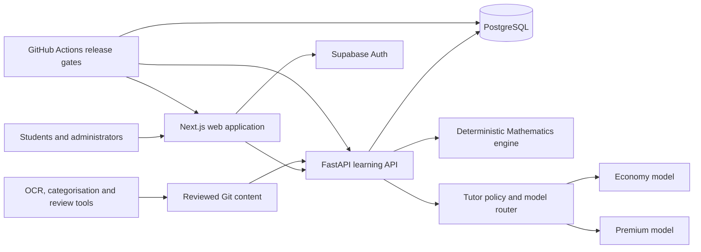
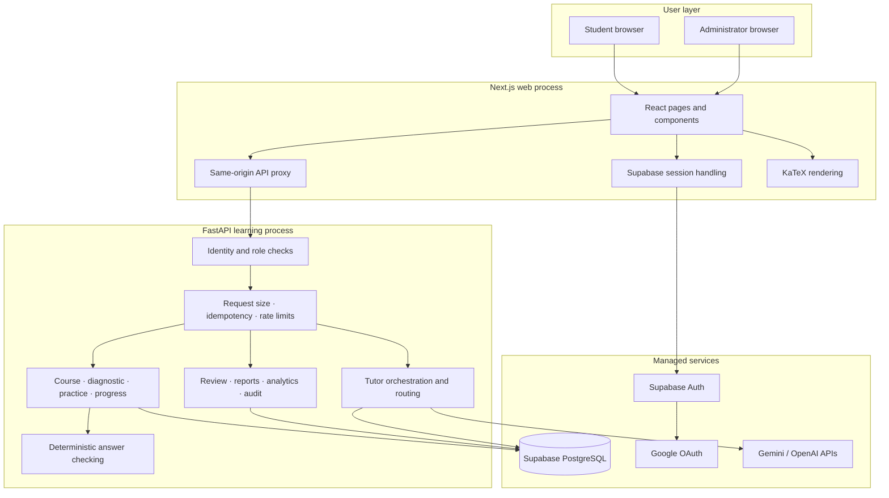
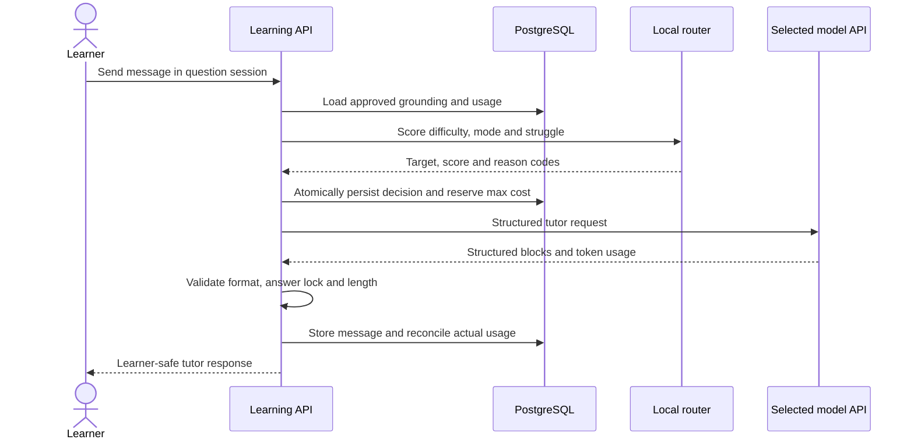

# NextScholar technology and architecture

**Audience:** Investors, technical diligence reviewers, product partners and new engineers

**Implementation snapshot:** 8 October 2026

**Scope:** Current repository, deployed review environment and the hybrid AI tutor milestone

**Document structure:** Part I is the short investor version. Part II is the detailed technical version.

This document describes what exists in the product today, what is protected behind release flags, and what remains to be validated before a student launch. It is a technical overview, not a claim that every planned feature or production integration is already live.

---

# Part I — Investor brief

## The one-minute explanation

NextScholar is a curriculum-aligned learning platform for students preparing for competitive secondary-school assessments. It combines structured lessons, reviewed exam-style questions, deterministic Mathematics marking, progress and mastery tracking, and a conversational AI tutor that is grounded in approved content.

The central technical choice is simple: **AI explains; verified product logic decides.** The language model can diagnose confusion, ask a Socratic question, give another explanation or recommend a lesson. It does not decide whether a Mathematics answer is correct, invent the official solution, or bypass content review. Marking, progression, answer locks, budgets and entitlements remain deterministic application logic.

This gives the product the engagement of an AI tutor with the control expected of an education platform.

## What has been built

The repository contains a working end-to-end product foundation:

- Google sign-in through Supabase Auth, invitation-only onboarding and database-backed roles;
- a responsive Next.js student and administration application;
- a FastAPI learning backend with courses, diagnostics, lessons, practice, progress, reports and tutor APIs;
- a versioned PostgreSQL content and learner-state model with 23 additive migrations;
- deterministic checking for structured Mathematics answers;
- content review, audit history, operational health and account-deletion workflows;
- an offline pipeline for extracting questions from papers, preserving source evidence and mapping content to the syllabus;
- a seven-mode, multi-turn AI tutor evaluation lab with human Mathematics and editorial review; and
- a provider-neutral hybrid model router that can reserve expensive models for turns where their quality is most useful.

The tutor routing implementation and its no-premium-spend shadow mode are complete in code on the feature branch, but remain disabled by default until their database migrations, fixed evaluation suite and cost controls pass in the hosted environment.

## Why the architecture matters commercially

| Business requirement | Technical response | Commercial effect |
| --- | --- | --- |
| Trusted Mathematics help | Human-approved content, deterministic marking and answer locks | Reduces the risk of confident but incorrect grading |
| Useful conversational support | Grounded, multi-turn tutor with seven pedagogical modes | Creates a differentiated student experience |
| Affordable usage | Local routing rules choose economy or premium models per turn | Preserves quality while controlling gross margin |
| Fast product iteration | Next.js web app plus a modular FastAPI backend | A small team can ship without operating many services |
| Auditable content | Immutable revisions, review gates and source evidence | Makes every live lesson and question traceable |
| Safe scaling | Stateless application processes and managed PostgreSQL/Auth | Supports horizontal growth without an early platform rewrite |
| Provider flexibility | Common tutor contract across Gemini and OpenAI | Reduces lock-in and enables quality/cost benchmarking |

## High-level architecture

The beta deliberately uses two application processes: the web application and the learning API. Domain modules live inside the API rather than being prematurely split into microservices. Supabase provides managed authentication and PostgreSQL. This is enough operational separation for a small team while keeping deployments, transactions and debugging manageable.

## AI tutor economics and quality strategy

Every tutor turn follows a deterministic decision path:

1. Load the approved question, solution, learner attempts and recent conversation.
2. Select the appropriate teaching mode.
3. Score the turn using question difficulty, teaching mode, repeated mistakes and repeated confusion.
4. Use the economy model for normal guidance.
5. Use the premium model for difficult questions, difficult explanation modes or persistent confusion.
6. Reserve the maximum possible cost before sending the request.
7. Reconcile the reservation with actual token use and persist the evidence.
8. Stop or downgrade when the learner's budget or premium-turn allowance is reached.

The route itself requires no model call. It is explainable, testable and cheap. The current planning policy keeps the premium route limited to the turns most likely to benefit from it. Prices and exchange rates are configuration, so finance can update assumptions without rewriting the routing algorithm.

The previously discussed GPT-4o planning example—2,500 input tokens and 700 output tokens—is approximately **S$0.01696, rounded to S$0.017, per response** using the documented October 2026 planning prices and exchange rate. This is an estimate, not a fixed invoice amount. Real cost depends on the selected model, cached input treatment, actual token counts, provider pricing and foreign exchange.

## Scale posture

Capacity planning assumes a deliberately conservative **30–40% of registered users may be active during a normal peak**. The application remains a modular monolith while demand is measured. Stateless web/API processes can scale horizontally, and PostgreSQL remains the transaction system of record. Background jobs, a cache or a separate analytics store should be introduced only when observed workload justifies them.

The expected scale path is:

| Stage | Main engineering concern | Architecture response |
| --- | --- | --- |
| Beta | Correctness, review and observability | One web process, one API process, managed database, strict flags |
| 100–500 users | Cold starts, provider limits and support workflow | Paid always-on compute, rate limits, dashboards and provider fallback |
| 1,000–2,000 users | Peak concurrency and database connections | Horizontal API/web replicas, pooling, load tests and tuned indexes |
| 10,000–20,000 users | Cost predictability and workload isolation | Capacity-based compute, asynchronous non-interactive work and data lifecycle policies |

## What is defensible

The moat is not a single model API. It is the combination of:

- versioned curriculum and question data;
- source-linked review evidence;
- deterministic answer contracts and learner-state history;
- approved tutor grounding and answer-lock rules;
- evaluation data across seven teaching modes;
- per-turn quality, latency and cost evidence; and
- an auditable routing policy that improves as real usage is measured.

This data and workflow compound over time. A model provider can be replaced; the reviewed educational system around it remains.

## Current diligence view

| Area | State | Remaining proof |
| --- | --- | --- |
| Core learning backend | Implemented | Hosted cohort rehearsal and load evidence |
| Web and admin application | Implemented technical product | Final design, accessibility and device acceptance |
| Auth and access control | Implemented | Final hosted Google OAuth journey |
| Content/versioning/review | Implemented workflow | Complete and approve the production curriculum |
| Mathematics marking | Implemented deterministic engine | Expand reviewed answer-contract coverage |
| AI tutor foundation | Implemented and evaluated in admin lab | Complete fixed evaluation gate and student pilot |
| Hybrid model routing | Router and shadow evidence implemented, disabled by default | Apply migrations, configure prices, collect shadow evidence, then enable gradually |
| Operations and release gates | Implemented | Confirm production secrets, alerts, restore and rollback drills |

---

# Part II — Detailed technical version

## 1. Product boundaries

NextScholar currently covers three technical journeys.

### Learner journey

An invited learner signs in with Google, accepts an invitation-bound course, completes a diagnostic, studies lesson sections, answers active-recall checks, practises increasingly difficult questions, receives authored hints or grounded tutor help, retries weak skills and completes a mastery checkpoint. Attempts and progress survive refresh, sign-out and another browser.

### Administrator journey

An authorised administrator can manage invitations and roles, inspect learners and question analytics, review content, resolve question reports, inspect audit history and system health, and evaluate live AI tutor responses before student release.

### Content journey

Authors store versioned course, syllabus and question sources in Git. Questions can begin in an offline extraction pipeline, but rendered source crops remain the evidence for Mathematics. Content is validated, reviewed and imported into PostgreSQL. Student-visible revisions are pinned so later edits do not silently change historical attempts.

## 2. Architecture principles

### 2.1 Verified state over generated state

Questions, solutions, lesson references, mastery rules and marks are versioned data. A model response is transient guidance with evidence attached. It does not overwrite the source of truth.

### 2.2 Deterministic marking

The `question_bank` package checks numeric values, expressions and other structured answer types. The runtime does not send normal Mathematics answers to an LLM for grading. This improves consistency, latency and cost while keeping marking reproducible.

### 2.3 Modular monolith before distributed services

Identity, course, diagnostics, practice, progress, administration, review and tutor modules run in one FastAPI process. They have explicit repository and service boundaries, so a module can be separated later if ownership, throughput or isolation demands it. Today, one process keeps cross-domain transactions and debugging simple.

### 2.4 Immutable content revisions

Learner sessions reference deployed question and course revisions. A correction creates or promotes a revision through the review workflow. Historical results can therefore be interpreted against the exact content the learner saw.

### 2.5 AI behind gates

Tutor providers, hybrid routing and student exposure are controlled independently. A provider can be tested in the internal evaluation lab while the student-facing tutor stays off. Cost, response structure, answer locking, Mathematics quality and editorial quality are separate gates.

### 2.6 Evidence before infrastructure expansion

The current stack avoids Kubernetes, a message broker, a separate analytics warehouse and an always-on vector database. These are added only when measurements show a need. That keeps fixed cost and operational load low during validation.

## 3. Deployed system topology

The browser receives a Supabase session. The Next.js application forwards the verified access token to the learning API through a same-origin route. The API validates identity and database-backed roles; it does not trust a role supplied by the browser. Server-only database credentials and model API keys never belong in client-side variables.

## 4. Technology stack

### 4.1 Web application

| Technology | Current repository version | Responsibility |
| --- | ---: | --- |
| Node.js | 24+ | Web build and runtime |
| Next.js | 16.3.6 | Routing, server rendering, route handlers and deployment unit |
| React | 19.3.0 | Student and administrator interfaces |
| TypeScript | 5.9.3 | Static contracts in the web application |
| Tailwind CSS | 4.3.3 | Design system and responsive styling |
| KaTeX | 0.18.7 | Learner-facing mathematical rendering |
| Supabase JS/SSR | 2.117.1 / 0.12.7 | OAuth session and cookie integration |
| `openapi-fetch` | Repository dependency | Typed calls generated from the FastAPI contract |
| Vitest | Repository dependency | Component and application tests |
| Playwright | Repository dependency | Authenticated browser acceptance tests |

The web layer contains student pages, administration pages, authentication callbacks, reusable components and a same-origin proxy to the learning API. Generated OpenAPI types keep frontend/backend drift visible in CI.

### 4.2 Learning API

| Technology | Version policy | Responsibility |
| --- | ---: | --- |
| Python | 3.12 | Backend runtime |
| FastAPI | `>=0.115,<1` | HTTP API and OpenAPI contract |
| Pydantic | `>=2.11,<3` | Request, response, config and content validation |
| psycopg | `>=3.2,<4` | PostgreSQL access and transactions |
| Uvicorn | `>=0.34,<1` | ASGI server |
| PyJWT | Locked project dependency | Supabase token verification |
| Ruff | Locked development dependency | Python linting and consistency |
| pytest | Locked development dependency | Unit, contract and PostgreSQL integration tests |
| uv | 0.12.5 in CI | Locked Python environments and commands |

The API follows router → service → repository boundaries. PostgreSQL implementations serve hosted environments; in-memory implementations support focused tests and limited local workflows. Public API responses omit internal provider prompts, prices and route evidence.

### 4.3 Data and identity

| Technology | Use |
| --- | --- |
| Supabase Auth | Google OAuth identity, access/refresh tokens and browser sessions |
| PostgreSQL 16 in CI | Content, identity profile, enrolment, learner state, reviews, audit and usage ledger |
| Supabase migrations | 23 ordered additive migrations through tutor routing evidence pagination |
| Row-level security | Defence in depth on application tables |
| Application authorization | Ownership, enrolment and administrator-role checks at API boundaries |

The API uses PostgreSQL as the system of record. Supabase PostgREST is not the primary learning-data path. Server-side application checks remain necessary because an owner-level database connection can bypass row-level security.

### 4.4 Content and authoring tools

| Component | Technology | Role |
| --- | --- | --- |
| Question domain | Python/Pydantic/JSON Schema | Versioned content blocks, parts, answers, hints, solutions and assets |
| Mathematics checking | Local deterministic Python | Reproducible marking without runtime LLM calls |
| OCR extractor | PyMuPDF, Pillow, NumPy, OpenCV and optional OCR/vision adapters | Paper rendering, region extraction, recognition and review staging |
| Question categoriser | Local explainable rules | Fixed-syllabus topic/outcome mapping with `unclassified` preserved |
| Reviewer workbench | Local web interface with source crops and KaTeX | Human correction and academic verification |
| Git-authored resources | JSON, Markdown and assets | Reviewable source history for syllabus, course, questions and tutor evaluations |

OCR text is a navigation and drafting aid. The rendered source crop is authoritative for symbols, diagrams and layout. Extracted material does not become student-visible merely because it passes schema validation.

### 4.5 AI providers

The tutor uses one provider-neutral request and response contract. The current evaluation path supports Gemini, and the hybrid milestone adds OpenAI Responses API support for a premium route. Both must return bounded structured tutor blocks rather than unrestricted prose.

| Route | Intended use | Initial target |
| --- | --- | --- |
| Economy | Normal clarification, Socratic guidance and lesson recommendations | Gemini Flash-class model |
| Premium | High difficulty, hard explanation modes or repeated confusion | GPT-4o planning target |
| Synthetic | Deterministic development and contract checks | No external request |

Provider/model identifiers are configuration rather than persisted business logic. A route decision stores the provider, model, policy version, score and reasons used at that moment, making later quality and cost comparisons possible.

### 4.6 Hosting and delivery

The repository supports container-style web and API processes. The current shared review deployment uses a Render blueprint in Singapore and may sleep on the free tier. GitHub workflows also define guarded Railway/Supabase staging and production release sequences. Those workflows are deployment automation, not proof that every environment is presently provisioned.

The release path validates migrations and content, applies database changes, imports versioned resources, deploys the API before the web app, checks health/readiness and verifies release identity. Rollback uses application release history plus additive database changes; destructive migrations require explicit review.

## 5. Backend domain map

| Domain | Main responsibility |
| --- | --- |
| Identity | Token verification, profiles, invitations, roles and enrolments |
| Course | Versioned programmes, courses, units, lessons and prerequisites |
| Diagnostic | Forms, sessions, responses, results and controlled resets |
| Practice | Session assignment, hints, attempts, give-up, solutions and idempotency |
| Progress | Lesson sections, proficiency, retry scheduling and mastery events |
| Question reports | Learner reports and administrator resolution |
| Content review | Mathematics/editorial decisions, safe previews and lifecycle requests |
| Administration | Invitations, analytics, roles, audits and operational status |
| Tutor | Grounding, mode selection, answer locks, provider calls and usage reconciliation |
| Tutor evaluation | Fixed cases, live runs, automated checks, conversations and human review |

The public endpoints are grouped under `/api/v1`. Administrator endpoints require database-backed roles. Health and readiness are separate: health proves that the process is alive; readiness also checks dependencies, migrations and deployed content expectations.

## 6. Core data model

### Content and learning

- curriculum versions, syllabus topics and outcomes;
- question banks, questions, immutable question versions and multipart parts;
- answer specifications, hints, solution steps and assets;
- programmes, courses, course/unit/lesson versions and prerequisite graphs;
- question pools for lesson practice and checkpoints;
- diagnostic forms and responses;
- practice sessions, assigned question revisions, attempts and progress; and
- mastery policies and append-only mastery events.

### Identity and operations

- profiles, beta invitations and course enrolments;
- database-backed administrator roles;
- audit and security events;
- question reports and lifecycle decisions;
- content-review records; and
- account deletion/retention evidence.

### Tutor and economics

- tutor sessions and messages;
- daily and monthly learner usage;
- pre-call reservations and reconciled usage events;
- evaluation runs, automated checks and human reviews;
- evaluation conversations and turns; and
- append-only model route decisions linked to the generated tutor message.

Monetary values use integer micro-SGD in the backend. This avoids floating-point drift and makes reservations, caps and reconciliation exact.

## 7. AI tutor design

### 7.1 Grounding packet

Before an external request, the API assembles a bounded packet containing:

- the exact approved question revision;
- relevant solution/hint data according to the current answer-lock state;
- learner attempts and known misconceptions;
- the recent conversation window;
- question difficulty and approved lesson references;
- current teaching mode; and
- response-format and safety rules.

Long-term learner history is not blindly pasted into every prompt. The active question and a bounded recent conversation keep token use and context drift under control.

### 7.2 Seven teaching modes

The tutor contract supports:

1. clarify the question;
2. Socratic prompt;
3. diagnose misconception;
4. alternative explanation;
5. analogous example;
6. lesson recommendation; and
7. solution explanation when the answer is unlocked.

Mode selection uses the learner message, attempt state and lock state. The provider returns structured content blocks, reply controls and a recommended next action. The web application renders mathematics through KaTeX rather than showing raw delimiters.

### 7.3 Answer locking

Before the learner gives up or reaches the configured unlock point, the prompt omits or protects the canonical answer. Automated checks also reject a response that states the locked answer. This is an educational control implemented across grounding, provider instruction and output evaluation.

### 7.4 Hybrid routing policy

The deterministic v1 score combines:

- question difficulty;
- teaching mode complexity;
- number of incorrect attempts;
- repeated-confusion signals;
- premium turns already used in the session; and
- the remaining monthly monetary budget.

Level 5 questions in complex modes can go directly to premium. Other turns cross a configured score threshold. A premium-session cap and route-specific maximum reservation prevent a single conversation from consuming the learner's allowance unexpectedly. When premium is unavailable or its reservation does not fit the budget, policy can select the economy target or return the existing budget-limit response.

The full schema and rationale are in [TUTOR_HYBRID_MODEL_ROUTING.md](TUTOR_HYBRID_MODEL_ROUTING.md).

### 7.5 Tutor request sequence

If the provider fails, the API does not fabricate a successful response. Reservations are released or reconciled and a safe retryable error is returned. Retry counts and backoff are bounded.

## 8. Cost controls and unit economics

Cost control exists at several layers:

- a short, question-scoped conversation window;
- maximum output tokens per route;
- structured responses that discourage unnecessary prose;
- deterministic routing without an extra classifier call;
- route-specific token-price configuration;
- atomic pre-call reservations;
- actual-usage reconciliation;
- daily/monthly learner ledgers;
- a planned S$7 monthly base allowance per student; and
- configurable premium-turn and request limits.

The S$7 allowance should be treated as a product budget, not a promise to spend S$7. Most students should cost materially less. A paid upgrade must also retain a fair-use or monetary control; “unlimited” should be a user-facing convenience tier with explicit abuse protection rather than an uncapped provider liability.

Cost scenarios from beta through 20,000 users, including conservative concurrency assumptions and per-student ranges, are maintained in [CAPACITY_AND_COST_MODEL.md](CAPACITY_AND_COST_MODEL.md). Provider prices and SGD/USD exchange rates must be refreshed before a financial decision.

## 9. Security, privacy and trust boundaries

### Identity and authorization

- Supabase verifies the Google identity and issues sessions.
- The API verifies token issuer, audience, signature and expiry, or uses the supported Auth verification fallback.
- Profiles, enrolments and roles come from PostgreSQL.
- Student ownership and administrator permissions are checked for every protected workflow.

### Secret handling

- Database URLs, service credentials and model API keys are server-only environment variables.
- The web client receives only publishable Supabase configuration.
- Invitation codes are hashed; raw codes and onboarding URLs are not logged as normal application data.
- Tutor evidence stores operational metadata without returning internal prompts or price configuration to students.

### Abuse and integrity controls

- request-size limits;
- shared mutation rate limits;
- idempotency keys for retry-prone writes;
- append-only audit/security/usage events;
- cost reservation before external calls;
- CORS allowlists and trusted-proxy controls; and
- account-deletion procedures covering learner and tutor data.

The security posture still requires hosted penetration testing, secret rotation practice, privacy review and final retention decisions before broader public release.

## 10. Reliability and observability

The current platform includes:

- process health and dependency readiness endpoints;
- structured request logs with request IDs, release SHA and deployment identity;
- startup checks for required schema revision and content compatibility;
- bounded provider retries and clear external-provider failure states;
- service-status visibility in the admin application;
- scheduled availability checks in GitHub Actions;
- PostgreSQL dump/restore integrity drills;
- bounded load-smoke tooling; and
- deployment smoke tests for API, web, release and environment identity.

Free Render review services can sleep after inactivity, causing visible cold starts. Paid pilot environments should use always-on compute. Provider uptime is a separate dependency; the product must distinguish model saturation from an application outage and retain a fallback route or authored help.

## 11. Testing and release controls

GitHub Actions currently enforce:

- OpenAPI and frontend-fixture generation;
- TypeScript type checking, ESLint, Vitest and production web builds;
- Python Ruff and pytest suites;
- deterministic question-bank validation and tests;
- question-authoring ownership and reviewer evidence;
- migration safety and PostgreSQL integration tests;
- authenticated Playwright journeys using a disposable database;
- backup/restore proof;
- deployment health/readiness and bounded load smoke; and
- verification that generated contracts remain committed.

Tutor-specific validation adds a fixed calibration suite, automated structural and answer-lock checks, human Mathematics review, human editorial review, token/cost evidence and multi-turn conversation evaluation. Model quality should be compared on this fixed set before routing weights or provider targets change.

## 12. Scaling strategy

### Through the first 2,000 registered users

The existing shape remains suitable. Move web/API services to paid always-on instances, use PostgreSQL connection pooling, observe slow queries, tune the existing indexes and scale stateless processes horizontally. Apply provider rate limits and queues at the application boundary before external APIs become saturated.

### Toward 10,000–20,000 registered users

Use measured peak requests and tutor-call concurrency rather than registered-user count alone. Likely additions are:

- separate worker capacity for imports, reports and other non-interactive jobs;
- a short-lived cache for safe, high-read shared data such as catalogue metadata;
- read replicas or analytics export only when operational queries compete with learner traffic;
- provider failover and purchased quota sized from observed tokens per turn; and
- partitioning or retention policies for large audit/usage tables when their growth warrants it.

The product does not need to become a network of microservices at a particular user number. Split a module only when independent scaling, isolation or team ownership produces a measurable benefit.

## 13. Technical roadmap from this milestone

### Immediate

1. Apply migrations through `202610080023_tutor_routing_evidence_pagination.sql` in a disposable and then hosted staging database.
2. Configure the economy and premium providers with current model identifiers and prices.
3. Run both models across the fixed evaluation set and compare Mathematics, editorial, latency and cost evidence.
4. Enable shadow mode for administrators and collect recommended-versus-executed route and projected-cost evidence without premium calls.
5. Tune score weights and thresholds from that evidence, then enable live hybrid routing for administrators only.

### Before a student tutor pilot

1. Pass all seven tutor modes and representative multi-turn conversations.
2. Confirm raw LaTeX renders correctly through KaTeX on desktop and mobile.
3. Validate the S$7 ledger cap, route reservation and failure reconciliation against real provider usage.
4. Test provider saturation, timeout, malformed response and fallback behaviour.
5. Complete privacy/retention review for conversations and learner evidence.
6. Enable the feature for a small invitation cohort with rollback controls.

### After product evidence

Use accepted help rate, repeat-confusion rate, answer-lock failures, learning outcomes, cost per active learner and premium-route lift to decide whether to change models, weights or subscription allowances. Model upgrades should be evidence-led rather than brand-led.

## 14. Main technical risks and mitigations

| Risk | Mitigation |
| --- | --- |
| Model gives a polished but poor explanation | Fixed evaluation set, human dual review, grounding, answer locks and provider comparison |
| Premium route erodes margin | Deterministic threshold, pre-call reservation, premium-session cap and monthly ledger |
| Provider outage or saturation | Bounded retry, economy fallback, authored hints/solutions and visible provider status |
| Draft or incorrect content reaches learners | Immutable revisions, Mathematics/editorial review and release gate |
| OCR corrupts a symbol | Preserve source crop; require human academic verification |
| Web and API contracts drift | Generated OpenAPI types and CI diff checks |
| Database change breaks older application releases | Additive migrations, schema readiness check, integration tests and rollback runbook |
| Free preview infrastructure looks unreliable | Direct readiness evidence for development; paid always-on compute for pilots |
| Early over-engineering slows validation | Maintain the modular monolith until observed evidence justifies extraction |

## 15. Repository map

| Path | Purpose |
| --- | --- |
| `apps/web` | Next.js student/admin web application |
| `services/learning_api` | FastAPI application, repositories, domain services and tutor orchestration |
| `question_bank` | Versioned Mathematics contracts, checking, import and authoring tools |
| `ocr_extractor` | Offline paper extraction and source-evidence review workflow |
| `question_categorizer` | Explainable fixed-syllabus classification |
| `backend_resources` | Versioned syllabus, course, question and tutor-evaluation sources |
| `supabase/migrations` | Ordered PostgreSQL schema changes and security policies |
| `docs/plan` | Product, architecture, operations, cost and execution sources |
| `.github/workflows` | CI, release, availability and recovery automation |
| `render.yaml` | Current Render review-environment blueprint |
| `scripts` | Migration, deployment, load, auth and backup/restore tooling |

## 16. Technical diligence conclusion

NextScholar has moved beyond a UI prototype. The repository contains the core transactional learning system, reviewed-content workflow, deterministic Mathematics engine, operational controls and a real AI tutor evaluation path. Its architecture is intentionally conventional: a typed web application, a modular Python API and managed PostgreSQL/Auth. That lowers execution risk for a small team.

The remaining work is principally evidence and rollout work: complete reviewed content, validate the hosted student journey, prove provider quality and unit cost, finish the product design acceptance, and gradually expose the tutor. The hybrid router strengthens that path by making model quality an allocated resource rather than an all-or-nothing platform decision.

## Related technical documents

- [Hybrid tutor model routing](TUTOR_HYBRID_MODEL_ROUTING.md)
- [Tutor interaction design](TUTOR_INTERACTION_DESIGN.md)
- [Capacity and cost model](CAPACITY_AND_COST_MODEL.md)
- [Beta architecture](BETA_ARCHITECTURE.md)
- [Beta/V2/V3 technical execution](BETA_V2_V3_TECHNICAL_EXECUTION.md)
- [Hosted staging](HOSTED_STAGING.md)
- [API abuse and recovery](API_ABUSE_RECOVERY.md)
