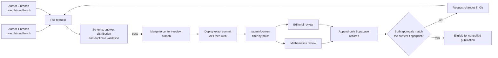

# Shared question review and temporary staging

**Implementation:** 1 October 2026 on branch
`feature/bulk-question-authoring-pipeline`.

## Decision

The administrator dashboard is the primary review surface for generated question
batches. The checked-in HTML, Markdown and CSV packets remain portable audit and
fallback artifacts; reviewers do not need VS Code or spreadsheet software for their
normal work.

A shared hosted environment is practical while the approximately 2,000-question bank
is being authored. Use a separate staging Supabase project for persistent authentication,
roles and append-only review decisions. Deploy the FastAPI service and Next.js service
from one reviewed integration branch. A generated local file does not appear remotely
until its branch passes validation, is merged into the integration branch and that exact
commit is deployed.

## What the dashboard now provides

- every authored question bank is loaded into the protected review catalogue, while
  the learner runtime catalogue stays restricted to deployable content;
- a batch selector lists the manifests that currently own authored questions;
- selecting a batch shows all of its questions and the number with both approvals;
- the protected reviewer preview includes the prompt, canonical response, two authored
  hints, worked solution, marks, outcome, difficulty and calculator setting;
- Mathematics and editorial decisions remain separate and append-only;
- a changed question fingerprint invalidates decisions for the previous content; and
- the existing student-safe preview contract still omits answers, hints and solutions.

Open `/admin/content` using an `academic_admin` or `content_admin` account. An
`academic_admin` may record either review dimension. A `content_admin` may record the
editorial decision only. The team should use distinct accounts when practical so the
audit trail clearly identifies each reviewer.

## Collaboration workflow

1. Claim exactly one planned 20–30-question manifest per branch.
2. Record concrete generator and prompt provenance in that manifest.
3. Author only the stable keys allocated by the manifest.
4. Run `question-bank authoring-validate` and the question-bank tests.
5. Open a pull request to the shared content-review integration branch.
6. Merge only after CI passes. Avoid pushing two authors' generated files directly to
   the same branch.
7. Deploy the merge commit and record its SHA.
8. In `/admin/content`, select the batch ID and review each full question.
9. Record `changes_requested` with specific notes, or approve the appropriate review
   dimension. Make corrections in Git and deploy the new revision.
10. Request publication only after both latest approvals match the deployed fingerprint.

This workflow keeps Git as the authored source of truth and Supabase as the review and
audit store. It also prevents a dashboard edit from silently diverging from the files
that CI validated.

## Temporary hosting options

### Recommended for zero-cost, intermittent review

Use two Render Free web services, one for FastAPI and one for Next.js, plus a Supabase
Free staging project. This fits intermittent founder review because Render Free services
sleep after 15 minutes without inbound traffic and wake on the next request. The first
request after sleep can take about a minute. The free workspace includes 750 instance
hours per month; running two always-active services would exceed that allowance, so the
sleep behavior matters. The filesystem is ephemeral, so all durable review state must
stay in Supabase and all authored questions must stay in Git.

Do not create a Render Free PostgreSQL database for this workflow: free Render databases
expire after 30 days. Supabase Free currently permits two free projects, which supports
isolating staging from production, although a low-activity free project may pause and
need restoration.

Official limits:

- [Render Free services](https://render.com/docs/free)
- [Supabase plan billing and free-project allowance](https://supabase.com/docs/guides/platform/billing-on-supabase)
- [Supabase free-project pausing](https://supabase.com/docs/guides/platform/free-project-pausing)

### Operationally simpler

Keep the existing Railway staging workflow in
[HOSTED_STAGING.md](HOSTED_STAGING.md) and pay only for its actual usage. The repository
already has deployment ordering, migration, exact-SHA readiness and smoke checks for
Railway. This reduces new deployment configuration and is the recommended path once the
team starts daily review or invites beta learners.

Vercel Hobby is not selected for this startup staging environment because its official
terms restrict Hobby use to personal, non-commercial use:
[Vercel Hobby plan](https://vercel.com/docs/plans/hobby).

## Environment boundary

The shared review environment needs its own:

- Supabase project, pooler URL and database password;
- Google OAuth callback and exact web Site URL;
- administrator invitations and role assignments;
- server-only abuse hash secret;
- public web and API origins; and
- deployment secrets stored in the host or GitHub environment, never in Git.

Set the API to preview mode with draft content allowed. Import migrations and immutable
content revisions before the API deployment, then deploy the web app and run the hosted
smoke checks. Do not point a temporary deployment at a production Supabase project.

## Current boundary

The repository integration is complete, but no external service has been created by this
commit. Hosting requires the team-owned Supabase, Google OAuth and host credentials.
Once those values exist, use the existing Railway runbook or configure the equivalent two
Render services and perform the hosted authentication check before sharing the URL.
