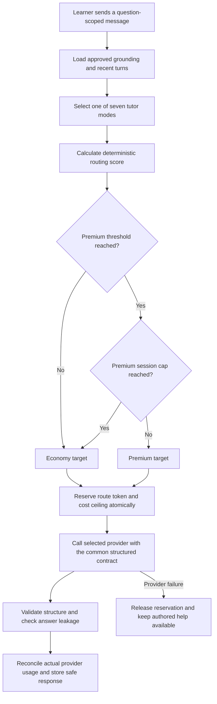

# AI tutor hybrid model routing

**Status:** Implemented behind a disabled server feature flag

**Prepared:** 8 October 2026

**Scope:** Question-scoped Mathematics tutor conversations
**Routing policy version:** `math-tutor-routing-v1`

## Purpose

The tutor should spend premium-model budget only when the current teaching turn is likely
to benefit from it. A short first hint on a Level 1 question should use the economy model.
A Level 5 misconception, repeated failed attempts, or a request for another explanation
can use the premium model. The browser does not select a provider or model.

This milestone adds:

- a deterministic and versioned server-side router;
- an OpenAI Responses API adapter for the premium route;
- route-specific token and cost reservations before a provider call;
- append-only evidence explaining every route decision;
- a maximum number of premium turns in one question-scoped session; and
- configuration that keeps the hybrid route disabled until migrations, credentials, and
  evaluation gates are complete.

The existing answer locks, structured response schema, leakage check, learner S$7 monthly
boundary, academy circuit breaker, and useful non-AI fallback still apply to both routes.
Model routing never marks an answer, changes mastery, or unlocks a solution.

## Runtime flow



All routing inputs come from server-owned records. Learner text contributes only bounded
confusion phrases; it cannot name a provider, override a score, or raise a quota.

## Routing policy

The first implemented policy uses this score:

```text
score = difficulty contribution
      + tutor-mode contribution
      + incorrect-attempt contribution
      + confusion contribution
```

### Contributions

| Signal | Contribution |
| --- | ---: |
| Difficulty Level 1–5 | `difficulty - 1`, producing 0–4 |
| Clarify question | 0 |
| Socratic prompt | 0 |
| Lesson recommendation | 0 |
| Diagnose misconception | 1 |
| Analogous example | 1 |
| Alternative explanation | 2 |
| Solution explanation | 2 |
| Two incorrect attempts | 1 |
| Three or more incorrect attempts | 2 |
| One bounded confusion signal | 1 |
| Two or more bounded confusion signals | 2 |

The default premium threshold is **5**. A Level 5 question also goes directly to the
premium route for misconception diagnosis, analogous examples, alternative explanations,
and solution explanations. This explicit rule makes the most difficult teaching turns
easy to audit even if the score weights change later.

The router recognizes phrases such as “I still don't understand”, “another way”, and
“explain differently” in the current and recent learner turns. This is a small local rule,
so routing itself has no model cost and cannot fail because a classification provider is
unavailable.

### Premium session cap

The default cap is three premium assistant turns in one question-scoped tutor session.
After the cap, later turns use the economy model and the decision records
`premium_session_cap`. The learner can still receive help. The cap prevents a single hard
question from silently consuming the learner's entire monthly allowance.

### Example decisions

| Situation | Score | Route | Main reasons |
| --- | ---: | --- | --- |
| Level 1, first Socratic hint | 0 | Economy | `difficulty_1`, `economy_sufficient` |
| Level 2, alternative explanation after two attempts and one confusion signal | 5 | Premium | difficult mode, multiple attempts, confusion |
| Level 4, diagnose misconception | 4 | Economy | below threshold |
| Level 5, alternative explanation | 6 | Premium | threshold and Level 5 rule |
| Premium-worthy turn after three premium replies | 5+ | Economy | `premium_session_cap` |

The policy is deliberately conservative at launch. Review the real premium-turn rate and
human evaluation results before adjusting weights. Do not tune the threshold only to hit
a cost percentage.

## Provider targets

The route targets are configuration, not browser-visible product choices.

| Tier | Initial target | Use |
| --- | --- | --- |
| Economy | Existing configured tutor provider, initially Gemini Flash/Lite after evaluation | Most hints, clarification, lesson recommendations, and ordinary guided turns |
| Premium | Pinned GPT-4o snapshot through the OpenAI Responses API | Difficult or repeatedly unsuccessful explanations |

Both adapters receive the same grounded `TutorProviderRequest` and must return the same
strict response structure: safe text or mathematics blocks, suggested replies, and an
optional next action. The OpenAI adapter sends `store: false`, applies a strict JSON schema,
and sets a route-specific `max_output_tokens` value. Provider output is parsed locally;
raw provider responses and API keys are not returned to the browser or written to tutor
messages.

The initial pinned OpenAI model is `gpt-4o-2024-11-20`. Any model identifier, price, prompt,
or routing-policy change requires a new fixed evaluation run and a policy-version change.

Run the premium target against the fixed suite only from a shell that contains the
server-only key:

```bash
OPENAI_API_KEY=... \
  uv run --project services/learning_api --locked \
  python services/learning_api/scripts/evaluate_tutor.py --provider openai --live
```

## Cost model

Prices are stored as **micro-SGD per million tokens** so cost accounting uses integers.
The values are configuration because vendor prices and foreign-exchange rates can change.

For the planning example, use the published GPT-4o prices of US$2.50 per million input
tokens and US$10.00 per million output tokens, with an illustrative conversion of
US$1 = S$1.28:

```text
configured input price  = 3,200,000 micro-SGD per 1M tokens
configured output price = 12,800,000 micro-SGD per 1M tokens
```

For a representative turn with 2,500 input tokens and 700 output tokens:

```text
input  = 2,500 × S$3.20 / 1,000,000 = S$0.00800
output =   700 × S$12.80 / 1,000,000 = S$0.00896
total                                      S$0.01696
```

Therefore the planning estimate is approximately **S$0.017 per GPT-4o response**. This is
an estimate for that token mix, not a flat per-message price.

The API reserves against the configured maximum before making a call. With the current
5,000-token global input ceiling and 700-token premium output ceiling, the temporary
premium reservation is:

```text
5,000 × S$3.20 / 1,000,000 + 700 × S$12.80 / 1,000,000
= S$0.02496
```

After a successful response, the ledger replaces the reservation with provider-reported
actual input tokens, output tokens, and calculated cost. A failed call releases the
reservation. Consequently, the temporary S$0.02496 reservation protects the cap but does
not become the learner's charged usage when the actual turn costs S$0.01696.

At S$0.01696 per premium turn, 60 all-premium turns would cost about S$1.02 before retries
or tax. A hybrid month with 54 economy turns and 6 premium turns costs the six GPT-4o turns
at about S$0.10 plus the economy-model usage. Real per-learner planning must use measured
input and output token distributions from the evaluation lab.

## Persistence schema

Migration `202610080021_tutor_hybrid_model_routing.sql` adds one append-only decision table
and links assistant messages to the decision that produced them.

```text
tutor_route_decisions
  id                                  uuid primary key
  reservation_id                      uuid unique -> tutor_usage_reservations
  tutor_session_id                    uuid -> tutor_sessions
  student_id                          uuid -> auth.users
  request_id                          text unique
  policy_version                      text
  tutor_mode                          tutor_mode
  question_difficulty                 smallint 1..5
  route_score                         smallint >= 0
  selected_tier                       economy | premium
  provider_name                       text
  model_name                          text
  reason_codes                        text[]
  estimated_input_tokens              integer > 0
  max_output_tokens                   integer > 0
  reserved_cost_micros_sgd            bigint > 0
  created_at                          timestamptz

tutor_messages additions
  provider_name                       text, assistant only
  model_tier                          economy | premium, assistant only
  route_decision_id                   uuid unique -> tutor_route_decisions
```

The decision table contains selection evidence and cost ceilings, not learner prompts,
answers, canonical solutions, provider credentials, or raw provider responses. It uses
row-level security, owner reads, service-role writes, and the existing account-deletion
exception for otherwise append-only evidence.

The public learner response contract remains provider neutral. `model_tier`, provider,
model, routing score, and reason codes stay on the server and in administrator evidence.

## Configuration

Hybrid routing remains off by default.

| Environment variable | Initial value or purpose |
| --- | --- |
| `ASEAN_ACADEMY_TUTOR_HYBRID_ROUTING_ENABLED` | `false` until rollout gates pass |
| `ASEAN_ACADEMY_TUTOR_PROVIDER` | Economy provider, currently `gemini` in hosted evaluation |
| `ASEAN_ACADEMY_TUTOR_ECONOMY_MAX_OUTPUT_TOKENS` | `500` |
| `ASEAN_ACADEMY_TUTOR_PREMIUM_PROVIDER` | `openai` |
| `ASEAN_ACADEMY_TUTOR_ROUTING_POLICY_VERSION` | `math-tutor-routing-v1` |
| `OPENAI_API_KEY` | Server-only secret |
| `ASEAN_ACADEMY_TUTOR_OPENAI_MODEL` | `gpt-4o-2024-11-20` |
| `ASEAN_ACADEMY_TUTOR_OPENAI_INPUT_COST_PER_MILLION_MICROS_SGD` | `3200000` for the planning rate above |
| `ASEAN_ACADEMY_TUTOR_OPENAI_OUTPUT_COST_PER_MILLION_MICROS_SGD` | `12800000` for the planning rate above |
| `ASEAN_ACADEMY_TUTOR_PREMIUM_THRESHOLD` | `5` |
| `ASEAN_ACADEMY_TUTOR_MAX_PREMIUM_TURNS_PER_SESSION` | `3` |
| `ASEAN_ACADEMY_TUTOR_PREMIUM_MAX_OUTPUT_TOKENS` | `700` |

The configured route output limits must not exceed the existing global output limit. Each
route's calculated maximum cost must also remain below the global maximum turn cost.

## Failure behaviour

- If hybrid routing is disabled, every request uses the configured economy provider.
- If required premium credentials or prices are missing while hybrid routing is enabled,
  the service refuses to start with a configuration error.
- If the selected provider fails, the reservation is released and the API returns the
  existing safe `tutor_provider_unavailable` response.
- If provider-reported usage exceeds the route reservation, the response is rejected and
  the reservation is released as invalid provider usage.
- If a learner reaches a daily or monthly boundary, only live tutor messages stop. Lessons,
  deterministic marking, authored hints, Give up, and approved solutions remain available.

The first implementation does not automatically retry a failed economy request against
the premium provider. Cross-provider fallback would spend a second request and complicate
idempotency. Add it only after failure-rate evidence shows that the extra path is needed.

## Rollout gates

1. Apply database migrations through revision `202610080021` and confirm readiness.
2. Configure server-only provider keys and current micro-SGD token prices.
3. Keep hybrid routing disabled and run the fixed evaluation suite separately against
   both target models with `--provider gemini --live` and `--provider openai --live`.
4. Obtain Mathematics and editorial approval for all seven tutor modes on both routes.
5. Confirm locked-answer leakage, structured output, LaTeX rendering, latency, retry, and
   provider-unavailable behaviour.
6. Enable hybrid routing only for administrators, then inspect premium rate, route reasons,
   cost per accepted response, and disagreement with human review.
7. Pilot with a small invited learner group under the S$7 boundary and academy circuit
   breaker.
8. Change thresholds only through a new policy version with before-and-after evaluation.

## Acceptance criteria

- Easy first-turn cases use the economy provider.
- Hard and repeatedly unsuccessful teaching cases use the premium provider.
- Premium use stops at the configured per-session cap.
- Route-specific output limits reach the selected provider.
- The atomic reservation uses the selected target's prices and token ceiling.
- Each provider-backed assistant message links to an immutable route decision.
- Provider and model details remain absent from learner API responses.
- A provider failure cannot consume the reserved learner balance permanently.
- The global S$7 monthly learner boundary and academy circuit breaker remain authoritative.

## References

- [Grounded multi-turn AI teacher design](TUTOR_INTERACTION_DESIGN.md)
- [Capacity, infrastructure cost, and AI tutor model](CAPACITY_AND_COST_MODEL.md)
- [OpenAI GPT-4o model and pricing](https://developers.openai.com/api/docs/models/gpt-4o)
- [OpenAI Structured Outputs](https://developers.openai.com/api/docs/guides/structured-outputs?api-mode=responses)
- [OpenAI Responses API create method](https://developers.openai.com/api/reference/resources/responses/methods/create)
