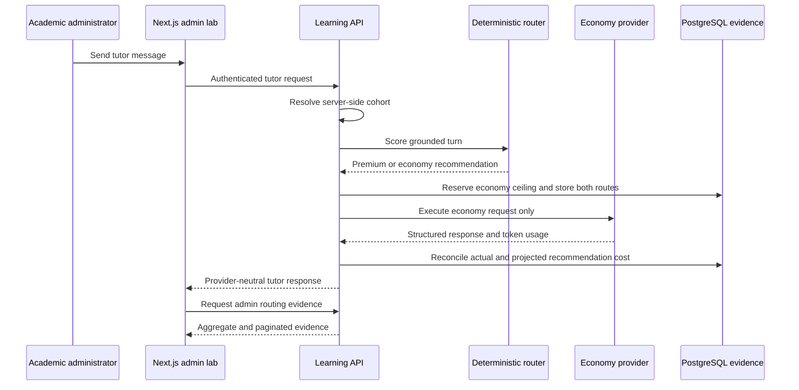

# Tutor Shadow Routing Staging Milestone

**Status:** Deferred to the pre-Beta gate after content completion; hosted activation smoke
complete, backup prerequisite and evidence dataset remain

**Prepared:** 8 October 2026

**Updated:** 10 October 2026

**Depends on:** hybrid routing commit `8376c5a` and shadow evidence commit `acfca30`

**Target environment:** hosted staging, restricted to academic administrators

## 1. Objective

Prove that the deterministic tutor router makes useful economy-versus-premium
recommendations under realistic multi-turn use without allowing the premium provider to
serve a learner response or consume learner allowance.

This milestone turns the implemented shadow-routing foundation into an observable staging
workflow. It adds a server-owned rollout cohort, gives administrators enough evidence to
understand each recommendation, validates the projected cost model against reconciled token
usage, and produces a written go/no-go decision for a later administrator-only live trial.

The milestone does **not** enable live premium routing for students.

**Sequencing decision (10 October 2026):** Paid backup infrastructure and the representative
shadow dataset are deferred until the content candidate is ready. During question and lesson
authoring, staging remains disposable, premium execution remains disabled and this milestone
does not block content work. The consolidated last-mile checklist is in
[B5_CONTENT_RELEASE_CONTROLLED_PILOT.md](B5_CONTENT_RELEASE_CONTROLLED_PILOT.md#pre-beta-hosted-operations-checklist).

**Implementation update:** Work packages A, B and C are implemented and deployed to hosted
staging. Work package D is activated for the `admins` cohort with live hybrid routing off.
The API resolves `off`, `shadow` or `live` from the PostgreSQL role and configured cohort;
adds restricted routing status and cursor-paginated decision endpoints; and includes the
pagination index in migration `202610080023_tutor_routing_evidence_pagination.sql`. The
Tutor Evaluation Lab now renders the restricted status, monthly aggregates, shadow safety
invariant, server-side filters and paginated decision evidence. The authenticated hosted
administrator smoke is complete. The hosted backup state is now recorded: the Supabase Free
plan does not provide project backups, so a managed backup or an operator-created snapshot
remains a prerequisite before the cohort expands. The remaining pilot work is to resolve
that prerequisite, collect the representative dataset and perform the evidence review in
work package E.

## 2. Required outcome

At completion, an academic administrator can:

1. open the Tutor Evaluation Lab and confirm that routing is `shadow` for their account;
2. run fixed and multi-turn tutor cases through the real economy provider;
3. see the recommended tier, executed tier, score, reason codes, actual usage, actual cost
   and projected recommendation cost;
4. filter the evidence by tutor mode, difficulty, recommendation and result;
5. verify from stored evidence that every shadow request executed the economy provider; and
6. export or record a review summary that supports a deliberate live-routing decision.

The learner-facing tutor contract remains provider-neutral. It must not reveal provider
names, model names, route scores, price snapshots or internal reason codes.

## 3. Scope

### 3.1 Server-side rollout cohort

Add a request-time eligibility policy instead of relying on a browser switch.

- Introduce a routing cohort setting with `off`, `admins` and `all` values.
- Default the setting to `off` in every environment.
- Resolve administrator eligibility from the authenticated database role. Do not accept a
  role, email address or routing mode supplied by the client.
- When the service is configured for shadow routing but the learner is outside the cohort,
  resolve the request to routing mode `off` and execute economy.
- Record the resolved routing mode with every route decision.
- Reserve `all` for a later invited learner pilot; this milestone uses `admins` only.

Suggested configuration:

```text
ASEAN_ACADEMY_TUTOR_ROUTING_COHORT=off|admins|all
ASEAN_ACADEMY_TUTOR_HYBRID_ROUTING_SHADOW_ENABLED=true|false
ASEAN_ACADEMY_TUTOR_HYBRID_ROUTING_ENABLED=true|false
```

Configuration validation must reject contradictory states, including a non-`off` cohort
when both routing flags are disabled and simultaneous live and shadow flags.

### 3.2 Administrator evidence API

Keep the existing monthly aggregate endpoint and add a paginated decision read model.

```http
GET /api/v1/admin/tutor-usage?month=YYYY-MM
GET /api/v1/admin/tutor-routing/status
GET /api/v1/admin/tutor-routing/decisions?month=YYYY-MM&cursor=...&limit=50
```

Optional filters:

- `routing_mode`
- `recommended_tier`
- `executed_tier`
- `tutor_mode`
- `question_difficulty`
- `reason_code`
- `reservation_status`

Each decision item should contain only operational evidence:

```text
decision_id
created_at
policy_version
routing_mode
tutor_mode
question_difficulty
route_score
reason_codes[]
recommended_tier, recommended_provider, recommended_model
executed_tier, executed_provider, executed_model
reservation_status
actual_input_tokens, actual_output_tokens
actual_cost_micros_sgd
projected_recommended_cost_micros_sgd
latency_ms
safety_outcome
```

Do not return learner prompts, canonical answers, provider credentials or raw provider
responses from this endpoint. Protect it with the existing academic-administrator policy,
use stable cursor pagination, and cap the page size.

### 3.3 Tutor Evaluation Lab evidence panel

Extend the existing administrator lab with a compact routing section:

- status banner: resolved mode, cohort, routing policy version and schema revision;
- monthly cards: route decisions, premium recommendations, premium executions, actual cost
  and projected recommended cost;
- recommendation rate and projected cost difference;
- filterable decision table with score and reason-code details;
- a clear invariant indicator: `Shadow premium executions: 0`;
- micro-SGD values rendered as SGD to four decimal places, with the raw integer available
  in details; and
- empty, loading, expired-session, API-unavailable and schema-not-ready states.

The panel should use the generated OpenAPI client types. It must not calculate authoritative
costs in the browser.

### 3.4 Staging deployment and runbook

Create a repeatable activation procedure:

1. record the API and web release SHAs;
2. back up or snapshot staging according to the existing database procedure;
3. apply migrations through `202610100024_tutor_zero_cost_reservations.sql`;
4. confirm `/api/v1/health` and `/api/v1/ready`, including schema revision `202610100024`;
5. configure current economy and premium model identifiers and micro-SGD price snapshots;
6. keep live hybrid routing `false`;
7. set the cohort to `admins` and shadow routing to `true`;
8. deploy the API, then deploy the web application;
9. run one connection check and one fixed tutor case; and
10. confirm the stored decision recommends a route while the executed tier remains economy.

No secret value, API key, database URL or invitation link belongs in the runbook or source
control. Record the source and date used for each provider price without copying credentials.

### 3.5 Evidence collection and calibration

Collect a minimum useful dataset before changing a threshold:

- at least 100 reconciled shadow decisions;
- all seven tutor modes represented;
- question difficulty levels 1 through 5 represented;
- the approved 20-case calibration suite completed;
- at least three multi-turn paths containing repeated confusion or incorrect attempts; and
- both economy and premium recommendations represented.

Use one unchanged routing policy version for the complete run. If the score weights,
threshold, premium cap or reason-code logic changes, increment the policy version and start a
new comparison set. Never mix two policy versions into one headline result.

## 4. Architecture and data flow



The database remains the authority for routing evidence and cost. The browser is a review
surface only.

## 5. Implementation sequence

### Work package A — cohort gate and configuration

**Status:** Implemented, deployed and verified with an authenticated academic administrator.

1. Add the routing cohort setting and validation.
2. Resolve eligibility from the authenticated role in the API dependency layer.
3. Pass the resolved `off`, `shadow` or `live` mode into `TutorService`.
4. Add unit tests for an administrator, a normal learner and every invalid configuration.
5. Confirm an ineligible account cannot force shadow or live mode through request data.

**Exit:** only eligible administrators can create shadow decisions; all other users remain
on the recorded `off` economy route.

### Work package B — evidence read model

**Status:** Implemented and deployed. CI PostgreSQL migration and repository integration
tests pass, and authenticated hosted evidence inspection is complete.

1. Define response contracts and cursor encoding.
2. Add an indexed repository query over route decisions, reservations and assistant
   messages.
3. Reuse the server-side token-price calculation for each projected cost.
4. Add administrator authorization, bounded filters and page-size validation.
5. Regenerate `openapi.json` and the frontend TypeScript schema.

**Exit:** authorized administrators can retrieve stable monthly aggregates and paginated
decision evidence; other roles receive `403`.

### Work package C — administrator UI

**Status:** Implemented, deployed and verified in the authenticated hosted administrator UI.

1. Add routing status and metric cards to the Tutor Evaluation Lab.
2. Add the decision table, filters and accessible details view.
3. Add explicit loading and failure states suitable for Render cold starts.
4. Add component tests for data, empty, failure and invariant-breach states.
5. Verify desktop and narrow-screen layouts.

**Exit:** an administrator can understand why a route was recommended without querying the
database or reading logs.

**Implementation note (9 October 2026):** The panel uses generated OpenAPI types and is
only mounted for academic administrators. Monthly evidence includes the server-calculated
`shadow_premium_executions` metric, so the isolation indicator remains accurate even if the
same month later contains live decisions. Costs are rendered in SGD while retaining the
raw micro-SGD value as inspectable detail. Component tests cover populated data, empty
results, filters, cursor pagination, API failure and invariant breach.

### Work package D — staging activation

**Status:** Hosted shadow routing and the authenticated smoke are complete. Backup posture is
verified but does not pass: the staging project is on Supabase Free, which has no project
backups.

1. Apply the migrations in a disposable PostgreSQL database and run repository integration
   tests.
2. Apply the migrations in hosted staging and verify readiness.
3. configure shadow mode and the `admins` cohort with live routing disabled.
4. Run the smoke sequence and confirm that no premium request occurred.
5. Record release SHAs, configuration names, policy version and activation time.

**Exit:** staging collects real shadow evidence and has a tested one-setting rollback.

#### Hosted activation record

Observed on **10 October 2026 at 01:03 WITA**:

| Item | Recorded value |
| --- | --- |
| Active API source release | `a5633f67fe900797a278e068358b5d832c118b99` |
| Shadow configuration commit included in release | `4ab492628c45780f4bdcd84ccfe6f884796abe3b` |
| CI run | `38030808486`; API, web, PostgreSQL and authenticated browser jobs passed |
| Required and current schema | `202610100024` |
| Economy target | `gemini` / `gemini-3.5-flash-lite` |
| Premium recommendation target | `openai` / `gpt-4o-2024-11-20` |
| Routing configuration | live `false`; shadow `true`; cohort `admins` |
| Routing policy | `math-tutor-routing-v1`; threshold `5`; premium session cap `3` |
| Price snapshot | Gemini input/output `384000` / `3200000`; OpenAI input/output `3200000` / `12800000` micro-SGD per million tokens |
| Public API checks | health `ok`, tutor `enabled`; readiness `ready`; database, schema and content `ready/current/current` |
| Public web check | `/login` returned HTTP `200` over HTTP/1.1 |
| Authorization check | unauthenticated routing-status request returned `authentication_required` |
| Backup evidence | Supabase dashboard inspected 10 October 2026 at 17:57 SGT: staging is on Free and has no project backups; resolve with a managed backup or operator-created snapshot before expanding the cohort |

The checked-in configuration declares `GEMINI_API_KEY` as a server-only Render secret and
does not add an OpenAI key. Shadow mode therefore records premium recommendations while the
Gemini economy provider remains the only callable provider. Automated tests include the
economy-only provider spy and passed before activation.

The Supabase backup dashboard for `ASEAN Academy Staging` was inspected on **10 October
2026 at 17:57 SGT**. It states that the Free plan does not include project backups and that
scheduled backups require an upgraded plan. Work package D therefore remains open even
though routing activation and the authenticated smoke passed. Before any cohort expansion,
either enable managed backups with recorded retention or create and verify an
operator-controlled `pg_dump` snapshot under the existing recovery procedure.

The authenticated administrator smoke completed on **10 October 2026 at 14:29 SGT**. After
three incorrect attempts, the administrator asked for another explanation. Policy
`math-tutor-routing-v1` scored the `alternative_explanation` turn at `5` from
`difficulty_1`, `mode_alternative_explanation`, `three_or_more_incorrect_attempts`,
`learner_confusion` and `premium_threshold_reached`. The router recommended OpenAI premium
but executed Gemini economy in `shadow` mode. The reservation reconciled with 2,118 input
and 167 output tokens, 1,349 micro-SGD actual cost and 8,916 micro-SGD projected premium
cost. `Shadow premium executions` remained `0`, and locked-answer protection recorded
`answer_leakage_blocked` without exposing the answer to the learner.

The hosted learner smoke also requires preview-only draft grounding because the shared
review environment intentionally serves draft lesson and question revisions. That exception
is resolved from the authenticated PostgreSQL role at request time: it applies only to an
`academic_admin` in `preview` when draft content is enabled. Students and production remain
restricted to published lesson and question grounding.

### Work package E — evidence review and decision

1. Run the fixed cases and multi-turn paths.
2. Review premium recommendations, false escalations and missed difficult turns.
3. Recompute projected costs independently from exported token counts and price snapshots.
4. Compare the projected P50 and P90 monthly active-student cost with the S$7 allowance.
5. Publish a short review recording pass/fail results, anomalies and the chosen threshold.

**Exit:** the team records either `proceed to administrator-only live trial` or `remain in
shadow`, with evidence and a named policy version.

## 6. Acceptance gates

| Gate | Required result |
| --- | --- |
| Premium isolation | Zero premium provider calls and zero executed premium routes in shadow mode |
| Decision integrity | Every provider-backed turn has one route decision and one linked reservation |
| Route integrity | Every shadow decision has `selected_tier=economy` |
| Cost integrity | Independent recomputation matches stored projected cost to the micro-SGD rounding rule |
| Authorization | Only academic administrators can read routing evidence or enter the shadow cohort |
| Learner contract | No provider, model, score, reason code or internal price appears in learner responses |
| Grounding safety | All locked-answer and structured-output automated checks pass |
| Review coverage | All seven modes, five difficulty levels and required multi-turn paths are represented |
| Budget | Projected P90 monthly cost per active learner remains within the S$7 allowance |
| Regression | Existing tutor API, evaluation lab, quota and frontend test suites remain green |

The premium recommendation rate is a calibration signal rather than a fixed product truth.
Use a provisional 10–30% review band for the representative staging set. A result outside
that band triggers inspection and threshold tuning; it does not justify silently changing
the policy during the same evidence run.

## 7. Test plan

### Automated

- router and route-plan unit tests;
- role/cohort matrix tests;
- configuration rejection tests;
- economy-only provider spy test in shadow mode;
- repository projection and cursor-pagination tests;
- PostgreSQL migration and query integration tests;
- authorization tests for both admin endpoints;
- OpenAPI generation and frontend typecheck;
- administrator panel component tests; and
- the 20-case synthetic evaluation suite.

### Staging

- direct health and readiness checks before opening the web application;
- economy connection check;
- one case for each tutor mode;
- a hard question that recommends premium but executes economy;
- an easy question that recommends and executes economy;
- a repeated-confusion conversation;
- a provider timeout or malformed response with reservation release; and
- sign-in as a normal learner to confirm cohort exclusion.

## 8. Rollback and incident response

The first rollback is configuration-only:

1. set `ASEAN_ACADEMY_TUTOR_HYBRID_ROUTING_SHADOW_ENABLED=false`;
2. set `ASEAN_ACADEMY_TUTOR_ROUTING_COHORT=off`;
3. keep `ASEAN_ACADEMY_TUTOR_HYBRID_ROUTING_ENABLED=false`;
4. redeploy or restart the API; and
5. verify new decisions use routing mode `off` and the tutor still uses economy.

Do not roll back the additive evidence migration during an incident. Existing rows remain
valid and useful for diagnosis. Roll back the application release only if disabling shadow
mode does not restore normal tutor behaviour.

Stop the evidence run immediately if any premium call occurs in shadow mode, a learner can
read administrator evidence, reservations remain stuck after provider failure, or learner
responses expose internal routing details.

## 9. Deliverables

- server-side administrator cohort gate;
- paginated routing-decision administrator API;
- routing evidence panel in the Tutor Evaluation Lab;
- regenerated OpenAPI and TypeScript contracts;
- migration and staging activation runbook;
- automated and staging verification evidence; and
- a dated routing policy review with a live-trial recommendation.

## 10. Estimate and follow-on milestone

For one developer, the expected implementation effort is four to six focused engineering
days, plus one to two days for staging evidence collection and human review. Provider quota,
reviewer availability and hosted deployment access can extend elapsed time without changing
the engineering scope.

After all gates pass, the next milestone is an **administrator-only live hybrid trial**. It
will provision the premium provider key, change eligible administrators from shadow to live,
retain the premium-turn and S$7 boundaries, and compare actual quality and cost with this
shadow baseline. Student access remains a separate release decision.
